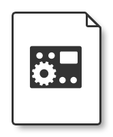

# HALion Instrument & Sound Designers

Whether you want to dive into the Macro Page Editor or get in-depth descriptions of the classes and functions provided in HALion Script, HALion Developer Resource is the go-to reference for all relevant information concerned with creating advanced content libraries in HALion.

Please choose from the below to learn how to get started and find short examples and detailed information on the selected topic.

||HALion Developer Resource||
|:-:|:-:|:-:|
||||
|**[HALion Script](./HALion-Script/pages/HALion-Script.md)**|**[HALion Macro Page](./HALion-Macro-Page/pages/HALion-Macro-Page.md)**|**[HALion Tutorials & Guidelines](./HALion-Tutorials-Guidelines/pages/HALion-Tutorials-Guidelines.md)**|

