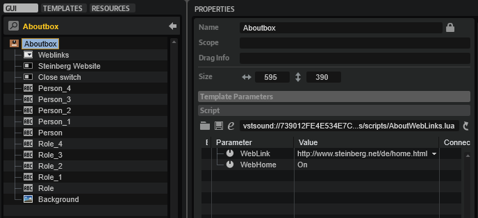

/ [HALion Developer Resource](../../HALion-Developer-Resource.md) / [HALion Macro Page](./HALion-Macro-Page.md) / [Templates](./Templates.md) /

# About Box

---

**On this page:**

[[_TOC_]]

---

## Description

You can use the About Box template to display information about the library manufacturer and the developers, for example. Its default size matches the standard size of a HALion Sonic macro page and it contains several control elements, such as a background bitmap, several example labels, two switches, and a menu. You can adapt these elements to your own needs.

**To explore the functionality and connections:**

1. Load the [Init Basic Controls.vstpreset](../vstpresets/Init%20Basic%20Controls.vstpreset) from the [Basic Controls](./Exploring-Templates.md#basic-controls) library.
2. In the **Macro Page Designer**, examine the template "Aboutbox" in the Templates Tree and the "Popup Views" variable in the GUI Tree.

To open an about box, a Popup List variable is required. See "Popup Views" in the GUI Tree. The first entry of the Popup List variable must refer to the template name of the about box, here: ``Aboutbox``. The page switch "Sw_About Box" in the GUI Tree is used to open the about box. The Value of "Sw_About Box" must be set to ``@Popup Views`` and the Onvalue must be set to ``1``. The "Close switch" inside the Aboutbox template is used to close the about box. Its Value must also be set to ``@Popup Views`` and its Onvalue must be set to ``0``. A click on the opened about box will close it.

In addition, the Aboutbox template contains a switch "Steinberg Website" and a menu "Weblinks" that are used to open webpages. These two controls require a UI script that is attached to the Aboutbox template. The Value of "Steinberg Website" is set to ``@WebLink`` and the Value of "Weblinks" is set to ``@WebHome``. These values refer to the parameters that are defined in the UI script and they will open the corresponding webpages, also defined in the UI script. You can edit the UI script to change the URLs.

#### UI Script

```lua
-- define web links

links = {
				"http://www.steinberg.net/de/home.html",
				"http://www.steinberg.net/de/support.html",
			  }
			  
function onWebLinkChanged()  
  openURL (links[WebLink])
end

defineParameter{name="WebLink", default=1, strings=links, onChanged=onWebLinkChanged,writeAlways=true}


-- define single home web link

function onWebHomeChanged()  
  openURL ("http://www.steinberg.net/de/home.html")
end

defineParameter("WebHome", nil, true, onWebHomeChanged)
```

## Template Properties

|Poperty|Description|
|:-|:-|
|**Name**|The name of the template. The first entry of the Popup List variable must refer to this name.|

## Components inside the Template



### Controls and Subtemplates

|Item|Description|
|:-|:-|
|**Weblinks**|A [Menu](./Menu.md) control to display a list of web links. The menu is connected to the UI script using ``@WebLink`` as Value. The UI script is attached to the Aboutbox template. Edit the script to change the suggested links.|
|**Steinberg Website**|A [Switch](./Switch.md) control connected to the UI script using ``@Webhome`` as Value. The UI script is attached to the Aboutbox template. Edit the script to change the suggested link.|
|**Close switch**|A [Switch](./Switch.md) control set to ``exclusive`` mode. The Value must be set to the same Popup List variable ``@Popup Views`` that is used to open the about box. The Onvalue must be set to ``0``.|
|**Person ... , Role ...**|Several [Label](./Label.md) controls that can be used to mention developers. Alternatively, the labels could also be part of the background bitmap.|
|**Background**|An [Image](./Image.md) control for the background bitmap.|
