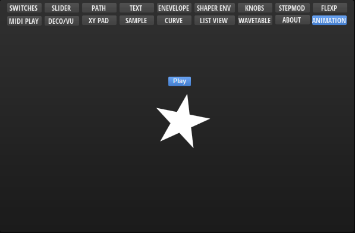
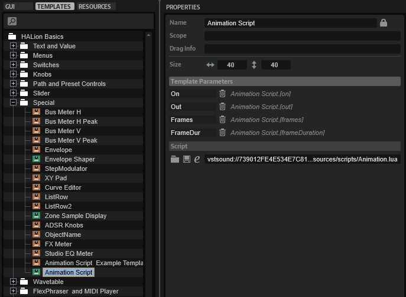
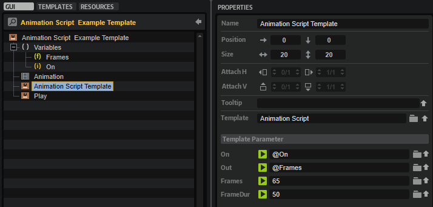

/ [HALion Developer Resource](../../HALion-Developer-Resource.md) / [HALion Macro Page](./HALion-Macro-Page.md) / [Templates](./Templates.md) /

# Animation Script

---

**On this page:**

[[_TOC_]]

---



## Description

The Animation Script template can be added to a macro page to run timer-controlled animations. These can be turned on and off by any parameter and the integrated script can be customized to set animation properties, such as the number of frames and the duration of a frame. There are two templates included in the [Basic Controls](./Exploring-Templates.md#basic-controls) library, the Animation Script template providing only the UI script and the Animation Script Example template, which includes additional components such as a play button, variables, and an example animation to show how the UI script can be connected.



**To explore the functionality and connections:**

1. Load the [Init Basic Controls.vstpreset](../vstpresets/Init%20Basic%20Controls.vstpreset) from the [Basic Controls](./Exploring-Templates.md#basic-controls) library.
2. Open the **Macro Page Designer**, go to the **GUI Tree** and navigate to "Pages > Animation Page". 
3. Select "Animation Script Example" and click **Edit Element**  to examine the template.

## Template Properties

|Poperty|Description|
|:-|:-|
{{#include ./_Properties.md:name}}
{{#include ./_Properties.md:position-size}}
{{#include ./_Properties.md:attach}}
{{#include ./_Properties.md:tooltip}}
{{#include ./_Properties.md:template}}

## Components inside the Template



### UI Variables

These variables are needed to allow the communication between the [Animation](./Animation.md) control, the Animation Script Template and the PLay button.

|Variable|Description|Type|Range|
|:-|:-|:-|:-|
|**Frames**|A float variable to connect the Out parameter of the Animation Script Template with the Value of the [Animation](./Animation.md) control.|float|0 - 1.0|
|**On**|An integer variable to connect the On parameter of the Animation Script Template with the Play button.|integer|0 - 1|

### Controls and Subtemplates

|Item|Description|
|:-|:-|
|**Animation**|A SVG of a rotating star as an example animation. It is connected to the Animation Script Template by ``@Frames``.|
|**Animation Script Template**|The template view that contains the UI script for controlling the animation. The template provides the following parameters:<ul><li>**On:** Starts and stops the animation. Connected  to the Play button by ``@On``.</li><li>**Out:** The output of the script for controlling the animation. It is connected to the [Animation](./Animation.md) control by ``@Frames``.</li><li>**Frames:** The number of frames to be displayed (1 to 1000). The number is best set to the actual number of frames in the referenced animation. You can use a different number, e.g., use 50 for an animation with 100 frames, if you want to display only every second frame of the animation.</li><li>**Frame Duration:** Here you can specify the duration for each frame to be displayed. The duration is set in milliseconds (20 to 10.000).</li></ul>|
|**Play**|A [Switch](./Switch.md) control to start and stop the animation. It is connected to the Animation Script Template by ``@On``.|

### UI Script

```lua
function animate()
 while on do
  if out + inc <= 1  then
    out = out + inc
  else
	out = 0
  end
  wait(frameDuration)
 end
 
 out = 0
end

inc = 0.1
defineParameter{name = "on", default = false, onChanged = animate}
defineParameter{name = "out", default = 0, min = 0, max = 1}
defineParameter{name = "frames", default = 10, min = 1, max = 1000, type = "integer", onChanged = function() inc = 1 / frames end}
defineParameter{name = "frameDuration", default = 50, min = 20, max = 10000, type = "integer"}
```