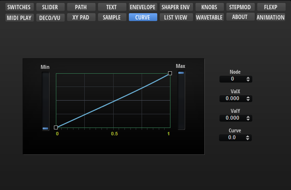
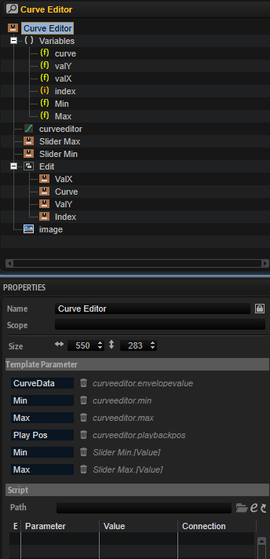

/ [HALion Developer Resource](../../HALion-Developer-Resource.md) / [HALion Macro Page](./HALion-Macro-Page.md) / [Templates](./Templates.md) /

# Curve Editor

---

**On this page:**

[[_TOC_]]

---

## Description

The Curve Editor template allows you to display and edit curves, such as the custom curve of the Velocity Curve MIDI module or the modulation matrix, for example. The template contains controls to adjust the values of the selected node and the minimum and maximum of the curve. These controls must be part of the template and they must use the [UI variables](#ui-variables) as defined in the template to connect with the [Curve Editor Control](#curve-editor-control).

>&#10069; The [Curve Editor Control](#curve-editor-control) cannot be created manually in the GUI Tree. {{#include ./_Templates.md:special-template}}

**To explore the functionality and connections:**

1. Load the [Init Basic Controls.vstpreset](../vstpresets/Init%20Basic%20Controls.vstpreset) from the [Basic Controls](./Exploring-Templates.md#basic-controls) library.
2. Open the **Macro Page Designer**, go to the **GUI Tree** and navigate to "Pages > Curve Editor Page". 
3. Select "Curve Editor" and click **Edit Element**  to examine the template.

## Template Properties

|Poperty|Description|
|:-|:-|
{{#include ./_Properties.md:name}}
{{#include ./_Properties.md:position-size}}
{{#include ./_Properties.md:attach}}
{{#include ./_Properties.md:tooltip}}
{{#include ./_Properties.md:template}}

## Template Parameters

|Parameter|Description|
|:-|:-|
|**Curve Data**|Connect this to the FuncData parameter of the Velocity Curve MIDI module, for example.|
|**Min**|Compresses the curve vertically from the bottom. Connect this to the Minimum parameter of a Velocity Curve MIDI module, for example.|
|**Max**|Compresses the curve vertically from the top. Connect this to the Maximum parameter of a Velocity Curve MIDI module, for example.|
|**Play Pos**|Allows you to connect a parameter that sends the current value on the curve, e.g., input to output velocity.|

## Components inside the Template

### UI Variables

The following variables are needed to allow the communication between the curve editor and other controls in the template.

|Variable|Description|Type|Range|
|:-|:-|:-|:-:|
|**curve**|The curvature of the selected node.|float|-10 - 10|
|**valY**|The y-value of the selected node.|float|0 - 1|
|**valX**|The x-value of the selected node.|float|0 - 1|
|**index**|The index of the selected node.|integer|0 - 100|

### Controls and Subtemplates

|Item|Description|
|:-|:-|
|**curveeditor**|The Curve Editor control. The properties FuncData, Minimum, and Maximum are exported and thus are available as template parameters. The exported Minimum and Maximum properties and the exported Value property of Slider Min and Slider Max (see below) share the same name for the template parameters and therefore appear only as one template parameter, Min and Max respectively, on the instance level of the template. For more details about the configuration of the control, see [Curve Editor Control](#curve-editor-control).|
|**Slider Max**|A slider template. The Value property of this slider template is exported and thus available as template parameter. It shares the name ``Max``with the exported Maximum property of the Curve Editor control. Therefore, both exported properties appear only as one template parameter.|
|**Slider Min**|A slider template. The Value property of this slider template is exported and thus available as template parameter. It shares the name ``Min``with the exported Minimum property of the Curve Editor control. Therefore, both exported properties appear only as one template parameter.|
|**Edit**|A group of valuebox templates for displaying and editing the values of the selected node. The controls are connected to the Curve Editor control by the [UI variables](#ui-variables) defined above. The respective [UI variable](#ui-variables) must be set as Value to establish the connection.<ul><li>**ValX:** A valuebox template to control the x-value of the selected node. Its Value is set to ``@valX``.</li><li>**ValY:** A valuebox template to control the y-value of the selected node. Its Value  is set to ``@valY``.</li><li>**Curve:** A valuebox template to control the curvature of the selected node. Its Value is set to ``@curve``.</li><li>**Index:** A valuebox template to select the index of the node to be edited. Its Value is set to ``@index``.</li></ul>|
|**image**|A [Bitmap](./Bitmap.md) resource for an embedded frame around the curve editor.|

### Curve Editor Control

The look and feel of the Curve Editor control can be configured with the following properties and colors.

#### Properties

|Property|Description|
|:-|:-|
{{#include ./_Properties.md:name}}
{{#include ./_Properties.md:position-size}}
{{#include ./_Properties.md:attach}}
{{#include ./_Properties.md:tooltip}}
|**Style**|<ul><li>**Bipolar:** Activate this for bipolar curves like pitch or pan.</li><li>**Cross:** Shows cross lines when editing a node.</li><li>**Grid:** Shows a grid behind the curve.</li><li>**Play Pos:** Shows the position of the current value on the curve.</li><li>**Nodes:** Shows the nodes.</li><li>**Add/Rem:** Allows you to add and remove nodes, otherwise a fixed number of nodes is used.</li><li>**Sel Node:** Allows to select a node.</li><li>**No Margins:** Activate this if you want to draw the curve using the full rectangle. ScaleX and ScaleY are clipped if No Margins is enabled. Therefore, you should deactivate them.</li><li>**Scale X:** Shows a scale for the x-axis.</li><li>**Scale Y:** Shows a scale for the y-axis.</li></ul>|
|**FuncData**|Export this property to the instance level of the template and connect the corresponding template parameter to the FuncData parameter of the Velocity Curve MIDI module, for example.|
|**Grid**|<ul><li>**MinX:** Defines the minimum value of the horizontal grid.</li><li>**MaxX:** Defines the maximum value of the horizontal grid.</li><li>**MinY:** Defines the minimum value of the vertical grid.</li><li>**MaxY:** Defines the maximum value of the vertical grid.</li></ul>|
|**Selected Node**|<ul><li>**Index:** The index of the selected node. Connected to the valuebox template Index by the [UI variable](#ui-variables) ``@index``.</li><li>**X:** The x-value of the selected node. Connected to the valuebox template ValX by the [UI variable](#ui-variables) ``@valX``.</li><li>**Y:** The y-value of the selected node. Connected to the valuebox template ValY by the [UI variable](#ui-variables) ``@valY``.</li><li>**Curve:** The curvature of the selected node. Connected to the valuebox template Curve by the [UI variable](#ui-variables) ``@curve``.</li></ul>|
|**Minimum**|Compresses the curve vertically from the bottom. Export this property to the instance level of the template and connect the corresponding template parameter to the Minimum parameter of the Velocity Curve MIDI module, for example.|
|**Maximum**|Compresses the curve vertically from the top. Export this property to the instance level of the template and connect the corresponding template parameter to the Maximum parameter of the Velocity Curve MIDI module, for example.|
|**Play Pos**|Allows you to connect a parameter that sends the current value on the curve, e.g., input to output velocity. The Play Pos style must be activated to get access to this.|

#### Colors

>&#10069; Some colors are only available if the corresponding Style options are active.

|Property|Description|
|:-|:-|
|**Line**|Line color between the nodes.|
|**Fill**|Fill color of the nodes.|
|**FillSelected**|Fill color of the selected node.|
|**FrameFocus**|Frame color of the focussed node.|
|**Frame**|Frame color of the nodes.|
|**Hover**|Hover frame color of the nodes.|
|**Crosshair**|Node edit crosshair color.|
|**Play Pos**|Color of the position indicator of the current value on the curve.|
|**Border**|Overall border color.|
|**Grid V**|Vertical grid color.|
|**Grid V2**|Vertical fine grid color.|
|**Grid V3**|Additional vertical fine grid color.|
|**Grid H**|Horizontal grid color.|
|**Grid H2**|Horizontal fine grid color.|
|**Scale**|Scale font color.|
