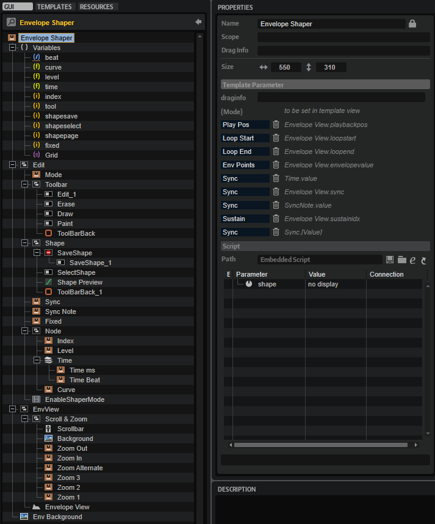

/ [HALion Developer Resource](../../HALion-Developer-Resource.md) / [HALion Macro Page](./HALion-Macro-Page.md) / [Templates](./Templates.md) /

# Envelope Shaper

---

**On this page:**

[[_TOC_]]

---

## Description

The Envelope Shaper template allows you to edit HALion's multi-stage envelopes. The template contains controls for scrolling and zooming the envelope and for setting the envelope mode or the values of the selected node, for example. In addition, it offers tools for drawing shapes. The controls must be part of the template and they must use the [UI variables](#ui-variables) as defined in the template to connect with the [Envelope View Control](#envelope-view-control).

>&#10069; The [Envelope View Control](#envelope-view-control) cannot be created manually in the GUI Tree. {{#include ./_Templates.md:special-template}}

**To explore the functionality and connections:**

1. Load the [Init Basic Controls.vstpreset](../vstpresets/Init%20Basic%20Controls.vstpreset) from the [Basic Controls](./Exploring-Templates.md#basic-controls) library.
2. Open the **Macro Page Designer**, go to the **GUI Tree** and navigate to "Pages > Envelope Shaper Page". 
3. Select "Envelope ShaperMode" and click **Edit Element**  to examine the template.

## Template Properties

|Poperty|Description|
|:-|:-|
{{#include ./_Properties.md:name}}
{{#include ./_Properties.md:position-size}}
{{#include ./_Properties.md:attach}}
{{#include ./_Properties.md:tooltip}}
{{#include ./_Properties.md:template}}

## Template Parameters

|Parameter|Description|
|:-|:-|
|**Mode**|Connect this to the Mode parameter of the envelope.|
|**Play Pos**|Connect this to the PlaybackPos parameter of the envelope.|
|**Loop Start**|Connect this to the LoopStart parameter of the envelope.|
|**Loop End**|Connect this to the LoopEnd parameter of the envelope.|
|**Env Points**|Connect this to the Envelope Points parameter of the envelope.|
|**Sync**|Connect this to the Sync parameter of the envelope.|
|**Sustain**|Connect this to the SustainIndex parameter of the envelope.|

## Components inside the Template

### UI Variables

These variables are needed to allow the communication between the Envelope View and other controls in the template.

|Variable|Description|Type|Range|
|:-|:-|:-|:-:|
|**beat**|Time in beats.|rational|n.a.|
|**curve**|Curvature of the selected node segment.|float|-10 - 10|
|**level**|Level of the selected node.|float|0 - 100|
|**time**|Time of the selected note.|float|0 - 30000|
|**index**|Index of the selected node.|integer|0 - 128|
|**tool**|The tool for drawing shapes.|integer|0 - 3|
|**shapesave**|Used for saving shapes.|integer|0 - 1|
|**shapeselect**|Used for selecting shapes.|integer|0 - 1|
|**fixed**|Fixed mode of the envelope.|integer| 0, 1|
|**Grid**|Specifies the note grid.|stringlist|1/64, 1/32, 1/16T, 1/16, 1/8T, 1/16D, 1/8, 1/4T, 1/8D, 1/4, 1/2T, 1/4D, 1/2, 1/1T, 1/2D, 4/4, 5/4, 6/4, 7/4, 8/4, 16/4, 32/4, 64/4|

### Controls and Subtemplates

|Item|Description|
|:-|:-|
|**Edit**|This [Group](./Group.md) contains controls that allow you to adjust the selected node and further options of the envelope.<ul><li>**Mode:** A menu template. Its Value is exported by ``@../{Mode}``. It should be connected to the Mode parameter of the corresponding envelope in the zone.</li><li>**Toolbar:** This [Group](./Group.md) contains switches for selecting the Edit, Erase, Draw, or Paint tool of the envelope.<ul><li>**Edit_1/Erase/Draw/Paint:** All switches must use the exclusive mode and be connected to ``@tool``.</li><li>**ToolBarBack:** A [Decor](./Decor-Resource.md) used as background.</li></ul></li><li>**Shape:** A [Group](./Group.md) of controls that allow to select and save the shapes for the Draw and Paint tools.<ul><li>**SaveShape:** A [Disable](./Disable.md) group for the save button. Its Value must be set to ``@tool``, so that saving is only possibe if the Edit tool is active.</li><ul><li>**SaveShape_1:** A [Switch](./Switch.md) for saving a shape. Its Value must be set to ``@shapesave``.</li></ul><li>**SelectShape:** A [Switch](./Switch.md) for opening the shape selector. Its Value must be set to ``@shapeselect``.</li><li>**Shape Preview:** A [Curve Editor](./Curve-Editor.md) for displaying the selected shape. Its Value must be set to ``@shape``.</li><li>**ToolBarBack_1:** A [Decor](./Decor-Resource.md) used as background.</li></ul><li>**Sync:** A switch template. Its Value is exported as ``Sync`` and should be connected to the Sync parameter of the corresponding envelope in the zone.</li><li>**SyncNote:** A [Disable](./Disable.md) view with a Sync Note template. The Value of the [Disable](./Disable.md) view is exported as ``Sync`` and should be connected to the Sync parameter of the corresponding envelope in the zone. If Sync is active, the [Disable](./Disable.md) view becomes active too and the contained template can be used to set Sync Note.</li><ul><li>**Sync Note:** A menu template. Its Value must be set to ``@Grid``, a stringlist [UI variable](#ui-variables) that defines the allowed note values. It is also connected to the corresponding property of the Envelope View, which uses the same [UI variable](#ui-variables).</li></ul><li>**Fixed:** A switch template. Its Value is connected to the corresponding property of the Envelope View by the [UI variable](#ui-variables) ``@fixed``.</li><li>**Node:** This [Group](./Group.md) contains controls for adjusting the selected node.</li><ul><li>**Index:** A valuebox template to select the index of the node to be edited. Its Value is connected to the corresponding property of the Envelope View by the [UI variable](#ui-variables) ``@index``.</li><li>**Level:** A valuebox template to adjust the level of the selected node. Its Value is connected to the corresponding property of the Envelope View by the [UI variable](#ui-variables) ``@level``.</li><li>**Time:** A [Stack](./Stack.md) with two templates to either set the time of a node in ms or fractions of a beat. The Value of the [Stack](./Stack.md) is exported as ``Sync`` and should be connected to the Sync parameter of the corresponding envelope in the zone.<ul><li>**Time ms/Time Beat:** The Value of the "Time ms" and the "Time Beat" templates must be set to the [UI variables](#ui-variables) ``@time`` and ``@beat`` respectively. This way, they are connected to the corresponding properties of the Envelope View, which use the same [UI variables](#ui-variables).</li></ul></li><li>**Curve:** A valuebox template to adjust the curvature of the selected node. Its Value is connected to the corresponding property of the Envelope View by the [UI variable](#ui-variables) ``@curve``.</li></ul><li>**EnableShaperMode:** A special invisible [Animation](./Animation.md) control which is only used to transfer the information about the selected envelope mode into the template. Its Value is exported using ``{Mode}``.</li></ul>|
|**EnvView**|This [Group](./Group.md) contains a group with controls for scrolling and zooming the envelope and the Envelope View. See [Envelope View Control](#envelope-view-control) for further details.<ul><li>**Scroll & Zoom:** This [Group](./Group.md) contains controls that allow you to scroll and zoom the envelope.<ul><li>**Scrollbar:** A [Range Slider](./Range-Slider.md) to reach areas of the envelope that are not visible through the zoom. The Low Value of the [Range Slider](./Range-Slider.md) must be set to ``@ScrollMin`` and the High Value must be set to ``@ScrollMax``.</li><li>**Background:** A background bitmap for the scrollbar.</li><li>**Zoom Out:** A switch template that allows you to zoom out the envelope. Its Value must be set to ``@ZoomOut``.</li><li>**Zoom In:** A switch template that allows you to zoom in the envelope. Its Value must be set to ``@ZoomIn``.</li><li>**Zoom Alternate:** A switch template that toggles between the last zoom state or completely zoomed out. Its Value must be set to ``@StateA.``</li><li>**Zoom1:** A switch template to activate zoom state 1. Its Value must be set to ``@State1``.</li><li>**Zoom2:** A switch template to activate zoom state 2. Its Value must be set to ``@State2``.</li><li>**Zoom3:** A switch template to activate zoom state 3. Its Value must be set to ``@State3``.</li></ul></li><li>**Envelope View:** The graphical envelope editor. The properties EnvValue, Mode, Sync, Triplet, Loop Start, Loop End, Sustain and Play Pos are exported and thus are available as template parameters. They should be connected to the parameters of the corresponding envelope in the zone. The Value of the properties SyncNote, Fixed, Index, Level, Time, Beat and Curve is set to the corresponding [UI variable](#ui-variables). This way, each property is connected to one of the control templates mentioned above. See [Envelope View Control](#envelope-view-control) for further details.</li></ul>|
|**Env Background**|The background bitmap for the envelope.|

### Envelope View Control

#### Properties

In addition to standard properties like size, position, etc., the Envelope View provides further properties and colors to customize its appearance and behavior.

|Poperty|Description|
|:-|:-|
{{#include ./_Properties.md:name}}
{{#include ./_Properties.md:position-size}}
{{#include ./_Properties.md:attach}}
{{#include ./_Properties.md:tooltip}}
|**Style**|<ul><li>**Bipolar:** Activate this for bipolar envelopes like pitch or pan.</li><li>**Scrollbar:** If this is active, the view can be scrolled and zoomed.</li><li>**Cross:** Shows crosslines when editing nodes.</li><li>**Grid:** Shows a time grid.</li><li>**Play Pos:** Shows the current playback position on the curve.</li><li>**Nodes:** Shows nodes.</li><li>**Add/Rem:** Allows adding and removing of nodes. Deactivate this option to provide an ADSR envelope with a fixed number of nodes, for example.</li><li>**Sel Node:** Allows you to select a node.</li><li>**Sustain:** Shows a sustain line. For this, an envelope Mode with sustain must be active.</li><li>**Loop:** Shows an overlay for the loop region. For this, the envelope Mode must be set to Loop.</li><li>**Free End:** Allows you to move the last node of a unipolar envelope away from the zero line.</li></ul>|
|**Env Value**|Exported as ``Env Points``. See [Template Parameters](#template-parameters) above.|
|**Mode**|Exported as ``Mode`` See [Template Parameters](#template-parameters) above.|
|**Sync**|Exported as ``Sync`` See [Template Parameters](#template-parameters) above.|
|**Triplet**|Not used in this template. See [Envelope](./Envelope.md) template for details of this property.|
|**SyncNote**|Connected to the corresponding control template by the [UI variable](#ui-variables) ``@Grid``.|
|**Fixed**|Connected to the corresponding control template by the [UI variable](#ui-variables) ``@fixed``.|
|**Tool**|Connected to the corresponding controls Edit_1, Erase, Draw, and Paint by the [UI variable](#ui-variables) ``@tool``.|
|**ShapeSave**|Connected to the corresponding control SaveShape_1 by the [UI variable](#ui-variables) ``@shapesave``.|
|**ShapeSelect**|Connected to the corresponding control SelectShape by the [UI variable](#ui-variables) ``@shapeselect``|
|**Shape**|Connected to the corresponding control Shape Preview by the [UI variable](#ui-variables) ``@shape``.|
|**Index**|Connected to the corresponding control template by the [UI variable](#ui-variables) ``@index``.|
|**Level**|Connected to the corresponding control template by the [UI variable](#ui-variables) ``@level``.|
|**Time**|Connected to the corresponding control template by the [UI variable](#ui-variables) ``@time``.|
|**Beat**|Connected to the corresponding control template by the [UI variable](#ui-variables) ``@beat``.|
|**Curve**|Connected to the corresponding control template by the [UI variable](#ui-variables) ``@curve``.|
|**Loop Start**|Exported as ``Loop Start``. See [Template Parameters](#template-parameters) above.|
|**Loop End**|Exported as ``Loop End``. See [Template Parameters](#template-parameters) above.|
|**Sustain**|Exported as ``Sustain``. See [Template Parameters](#template-parameters) above.|
**Play Pos**|Exported as ``Play Pos``. See [Template Parameters](#template-parameters) above.|
|**Min X**|Defines the minimum value of the horizontal zoom.|
|**Max X**|Defines the maximum value of the horizontal zoom.|
|**Min Y**|Defines the minimum value of the vertical zoom.|
|**Max Y**|Defines the maximum value of the vertical zoom.|

#### Colors

>&#10069; Some colors are only available if the corresponding Style options are active.

|Poperty|Description|
|:-|:-|
|**Line**|Line color between the nodes.|
|**Fill**|Fill color of the nodes.|
|**FillSelected**|Fill color of the selected nodes.|
|**FrameFocus**|Frame color of the focussed node.|
|**Frame**|Frame color of the nodes.|
|**Hover**|Hover frame color of the nodes.|
|**Sustain**|Color of the Sustain node and line.|
|**Synced**|Dot color of nodes that are aligned to the sync grid.|
|**Crosshair**|Node edit crosshair color.|
|**Playback**|Color of the playback position indicator.|
|**Border**|Overall border color.|
|**Grid V**|Vertical grid color.|
|**Grid V2**|Vertical fine grid color.|
|**Grid H**|Horizontal grid color.|
|**Grid H2**|Horizontal fine grid color.|
|**Font**|Timeline font color.|
|**Selector**|Selection area fill color.|
|**SelFrame**|Selection area frame color.|
|**Loop**|Loop area fill color.|
|**LoopFrame**|Loop area frame color.|
|**Zoom**|Zoom area fill color.|
|**ZoomFrame**|Zoom area frame color.|
