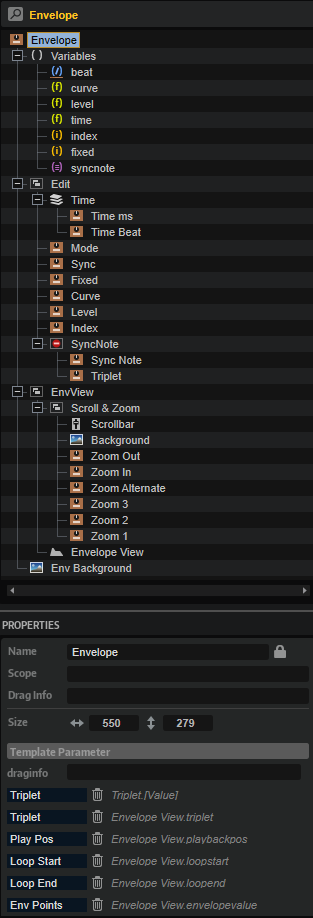

/ [HALion Developer Resource](../../HALion-Developer-Resource.md) / [HALion Macro Page](./HALion-Macro-Page.md) / [Templates](./Templates.md) /

# Envelope

---

**On this page:**

[[_TOC_]]

---

## Description

The Envelope template allows you to edit HALion's multi-stage envelopes. The template contains controls for scrolling and zooming the envelope and for setting the envelope mode or the values of the selected node, for example. The controls must be part of the template and they must use the UI variables as defined in the template to connect with the Envelope View.

>&#10069; The Envelope View cannot be created manually in the GUI Tree. {{#include ./_Templates.md:special-template}}

## Template Properties

|Poperty|Description|
|:-|:-|
{{#include ./_Properties.md:name}}
{{#include ./_Properties.md:position-size}}
{{#include ./_Properties.md:attach}}
{{#include ./_Properties.md:tooltip}}
{{#include ./_Properties.md:template}}

## Template Parameters

|Parameter|Description|
|:-|:-|
|**Triplet**|Connect this to the Triplet parameter of the envelope.|
|**Mode**|Connect this to the Mode parameter of the envelope.|
|**Play Pos**|Connect this to the PlaybackPos parameter of the envelope.|
|**Loop Start**|Connect this to the LoopStart parameter of the envelope.|
|**Loop End**|Connect this to the LoopEnd parameter of the envelope.|
|**Env Points**|Connect this to the Envelope Points parameter of the envelope.|
|**Sync**|Connect this to the Sync parameter of the envelope.|
|**Sustain**|Connect this to the SustainIndex parameter of the envelope.|

## Components inside the Template

### UI Variables

These variables are needed to allow the communication between the envelope editor and other controls in the template.

|Variable|Description|Type|Range|
|:-|:-|:-|:-:|
|**index**|Index of the selected node.|integer|0 - 128|
|**level**|Level of the selected node.|float|0 - 100|
|**time**|Time of the selected note.|float|0 - 30000|
|**curve**|Curvature of the selected node segment.|float|-10 - 10|
|**beat**|Time in beats.|rational|n.a.|
|**syncnote**|Specifies the note grid.|stringlist|1/1, 1/2, 1/4, 1/8, 1/16, 1/32, 1/64, 1/128, 1/256|

### Controls and Subtemplates

|Item|Description|
|:-|:-|
|**Scroll & Zoom**|This [Group](./Group.md) contains controls that allow you to scroll and zoom the envelope.<ul><li>**Scrollbar:** A [Range Slider](./Range-Slider.md) to reach areas of the envelope that are not visible through the zoom. The Low Value of the [Range Slider](./Range-Slider.md) must be set to ``@ScrollMin`` and the High Value must be set to ``@ScrollMax``.</li><li>**Background:** A background bitmap for the scrollbar.</li><li>**Zoom Out:** A switch template that allows you to zoom out the envelope. Its Value must be set to ``@ZoomOut``.</li><li>**Zoom In:** A switch template that allows you to zoom in the envelope. Its Value must be set to ``@ZoomIn``.</li><li>**Zoom Alternate:** A switch template that toggles between the last zoom state or completely zoomed out. Its Value must be set to ``@StateA.``</li><li>**Zoom1:** A switch template to activate zoom state 1. Its Value must be set to ``@State1``.</li><li>**Zoom2:** A switch template to activate zoom state 2. Its Value must be set to ``@State2``.</li><li>**Zoom3:** A switch template to activate zoom state 3. Its Value must be set to ``@State3``.</li></ul>|
|**Edit**|This [Group](./Group.md) contains controls that allow you to adjust the selected node and further options of the envelope.<ul><li>**Time:** A [Stack](./Stack.md) with two templates to either set the time of a node in ms or fractions of a beat. The Value of the [Stack](./Stack.md) is exported as ``Sync`` and should be connected to the Sync parameter of the desired envelope in the zone. The Value of the "Time ms" and the "Time Beat" templates must be set to the UI variables ``@time`` and ``@beat`` respectively. This way, they are connected with the corresponding properties of the Envelope View, which use the same UI variables.</li><li>**Mode:** A menu template. Its Value is exported as ``Mode`` and should be connected to the Mode parameter of the desired envelope in the zone.</li><li>**Sync:** A switch template. Its Value is exported as ``Sync`` and should be connected to the Sync parameter of the desired envelope in the zone.</li><li>**Fixed:** A switch template. Its Value must be set to ``@fixed``, a UI variable. This way, it is connected with the corresponding property of the Envelope View, which uses the same UI variable.</li><li>**Curve:** A valuebox template to adjust the curvature of the selected node. Its Value must be set to ``@curve``, a UI variable. This way, it is connected with the corresponding property of the Envelope View, which uses the same UI variable.</li><li>**Level:** A valuebox template to adjust the level of the selected node. Its Value must be set to ``@level``, a UI variable. This way, it is connected with the corresponding property of the Envelope View, which uses the same UI variable.</li><li>**Index:** A valuebox template to select the index of the node to be edited. Its Value must be set to ``@index``, a UI variable. This way, it is connected with the corresponding property of the Envelope View, which uses the same UI variable.</li><li>**SyncNote:** A [Disable](./Disable.md) view with two templates: Sync Note and Triplet. The Value of the [Disable](./Disable.md) view is exported as ``Sync`` and should be connected to the Sync parameter of the desired envelope in the zone. If Sync is active, the [Disable](./Disable.md) view becomes active too and the contained templates can be used to set the Sync Note and Triplet parameters of the envelope.</li><ul><li>**Sync Note:** A menu template. Its Value must be set to ``@syncnote``, a stringlist UI variable that defines the allowed note values. It is also connected with the corresponding property of the Envelope View, which uses the same UI variable.</li><li>**Triplet:** A switch template. Its Value is exported as ``Triplet`` and should be connected to the Triplet parameter of the desired envelope in the zone.</li></ul></ul>|
|**Envelope View**|The graphical envelope editor. The properties EnvValue, Mode, Sync, Triplet, Loop Start, Loop End, Sustain and Play Pos are exported and thus are available as template parameters. They should be connected to the corresponding parameters of the desired envelope in the zone. The Value of the properties SyncNote, Fixed, Index, Level, Time, Beat and Curve is set to the corresponding UI variable. This way, each property is connected with a control template mentioned above.|
|**Env Background**|The background bitmap for the envelope.|

### Envelope View

#### Properties

In addition to standard properties like size, position, etc., the envelope view provides a number of properties and colors to customize its appearance and behavior.

|Poperty|Description|
|:-|:-|
{{#include ./_Properties.md:name}}
{{#include ./_Properties.md:position-size}}
{{#include ./_Properties.md:attach}}
{{#include ./_Properties.md:tooltip}}
|**Style**|<ul><li>**Bipolar:** Activate this style for bipolar envelopes like pitch or pan.</li><li>**Scrollbar:** If this is active, the view can be scrolled and zoomed.</li><li>**Cross:** Shows crosslines when editing nodes.</li><li>**Grid:** Shows a time grid.</li><li>**Play Pos:** Shows the current playback position on the curve.</li><li>**Nodes:** Shows nodes.</li><li>**Add/Rem:** Allows adding and removing of nodes. Deactivate this option to provide an ADSR envelope with a fixed number of nodes, for example.</li><li>**Sel Node:** Allows you to select a node.</li><li>**Sustain:** Shows a sustain line. For this, an envelope Mode with sustain must be active.</li><li>**Loop:** Shows an overlay for the loop region. For this, the envelope Mode must be set to Loop.</li><li>**Free End:** Allows you to move the last node of a unipolar envelope away from the zero line.</li></ul>|
|**Env Value**|Exported to the template (see template parameters above).|
|**Mode**|Exported to the template (see template parameters above).|
|**Sync**|Exported to the template (see template parameters above).|
|**Triplet**|Exported to the template (see template parameters above).|
|**SyncNote**|Connected using @syncnote variable.|
|**Fixed**|Connected using @fixed variable.|
|**Index**|Connected using @index variable.|
|**Level**|Connected using @level variable.|
|**Time**|Connected using @time variable.|
|**Beat**|Connected using @beat variable.|
|**Curve**|Connected using @curve variable.|
|**Loop Start**|Exported to the template (see template parameters above).|
|**Loop End**|Exported to the template (see template parameters above).|
|**Sustain**|Exported to the template (see template parameters above).|
**Play Pos**|Exported to the template (see template parameters above).|
|**Min X**|The minimal horizontal zoom value.|
|**Max X**|The maximum horizontal zoom value.|
|**Min Y**|The minimal vertical zoom value.|
|**Max Y**|The maximum vertical zoom value.|

#### Colors

|Poperty|Description|
|:-|:-|
|**Line**|Curve line.|
|**Fill**|Fill color of the nodes.|
|**FillSelected**|Fill color of selected nodes (only used if "Sel Node" style is active).|
|**FrameFocus**|Focused node frame.|
|**Frame**|Node frame.|
|**Hover**|Hover frame.|
|**Sustain**|Sustain line (only used if "Sustain" style is active).|
|**Synced**|Dot color of nodes that are snapped to a sync grid position (only used if Sync is active).|
|**Crosshair**|Node edit crosshair (only used if "Crosshair" style is active).|
|**Playback**|Playback position indicator.|
|**Border**|Overall border.|
|**Grid V**|Main vertical grid (only used if "Grid" style is active).|
|**Grid V2**|Additional vertical fine grid (only used if "Grid" style is active).|
|**Grid H**|Main horizontal grid (only used if "Grid" style is active).|
|**Grid H2**|Additional horizontal fine grid (only used if "Grid" style is active).|
|**Font**|Scale font.|
|**SelFrame**|Selection area frame.|
|**Loop**|Loop area.|
|**LoopFrame**|Loop area frame.|
|**Zoom**|Zoom area.|
|**ZoomFrame**|Zoom area frame.|
