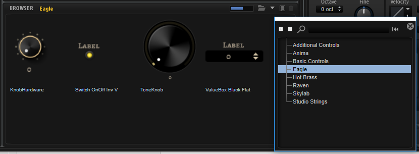

/ [HALion Developer Resource](../../HALion-Developer-Resource.md) / [HALion Macro Page](./HALion-Macro-Page.md) /

# Example Macro Pages

To learn more about macro pages and how to set them up, you can load the presets of Anima, Skylab, Eagle, Raven, Studio Strings, and Hot Brass. All presets of these instruments use macro pages that were entirely built with the **Macro Page Designer**. By exploring these example macro pages you can see how these macro pages are set up and how they are connected to the engine parameters.

1. Load a preset from Anima, Skylab, Eagle, Raven, Studio Strings, or Hot Brass.
1. Open the **Macro Page Designer**.
1. Select the first Layer in the **Program Tree**. The **Macro Page Designer** will display the respective macro page.
1. In the **Macro Page Designer**, explore the **GUI**, **Templates**, and **Ressources** tree.
1. Examine the **Properties** of the selected element in the tree to see how it is connected to the engine and UI parameters.

## Using Templates from the Example Macro Pages

The macro pages of Anima, Skylab, Eagle, Raven, Studio Strings, and Hot Brass are installed as independent VST Sounds for all HALion family products (HALion, HALion Sonic and HALion Sonic SE), which means that you can use the templates from these instruments for your own macro pages, too.

In the **Resource/Library Browser**, you have access to the templates of these macro pages.

1. In the **Resource/Library Browser**, navigate to the library that contains the template that you want to use.
1. Drag the template from the **Resource/Library Browser** to the canvas of your macro page or to a group on the canvas.
