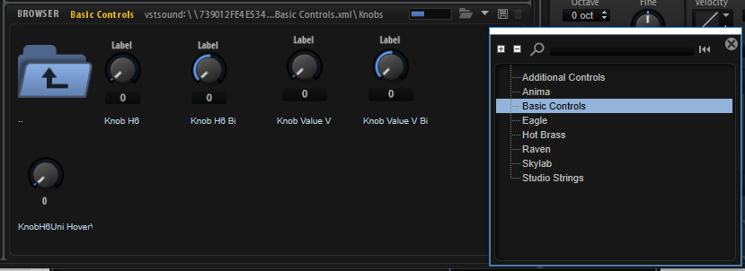
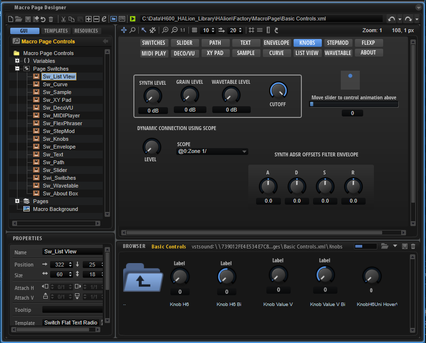

/ [HALion Developer Resource](../../HALion-Developer-Resource.md) / [HALion Macro Page](./HALion-Macro-Page.md) /

# Exploring Templates

## Controls Libraries

HALion provides a large number of preconfigured templates that can directly be used on macro pages. These are packed into two libraries: [Basic Controls](#basic-controls), [Additional Controls](#additional-and-vector-controls) and [Vector Controls](#additional-and-vector-controls).

### Basic Controls

The Basic Controls library contains standard controls like knobs, sliders, text fields, switches, etc., as well as a collection of advanced templates that can be used to accomplish more complex tasks such as loading subpresets or wavetables or control more complex modules like the FlexPhraser, the Step Modulator, or HALion's multi-stage envelope. You can access the libraries using the **Resource/Library Browser** of the **Macro Page Designer**.

The Basic Controls library also contains an example macro page that gives an overview of the available templates.

**To get access to this macro page:**

1. Download the program [Init Basic Controls.vstpreset](../vstpresets/Init%20Basic%20Controls.vstpreset).
1. Drag the program to the **Slot Rack**.

The Basic Controls macro page contains multiple pages to demonstrate the usage of the available templates. Each template examplifies how the connections to the engine and UI parameters have to be set up to work correctly.

**To explore the templates:**

1. In the **Macro Page Designer**, activate **Test Macro Page**  and navigate to the page that contains the template that you want to use.
1. Deactivate **Test Macro Page**  and select the template on the macro page.
1. Examine the **Properties** of the template to see how it is connected to the engine and UI parameters.
1. Click **Edit Element**  to examine how the template is built up.

For further details on the available templates, see the [Templates](./Templates.md) reference pages. 

### Additional and Vector Controls

The Additional Controls library provides further templates for knobs, sliders and switches with a customized look. The Vector Controls library provides templates for knobs, sliders and switches that use SVGs. You can use them just like the templates from the [Basic Controls](#basic-controls) library.
