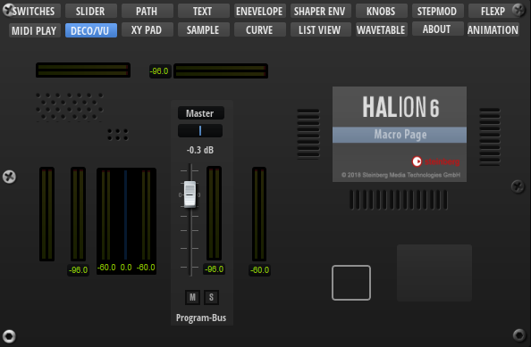

/ [HALion Developer Resource](../../HALion-Developer-Resource.md) / [HALion Macro Page](./HALion-Macro-Page.md) / [Templates](./Templates.md) /

# FX Meter

---

**On this page:**

[[_TOC_]]

---

## Description

The FX Meter template allows you to display input, output, and reduction meters for effects like Compressor, Expander, Limiter, etc. It also contains text controls for peak values and switches for reseting them. The controls are connected by corresponding UI variables. To guarantee the operation of the controls the preconfigured properties must not be modified. The look and the size of the controls can be modified freely including their ressources. Controls that are not needed for your instrument can be omitted on your macro page. For example, if an effect does not need a reduction meter, you can remove it and save this configuration in another template.

**To explore the functionality and connections:**

1. Load the [Init Basic Controls.vstpreset](../vstpresets/Init%20Basic%20Controls.vstpreset) from the [Basic Controls](./Exploring-Templates.md#basic-controls) library.
2. Open the **Macro Page Designer**, go to the **GUI Tree** and navigate to "Pages > Deco and Meter Page". 
3. Select "FX Meter" and click **Edit Element**  to examine the template.

## Template Properties

|Poperty|Description|
|:-|:-|
{{#include ./_Properties.md:name}}
{{#include ./_Properties.md:position-size}}
{{#include ./_Properties.md:attach}}
{{#include ./_Properties.md:tooltip}}
{{#include ./_Properties.md:template}}

## Template Parameters

|Parameters|Description|
|:-|:-|
|**FXType**|Specifies the effect type the controls should connect to. See [Effect Types](#effect-types) for a list of the supported types.|
|**Scope**|Determines to which effect the controls should connect. For example, ``@bus:0/@0:Tube Compressor`` connects the controls to the first effect named Tube Compressor in the first bus.|

### Effect Types

|Module|FX Type|Comment|
|:-|:-|:-|
|Compressor|Compressor|-|
|Expander|Expander|-|
|Limter|Limiter|-|
|Maximizer|Optimiser|-|
|Brickwall Limiter|BrickwallLimiter|-|
|Tube Compressor|TubeCompressor|-|
|Vintage Compressor|VintageCompressor|-|
|Gate|Gate|No reduction meter.|
|Graph EQ|GraphicEQ10|Only output meter.|
|Morph Filter|MorphFilter|Only output meter.|
|DJ EQ|HiFiEq|Only output meter.|

>&#10069; The Studio EQ effect requires the specialized template [Studio EQ Meter](./Studio-EQ-Meter.md).

## Components inside the Template

### Controls and Subtemplates

|Item|Description|
|:-|:-|
|**In_Meter_Left**|A [Meter](./Meter.md) control connected with the left input channel of the effect. Its Value must be set to ``@VUInL`` .|
|**In_Meter_Right**|A [Meter](./Meter.md) control connected with the right input channel of the effect. Its Value must be set to ``@VUInR`` .|
|**Reduction_Meter**|A [Meter](./Meter.md) control connected with the gain reduction output of the effect. Its Value must be set to ``@GainReduction`` .|
|**Out_Meter_Left**|A [Meter](./Meter.md) control connected with the left output channel of the effect. Its Value must be set to ``@VUOutL`` .|
|**Out_Meter_Right**|A [Meter](./Meter.md) control connected with the right output channel of the effect. Its Value must be set to ``@VUOutR`` .|
|**Peak_Input**|A [Group](./Group.md) with two elements:<ul><li>**Peak_In_Reset:** A switch that resets the peak value of the input meter. Its Value must be set to ``@ResetInputVU``.</li><li>**Peak_In_Text:** A text control that displays the peak value of the input meter. Its Value must be set to ``@VUInMax``.</li></ul>|
|**Peak_Output**|A [Group](./Group.md) with two elements:<ul><li>**Peak_Out_Reset:** A switch that resets the peak value of the output meter. Its Value must be set to ``@ResetOutputVU``.</li><li>**Peak_Out_Text:** A text control that displays the peak value of the ouput meter. Its Value must be set to ``@VUOutMax``.</li></ul>|
|**Peak_Reduction**| A [Group](./Group.md) with two elements:<ul><li>**Peak_Reduction_Reset:** A switch that resets the peak value of the reduction meter. Its Value must be set to ``@ResetReduction``.</li><li>**Peak_Reduction_Text:** A text control that displays the peak value of the reduction meter. Its Value must be set to ``@maxgainreduction``.</li></ul>|
|**Back**|An [Image](./Image.md) control that provides the background bitmap for the meters.|
