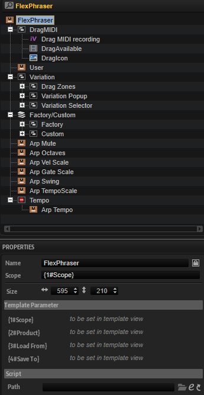

/ [HALion Developer Resource](../../HALion-Developer-Resource.md) / [HALion Macro Page](./HALion-Macro-Page.md) / [Templates](./Templates.md) /

# FlexPhraser

---

**On this page:**

[[_TOC_]]

---

## Description

The FlexPhaser template contains controls for selecting the phrases, adjusting the performance parameters like Swing, Gate Scale, etc., and for using the eight variations of the FlexPhraser MIDI module. In addition, there are controls for recording the MIDI output of the FlexPhraser and to export the recorded phrase via drag and drop.

Functionality such as using the eight variations, exporting the recorded MIDI output, etc., can not be realized with standard macro page controls. The [Internal](./Internal.md) control is used if this is the case. The performance parameters like Swing, Gate Scale, Vel Scale, etc. are connected to the eight variations by corresponding UI variables and they must be part of this template. To guarantee the operation of the performance parameters, the eight variations and the MIDI phrase export, the preconfigured properties must not be modified. The look and the size of the controls can be modified freely. All controls for functions that are not needed for your instrument can be omitted on your macro page.

**To explore the functionality and connections:**

1. Load the [Init Basic Controls.vstpreset](../vstpresets/Init%20Basic%20Controls.vstpreset) from the [Basic Controls](./Exploring-Templates.md#basic-controls) library.
2. Open the **Macro Page Designer**, go to the GUI Tree and navigate to FlexPhraser Page > Arp Parameter. 
3. Select FlexPhaser View and click Edit to examine the template.

>&#10069; The other control templates inside the Arp Parameter group are directly connected to the FlexPhraser MIDI module and should not require detailed explanation. The control template for creating User phrases can be found in the StepSEQ group. See [FlexPhraserStepSeq](./FlexPhraserStepSeq.md) for details.

## Template Properties

|Poperty|Description|
|:-|:-|
{{#include ./_Properties.md:name}}
{{#include ./_Properties.md:position-size}}
{{#include ./_Properties.md:attach}}
{{#include ./_Properties.md:tooltip}}
{{#include ./_Properties.md:template}}

## Template Parameters

|Parameter|Description|
|:-|:-|
|**Scope**|Defines the path to the FlexPhraser MIDI modue that will be controlled.|
|**Product**|Product specifies the root folder for the location of the subpresets, both for loading and saving. Set this to ``HALion`` if you want to load phrases from the standard file path for subpresets. Load From (see below) must be set to ``StepSEQ Phrases``, which specifies the path to the folder that contains the subpresets for the phrases. When saving User phrases, these will be written to ./Documents/Steinberg/HALion/Sub Presets/StepSEQ Phrases on hard disk. They are displayed accordingly in the phrase selector.
If you wish to deliver your own User phrases as part of your library, you can set Product to the name of your instrument, e.g., ``MyProductName``. Thereby, only the User phrases for ``MyProductName`` will be shown in the phrase selector. The location of the User phrases inside the VST Sound of your library must match the path defined by Product and Load From, otherwise the phrase selector will not see these User phrases. Assuming Load From is again set to ``StepSEQ Phrases``: Then, the User phrases must be added to the folder ./*``MyProductName``*/Sub Presets/*``StepSEQ Phrases``* inside the VST Sound. When saving User phrases, these will be written to ./Documents/Steinberg/*``MyProductName``*/Sub Presets/*``StepSEQ Phrases``* on hard disk. They are displayed accordingly in the phrase selector.

You can also include both, the HALion root folder and the root folder of your instrument, by setting Product to ``MyProductName``&vert;``HALion``. The phrase selector will then show the content of both locations. The path for saving a User phrase will use the first entry specified by ``MyProductName`` as root folder.
|
|**Load From**|Load From specifies the subpath to the location of the subpresets inside the root folder. The root folder is set by Product (see above). You can specify this subfolder freely. However, if you want to see the factory phrases, Load From must be set to ``StepSEQ Phrases`` and Product must contain ``HALion``.
Any User phrases you want to distribute with your library must be added to the corresponding location inside the VST Sound. For example, if Load From is set to ``StepSEQ Phrases`` and Product is set just to ``MyProductName``, the subpresets inside the VST Sound must be located at ./*``MyProductName``*/Sub Presets/*``StepSEQ Phrases``*.
|
|**Save To**|Allows you to specify the subpath to the location where the subpresets will be saved by default.<ul><li>If Product has only one entry, either ``Halion`` or the name of your instrument, e.g., ``MyProductName``, then the path of Load From will be included and prepend the path of Save To. See configurations 1 and 2 in the table below.</li><li>If Product has two entries, ``MyProductName``&vert;``HALion``, then only the path of Save To will be used. In this case it makes sense to set Save To to something like this: ``MyProductName``/``MySubfolder``. See configuration 3 in the table below.</li></ul>|

>&#10069; If you need further control over the content locations, you can specify the required subfolder together with the Product: ``MyProductName/StepSEQ Phrases``&vert;``HALion/StepSEQ Phrases``. See configuration 4 in the following table.

#### Content Locations for Different Configurations

|#|Configuration|Content visible in Phrase Selector|Default Save Path|
|:-|:-|:-|:-|
|1|
**Product** = ``HALion``

**Load From** = ``StepSEQ Phrases``

**Save To** = ``MySubfolder``
|Only phrases from HALion, including any phrases the user has saved on hard disk.|./Documents/Steinberg/HALion/Sub Presets/StepSEQ Phrases/MySubfolder|
|2|
**Product** = ``MyProductName``

**Load From** = ``StepSEQ Phrases``

**Save To** = ``MySubfolder``
|Only phrases from the specified library, including any phrases the user has saved with the instrument on hard disk.|./Documents/Steinberg/MyProductName/Sub Presets/StepSEQ Phrases/MySubfolder|
|3|
**Product** = ``MyProductName``&vert;``HALion``

**Load From** = ``StepSEQ Phrases``

**Save To** = ``MyProductName/MySubfolder``
|All phrases from HALion, the specified library and any phrases the user has saved on hard disk.|./Documents/Steinberg/MyProductName/Sub Presets/MyProductName/MySubfolder|
|4|
**Product** = ``MyProductName/StepSEQ Phrases``&vert;``HALion/StepSEQ Phrases``

**Load From** = deactivate, leave empty 

**Save To** = ``MySubfolder``
|All phrases from HALion, the specified library and any phrases the user has saved on hard disk.|./Documents/Steinberg/MyProductName/Sub Presets/StepSEQ Phrases/MySubfolder|

>&#10069; The location of the User phrases inside the VST Sound must match the path defined by Product and Load From, otherwise the phrase selector will not see these User phrases.

## Components inside the Template

### Controls and Subtemplates

To guarantee the operation of the controls and subtemplates, the preconfigured properties must not be modified. The look and the size of the controls can be modified freely. All controls for functions that are not needed for your instrument can be omitted on your macro page.

|Item|Description|
|:-|:-|
|**DragMIDI**|This [Group](./Group.md) contains controls for recording the MIDI output of the FlexPhraser and to export the recorded phrase via drag and drop. <ul><li>**DragIcon:** A [Bitmap](./Bitmap.md) resource that provides the background image of the drag area.</li><li>**DragAvailable:** This [Animation](./Animation.md) control indicates if the MIDI phrase is available for exporting it. The Value of the control must be set to ``@EnableDragMIDI``.</li><li>**Drag MIDI recording:** An [Internal](./Internal.md) control that provides the drag functionality. The View property of the control must be set to ``dragzone_midifile``.</li></ul>|
|**User**|A switch template that allows you to activate the User mode for the current variation. Its Value must be set to ``@UserMode``.|
|**Variation**|A [Group](./Group.md) with three subgroups that provide the necessary elements to switch between variations, to drag variations to the trigger pads, and to open the context menu of the variation switches. The aformentioned functionalities are implemented by [Internal](./Internal.md) controls. Their preconfigured properties should not be modified. Also, the z-order of the subgroups in the GUI Tree is not supposed to change. "Drag Zones" must be topmost, followed by "Variation Popup", and then "Variation Selector" as bottommost group.<ul><li>**Drag Zones:** This group contains the eight [Internal](./Internal.md) controls that provide the functionality for dragging a variation to a trigger pad. The View property of the respective control must be set to ``DragZone1``, ``DragZone2``, ..., or ``DragZone8`` accordingly.</li><li>**Variation Popup:** This group contains the eight [Internal](./Internal.md) controls that provide the context menu of the variation switches. The View property of the respective control must be set to ``ASB1``, ``ASB2``, ..., or ``ASB8`` accordingly.</li><li>**Variation Selector:** This group contains eight exclusive switches to select the active variation. The Value property of all switches must be set to ``@ActiveState`` and the switches must be named ``ASB1``, ``ASB2``, ..., or ``ASB8`` accordingly.</li></ul>|
|**Factory/Custom**|A [Stack](./Stack.md) containing two pages with controls to manage either the FlexPhraser factory phrases or the User phrases.<ul><li>**Factory Phrases:** This [Group](./Group.md) contains the controls required to load and display factory phrases.</li><ul><li>**Select:** This [Switch](./Switch.md) control opens the phrase selector. Its Value must be set to ``@PhraseSelectPopup``.</li><li>**Name:** This [Text](./Text.md) control displays the name of the current phrase. Its Value must be set to ``@phrase``.</li><li>**Background:** A [Bitmap](./Bitmap.md) resource that provides the background image behind the name of the current phrase.</li><li>**Label:** A [Label](./Label.md) control to display a title.</li><li>**Arp KeySwitchFilter:** A switch template that sets the Key Switch and Noises Filter of the FlexPhraser MIDI module. Its Value must be set to ``@FilterNoises``.</li></ul><li>**Custom:** This [Group](./Group.md) contains the controls required to load, save, delete, and display User phrases. Furthermore, there are controls for the additional parameters Arp Mode, Key Replace, Arp Wrap and Arp Quantize of the User mode and there are controls for importing a MIDI file to be used as reference for the Arp Quantize.</li><ul><li>**DropMIDI:** This [Group](./Group.md) contains the controls for importing the MIDI file that is needed for the Arp Quantize.</li><ul><li>**Internal:** This [Internal](./Internal.md) control is required to provide the drop functionality and a context menu to clear the MIDI data buffer. Its View property must be set to ``dropzone_midifile``.</li><li>**FileDropped:** This [Animation](./Animation.md) control indicates whether a file is present. Its Value must be set to ``@EnableGrooveQuantize``.</li><li>**DropIcon:** A [Bitmap](./Bitmap.md) resource that provides the background image of the drop area.</li></ul><li>**Save:** This [Switch](./Switch.md) control opens the dialog for saving User phrases. Its Value must be set to ``@SubPresetSave``. The default location for saving User phrases depends on the settings of the [Template Parameters](#template-parameters). </li><li>**Delete:** This [Switch](./Switch.md) control opens the dialog for deleting User phrases. Its Value must be set to ``@SubPresetDelete``.</li><li>**User Phrases:** This [Group](./Group.md) contains the controls required to load and display User phrases.</li><ul><li>**Select:** This [Switch](./Switch.md) control opens the phrase selector. Its Value must be set to ``@PhraseSelectPopup``. Any User phrases you want to distribute with your library must be added to the corresponding location inside the VST Sound as specifed by Product and Load From, otherwise the phrase selector will not see these User phrases. See [Template Parameters](#template-parameters) for details.</li><li>**Name:** This [Text](./Text.md) control displays the name of the current User phrase. Its Value must be set to ``@UsrArp``.</li><li>**Background:** A [Bitmap](./Bitmap.md) resource that provides the background image behind the name of the current phrase.</li><li>**Label:** A [Label](./Label.md) control to display a title.</li></ul><li>**KeyReplace:** A [Disable](./Disable.md) group for the following parameters. Its Value must be set to ``@showkeyreplace``.</li><ul><li>**Key Replace:** A menu template to specify the Key Replace mode. Its Value must be set to ``@KeyReplace``.</li><li>**Arp Wrap:** A menu template to specify the number of steps for wrapping the arpeggio. Its Value must to be set to ``@Wrap``.</li></ul><li>**Arp Mode:** A menu template to select the Arp Mode.  Its Value must be set to ``@UserArpMode``.</li><li>**Arp Quantize:** A value box template, to set the amount of the groove quantization. Its Value must be set to ``@GrooveQuantizeDepth``.</li></ul>|
|**Arp Mute**|A switch template that allows you to mute the variation. Its Value must be set to ``@Mute``.|
|**Arp Octaves**|A knob template that adjusts the octave range of the variation. Its Value must be set to ``@OctaveRange``.|
|**Arp Vel Scale**|A knob template that adjusts the velocity scale of the variation. Its Value must be set to ``@VelocityScale``.|
|**Arp Gate Scale**|A knob template that adjusts the gate scale of the variation. Its Value must be set to ``@GateScale``.|
|**Arp Swing**|A knob template that adjusts the swing of the variation. Its Value must be set to ``@Swing``.|
|**Arp TempoScale**|A value box template that adjusts the note value of the tempo scale of the variation. Its Value must be set to ``@TempoScale``.|
|**Tempo**|A [Disable](./Disable.md) control that specifies whether the contained "Arp Tempo" template is active. Its Value must be set to ``@Sync``.<ul><li>**Arp Tempo:** A value box template that adjusts the the tempo in bpm. Its Value must be set to ``@Tempo``.</li></ul>|