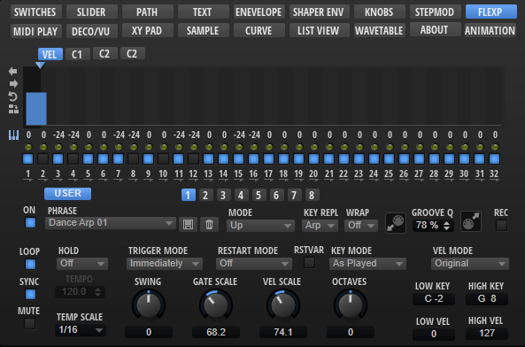

/ [HALion Developer Resource](../../HALion-Developer-Resource.md) / [HALion Macro Page](./HALion-Macro-Page.md) / [Templates](./Templates.md) /

# FlexPhraserStepSeq

---

**On this page:**

[[_TOC_]]

---



## Description

The FlexPhaserStepSeq template allows you to control the User phrase editor of the FlexPhraser. It combines several [Step Modulator](./Step-Modulator.md) controls with additional value boxes for Key Transpose and Key Replace and switches that modifiy the entire phrase. These controls are all preconfigured within the template and use dedicated parameters which are not supposed to change. The look and the size of the controls can be modified freely. All controls for functions that are not needed for your instrument can be omitted on your macro page.

**To explore the functionality and connections:**

1. Load the [Init Basic Controls.vstpreset](../vstpresets/Init%20Basic%20Controls.vstpreset) from the [Basic Controls](./Exploring-Templates.md#basic-controls) library.
2. Open the **Macro Page Designer**, go to the **GUI Tree** and navigate to "Pages > FlexPhraser Page > StepSEQ". 
3. Select "StepSeq" and click **Edit Element**  to examine the template.

>&#10069; The control templates for selecting phrases and for adjusting the performance parameters can be found in the Arp Parameter group. See [FlexPhraser](./FlexPhraser.md) for details.

## Template Properties

|Poperty|Description|
|:-|:-|
{{#include ./_Properties.md:name}}
{{#include ./_Properties.md:position-size}}
{{#include ./_Properties.md:attach}}
{{#include ./_Properties.md:tooltip}}
{{#include ./_Properties.md:template}}

## Template Parameters

|Parameter|Description|
|:-|:-|
|**Scope**|Defines the path to the FlexPhraser MIDI modue that will be controlled. For example: ``@0:FlexPhraser`` controls the first FlexPhraser in the program.|

## Components inside the Template


### UI Variables

These variables are needed to allow the communication between the [Step Modulator](./Step-Modulator.md) control and other controls in the template.

|Variable|Description|Type|Range|
|:-|:-|:-|:-|
|**VarTransp**|List of transpose variables used by the "templatelistview Transpose" template.|string list|@Transpose1 - 32|
|**VarKey**|List of key variables used by the "templatelistview Key" template.|string list|@Key1 - 32|
|**VarTie**|List of tie variables used by the "StepTie" template.|string list|@Tie1 - 32|
|**VarEnable**|List of enable variables used by the "Enable" template.|string list|@Enable1 - 32|
|**VarTransposeKey**|Used to switch between the pages of the "TranspKey" stack.|integer|0, 1|
|**VarKeyLabel**|List of numbers used as labels in the "Enable" template.|string list|1 - 32|
|**VarStepPages**|Used to switch between the pages of the "Step Pages" stack.|integer|0 - 3|

### Controls and Subtemplates

|Item|Description|
|:-|:-|
|**Disable**|A [Disable](./Disable.md) control containing all further elements. It is needed to disable the contained elements if the FlexPhraser variation is not set to User mode. Its Value must be set to ``@UserMode``.|
|**Sw Vel, Sw C1, Sw C2, Sw C3**|These switches are used to switch between the velocity and controller lane pages. The Value is set to ``@VarStepPages`` and the Onvalue is set to the index of the corresponding page.|
|**ArpMod**|A [Stack](./Stack.md) for switching between the pages that contain the controls for selecting the MIDI controller that is sent by the corresponding controller lane. It is switched by the UI Variable ``@VarStepPages``.<ul><li>**Empty Page:** A [Group](./Group.md) without content. It is displayed if the velocity lane is selected.</li><li>**Ctrl1/2/3:** These Groups contain the templates for selecting the MIDI controller of the corresponding controller lane.</li><ul><li>**MIDI Ctrl1/2/3:** The templates for selecting the MIDI controller. Their values must be set to ``@UsrCC1``, ``@UsrCC1``, ``@UsrCC2``, or ``@UsrCC3`` accordingly.</li><li>**MIDI Ctrl Label:** The label for the parameters.</li></ul></ul>|
|**LED pages**|A [Stack](./Stack.md) that switches between two LED chain bitmap displays, "LED Chain Off" and "LED Chain". They are both identical. "LED Chain Off" is not connected to the engine and is used when User mode is set to off. "LED Chain" is connected to the engine via ``@CurrentStep``.|
|**StepTie**|A [Template List](./Template-List.md) that controls the Tie parameter of the 32 steps. It uses the "StepTie" template as a switch. The switch will be disabled if the length of the phrase is smaller than the index of the corresponding step. This is controlled by ``@disableStepParams`` which is defined and managed in the UI script FlexPhraserStepSeq.lua that is attached to the FlexPhraserStepSeq template. See [UI Script](#ui-script) for details.|
|**Enable**|A [Template List](./Template-List.md) used to control the Enable parameter of the 32 steps. It uses the "StepSwitch OnOff " template as a switch. The switch will be disabled if the length of the phrase is smaller than the index of the corresponding step. This is is controlled by ``@disableStepParams`` which is defined and managed in the UI script FlexPhraserStepSeq.lua that is attached to the FlexPhraserStepSeq template. See [UI Script](#ui-script) for details. The Label parameter uses the stringlist variable ``@VarKeyLabel`` to set the label for each step.|
|**TranspKey**|A [Stack](./Stack.md) switching between the Key Transpose and Key Replace values. This is controlled by the [UI variable](#ui-variables) ``@VarTransposeKey``. These values are managed by "templatelistview Transpose" and "templatelistview Key". "templatelistview Transpose" uses the string list variable ``@VarTrans``. "templatelistview Key" uses the string list variable ``@VarKey``. Both will be disabled if the length of the phrase is smaller than the index of the corresponding step. This is is controlled by ``@disableStepParams`` which is defined and managed in the UI script FlexPhraserStepSeq.lua that is attached to the FlexPhraserStepSeq template. See [UI Script](#ui-script) for details.
|**Sw_TranspKey**|A [Switch](./Switch.md) that toggles between the Key Transpose and Key Replace values. Connected to the "TranspKey" stack by the [UI variable](#ui-variables) ``@VarTranposeKey``.|
|**Duplicate**|A push button that duplicates the active steps. Connected by the internal variable ``@Duplicate``. This works only inside the FlexPhraserStepSeq template.|
|**Reverse**|A push button that reverses the order of the active steps. Connected by the internal variable ``@Reverse``. This works only inside the FlexPhraserStepSeq template.|
|**ShiftRight**|A push button that shifts the active steps to the right. Connected by the internal variable ``@ShiftPhraseRight``. This works only inside the FlexPhraserStepSeq template.|
|**ShiftLeft**|A push button that shifts the active steps to the left. Connected by the internal variable ``@ShiftPhraseLeft``. This works only inside the FlexPhraserStepSeq template.|
|**PatternLength**|A [Slider](./Slider.md) to change the number of steps. Connected by ``@PatternLength`` which is defined and managed in the UI script FlexPhraserStepSeq.lua that is attached to the FlexPhraserStepSeq template. See [UI Script](#ui-script) for details.|
|**Step Pages**|A [Stack](./Stack.md) that contains four [Step Modulator](./Step-Modulator.md) controls, one for the step velocity and three for the available controller lanes. It is switched by the [UI variable](#ui-variables) ``@VarStepPages``.<ul><li>**stepmodulator:** A [Step Modulator](./Step-Modulator.md) controlling the step velocity. The required setting for Formats is ``Level%d;Length%d;Enable%d``. This allows to control the level, the length, and the enable state of the steps. This setting only works inside the FlexPhraserStepSeq template.</li><li>**stepmodulator C1:** A [Step Modulator](./Step-Modulator.md) for controlling the first controller lane. The required setting for Formats is ``Control1_%d``. This allows to control the level of each step in the controller lane. This setting only works inside the FlexPhraserStepSeq template.</li><li>**stepmodulator C2:** A [Step Modulator](./Step-Modulator.md) for controlling the second controller lane. The required setting for Formats is ``Control2_%d``. This allows to control the level of each step in the controller lane. This setting only works inside the FlexPhraserStepSeq template.</li><li>**stepmodulator C3:** A [Step Modulator](./Step-Modulator.md) for controlling the third controller lane. The required setting for Formats is ``Control3_%d``. This allows to control the level of each step in the controller lane. This setting only works inside the FlexPhraserStepSeq template.</li></ul>|

### UI Script

```lua
-- FlexPhraserStepSeq.lua  (Manages the disable state of the steps)

function onStepCountChanged()  
  step = math.floor (StepCount+0.5)

  for i = 1, step, 1 do
    _G["disableStep"..tostring(i)] = 0
  end

  for i=step + 1, 32, 1 do
	_G["disableStep"..tostring(i)] = 1
  end
end

defineParameter("StepCount", nil, 1, 1, 32, onStepCountChanged)

disableStepParams = {}
for i=1,32,1 do
	disableStepParams[i]="@disableStep"..tostring(i);
	defineParameter("disableStep"..tostring(i), nil, 0,0,1)	
end

defineParameter("disableStepParams", nil, 1, disableStepParams)
```