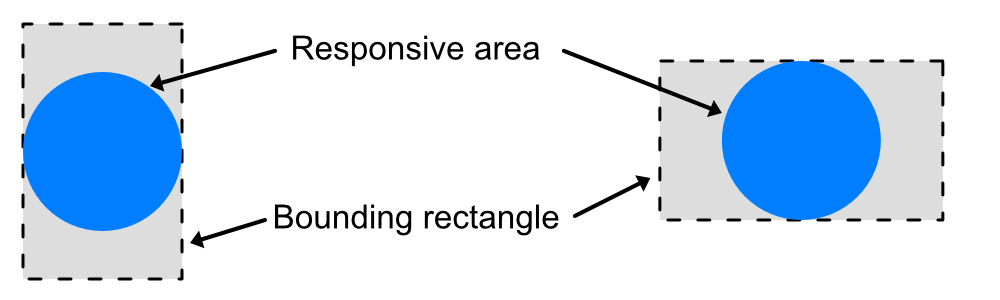

/ [HALion Developer Resource](../../HALion-Developer-Resource.md) / [HALion Macro Page](./HALion-Macro-Page.md) / [Controls](./Controls.md) /

# Knob

{{#include ../../_Version.md:halion700-svg}}

## Description

The Knob control allows to create potentiometers by using a [Bitmap](./Bitmap.md) resource, a [Section](./Section.md) resource with frames, or a SVG resource. These frames are played as an animation when turning the knob. You can specify whether the Knob control reacts on its entire area or only on those parts where the alpha channel of the bitmap is bigger than 0 (Shaped). Furthermore, the movement of the Knob control can be inverted and set to be Scalable, which allows resizing of the bitmap. The Slider option can be used to display a pop-up slider when using the knob, which can be helpful when working with rather small Knob controls.

## Properties

|Poperty|Description|
|:-|:-|
{{#include ./_Properties.md:name}}
{{#include ./_Properties.md:position-size}}
{{#include ./_Properties.md:attach}}
{{#include ./_Properties.md:tooltip}}
{{#include ./_Properties.md:value}}
{{#include ./_Properties.md:show-value}}
{{#include ./_Properties.md:bitmap-svg}}
|**Style**|<ul><li>**Invert:** Inverts the knob animation.</li><li>**Shaped:** If this is activated, the control only reacts on filled pixels, transparent pixels with an alpha channel value of 0 are unresponsive.</li><li>**Rectangle:** By default, the Knob control's reaction area is a circular area with a diameter of the shorter side of the the bounding rectangle of the Knob control, which is then centred along the axis of the longer side of the bounding rectangle. Activate this option if you want the knob to respond to mouse clicks in the entire bounding rectangle. {{#include ../../_Version.md:halion700}}

</li><li>**Scalable:** {{#include ./_Properties.md:scalable}} The margin splitters are defined as for simple bitmaps, but the lower splitter must be set in the lowest subframe. On round knobs, leave margins on 0 and set the Scale Mode to stretch for the [Bitmap](./Bitmap.md) resource. This way, the Knob control is resized as a whole.</li><li>**Slider:** Activate this option if you want to use a pop-up slider when adjusting the knob.</li></ul>|
