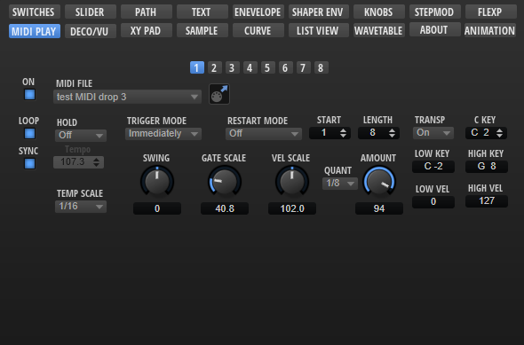
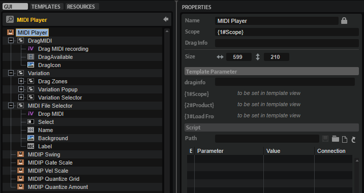

/ [HALion Developer Resource](../../HALion-Developer-Resource.md) / [HALion Macro Page](./HALion-Macro-Page.md) / [Templates](./Templates.md) /

# MIDI Player

---

**On this page:**

[[_TOC_]]

---

## Description

The MIDI Player template contains controls for selecting MIDI files, adjusting the performance parameters like Swing, Gate Scale, etc., and for using the eight variations of the MIDI Player module. In addition, there are controls for exporting the current MIDI File via drag and drop.

Functionality such as using the eight variations, exporting the current MIDI file, etc., cannot be realized with standard macro page controls. The [Internal](./Internal.md) control is used if this is the case. The performance parameters like Swing, Gate Scale, Vel Scale, etc. are connected to the eight variations by corresponding UI variables and they must be part of this template. To ensure the operation of the performance parameters, the eight variations and the MIDI file export, the preconfigured properties must not be modified. The look and the size of the controls can be modified freely. All controls for functions that are not needed for your instrument can be omitted on your macro page.

**To explore the functionality and connections:**

1. Load the [Init Basic Controls.vstpreset](../vstpresets/Init%20Basic%20Controls.vstpreset) from the [Basic Controls](./Exploring-Templates.md#basic-controls) library.
2. Open the **Macro Page Designer**, go to the **GUI Tree** and navigate to "Pages > MIDI Player Page > MIDI Player Parameter". 
3. Select "MIDI Player Template" and click **Edit Element**  to examine the template.

>&#10069; The other control templates inside the MIDI Player Parameter group are directly connected to the MIDI Player module and do not require detailed explanation.

## Template Properties

|Poperty|Description|
|:-|:-|
{{#include ./_Properties.md:name}}
{{#include ./_Properties.md:position-size}}
{{#include ./_Properties.md:attach}}
{{#include ./_Properties.md:tooltip}}
{{#include ./_Properties.md:template}}

## Template Parameters

|Parameter|Description|
|:-|:-|
|**Scope**|Defines the path to the MIDI Player module to be controlled. For example: ``@0:MIDI Player`` controls the first MIDI Player module in the program.|
|**Product**|Product specifies the root folder for the location of the MIDI files (.mid). Set this to ``HALion`` if you want to load MIDI files from the standard file path for subpresets. Load From (see below) must be set to ``MIDI Files``, which specifies the path to the folder that contains the MIDI files.
If you wish to deliver your own MIDI files as part of your library, you can set Product to the name of your instrument, e.g., ``MyProductName``. Thereby, only the MIDI files for ``MyProductName`` will be shown in the MIDI files selector. The location of your MIDI files inside the VST Sound of your library must match the path defined by Product and Load From, otherwise the MIDI file selector will not see them. Assuming Load From is again set to ``MIDI Files``: Then, the MIDI files must be added to the folder ./*``MyProductName``*/Sub Presets/*``MIDI Files``* inside the VST Sound.

You can also include both, the HALion root folder and the root folder of your instrument, by setting Product to ``MyProductName``&vert;``HALion``. The MIDI file selector will then show the content of both locations.
|
|**Load From**|Load From specifies the subpath to the location of the MIDI files inside the root folder. The root folder is set by Product (see above). You can specify this subfolder freely. However, if you want to see the factory MIDI files, Load From must be set to ``MIDI Files`` and Product must contain ``HALion``.
Any MIDI files you want to distribute with your library must be added to the corresponding location inside the VST Sound. For example, if Load From is set to ``MIDI Files`` and Product is set just to ``MyProductName``, the subpresets inside the VST Sound must be located at ./*``MyProductName``*/Sub Presets/*``MIDI Files``*.
|

### Content Locations for Different Configurations

|#|Configuration|Content visible in MIDI File Selector|
|:-|:-|:-|
|1|
**Product** = ``HALion``

**Load From** = ``MIDI Files``
|Only MIDI files from HALion, including any MIDI files the user has saved on hard disk.|
|2|
**Product** = ``MyProductName``

**Load From** = ``MIDI Files``
|Only MIDI files from the specified library.|
|3|
**Product** = ``MyProductName``&vert;``HALion``

**Load From** = ``MIDI Files``
|All MIDI files from HALion, the specified library and any MIDI files the user has saved on hard disk.|

>&#10069; The location of the MIDI files inside the VST Sound must match the path defined by the Product and Load From parameters, otherwise the MIDI File selector cannot access them.

## Components inside the Template

### Controls and Subtemplates

To ensure the operation of the controls and subtemplates, the preconfigured properties must not be modified. The look and the size of the controls can be modified freely. All controls for functions that are not needed for your instrument can be omitted on your macro page.

|Item|Description|
|:-|:-|
|**DragMIDI**|This [Group](./Group.md) contains controls for exporting the current MIDI file via drag and drop. <ul><li>**DragIcon:** An [Image](./Image.md) control that provides the background bitmap of the drag area.</li><li>**DragAvailable:** This [Animation](./Animation.md) control indicates if the MIDI file is available for exporting it. The Value of the control must be set to ``@EnableDragMIDI``.</li><li>**Drag MIDI recording:** An [Internal](./Internal.md) control that provides the drag functionality. The View property of the control must be set to ``dragzone_midifile``.</li></ul>|
|**Variation**|A [Group](./Group.md) with three subgroups that provide the necessary elements to switch between variations, to drag variations to the trigger pads, and to open the context menu of the variation switches. The aformentioned functionalities are implemented by [Internal](./Internal.md) controls. Their preconfigured properties should not be modified. Also, the z-order of the subgroups in the GUI Tree is not supposed to change. "Drag Zones" must be topmost, followed by "Variation Popup", and then "Variation Selector" as bottommost group.<ul><li>**Drag Zones:** This group contains the eight [Internal](./Internal.md) controls that provide the functionality for dragging a variation to a trigger pad. The View property of the respective control must be set to ``DragZone1``, ``DragZone2``, ..., or ``DragZone8`` accordingly.</li><li>**Variation Popup:** This group contains the eight [Internal](./Internal.md) controls that provide the context menu of the variation switches. The View property of the respective control must be set to ``ASB1``, ``ASB2``, ..., or ``ASB8`` accordingly.</li><li>**Variation Selector:** This group contains eight exclusive switches to select the active variation. The Value property of all switches must be set to ``@ActiveState`` and the switches must be named ``ASB1``, ``ASB2``, ..., or ``ASB8`` accordingly.</li></ul>|
|**MIDI File Selector**|This [Group](./Group.md) contains controls for selecting MIDI files and for loading MIDI files from disk using drag and drop.<ul><li>**Drop MIDI:** This [Internal](./Internal.md) control is required to provide the drop functionality for loading MIDI files. Its View property must be set to ``dropzone_midifile``. The dropped MIDI files are always saved to the ./HALion/Subpresets/MIDI Files/User folder.</li><li>**Select:** This [Switch](./Switch.md) control opens the MIDI file selector. Its Value must be set to ``@PhraseSelectPopup``.</li><li>**Name:** A [Text](./Text.md) control to display the name of the current phrase. Its Value must be set to ``@Filename``.</li><li>**Background:** An [Image](./Image.md) control that provides the background bitmap for the MIDI file name.</li><li>**Label:** A [Label](./Label.md) control for the file selector.</li></ul>|
|**MIDIP Swing**|A knob template that adjusts the swing of the variation. Its Value must be set to ``@Swing``.|
|**MIDIP Gate Scale**|A knob template that adjusts the gate scale of the variation. Its Value must be set to ``@GateScale``.|
|**MIDIP Vel Scale**|A knob template that adjusts the velocity scale of the variation. Its Value must be set to ``@VelocityScale``.|
|**MIDIP Quantize Grid**|A menu template for selecting the note value of the quantization grid of the variation. Its Value must be set to ``@QuantizeGrid``.|
|**MIDIP Quantize Amount**|A knob template that adjusts the amount of quantization for the MIDI file of the variation. Its Value must be set to ``@QuantizeAmount``.|