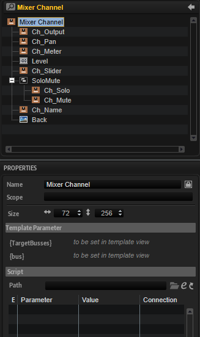

/ [HALion Developer Resource](../../HALion-Developer-Resource.md) / [HALion Macro Page](./HALion-Macro-Page.md) / [Templates](./Templates.md) /

# Mixer Channel

---

**On this page:**

[[_TOC_]]

---

## Description

The Mixer Channel template contains all necessary controls for the parameters of a bus. The controls are connected by corresponding UI variables. To guarantee the operation of the controls the preconfigured properties must not be modified. The look and the size of the controls can be modified freely including their ressources. Controls that are not needed for your instrument can be omitted on your macro page.

**To explore the functionality and connections:**

1. Load the [Init Basic Controls.vstpreset](../vstpresets/Init%20Basic%20Controls.vstpreset) from the [Basic Controls](./Exploring-Templates.md#basic-controls) library.
2. Open the **Macro Page Designer**, go to the **GUI Tree** and navigate to "Pages > Deco and Meter Page". 
3. Select "Mixer Channel" and click **Edit Element**  to examine the template.

## Template Properties

|Poperty|Description|
|:-|:-|
{{#include ./_Properties.md:name}}
{{#include ./_Properties.md:position-size}}
{{#include ./_Properties.md:attach}}
{{#include ./_Properties.md:tooltip}}
{{#include ./_Properties.md:template}}

## Template Parameters

|Parameters|Description|
|:-|:-|
|**TargetBusses**|Allows you to specify the selectable output busses. For example, if your instrument contains the busses Bus A, Bus B and Bus C and you set TargetBusses to ``buslist='Bus A; Bus B'``, only Bus A and Bus B will be shown in the output selector of the channel. Bus C will not be shown. For more options, see Ch_Output below.|
|**bus**|Determines to which bus the controls should connect. For example, ``@bus:0`` connects the controls to the first bus in the program.|

## Components inside the Template

### Controls and Subtemplates

|Item|Description|
|:-|:-|
|**Ch_Output**|This template contains the necessary elements to specify the output of a bus. It contains the following elements:<ul><li>**Menu:** A [Menu](./Menu.md) control that opens a context menu showing the available outputs. The Value must be set to ``@TargetBusMenu``.</li><li>**Name:** A [Text](./Text.md) control showing the name of the selected output. The Value must be set to ``@TargetBusMenu``.</li><li>**Image:** An [Image](./Image.md) control that provides the background bitmap.</li></ul>To specify the outputs that are made available in the menu, you can configure Menu by adding one of the following tags to its Value property:<ul><li>**{TargetBusses}:** Set this to evaluate the busses provided by the TargetBusses parameter of the Mixer Channel template. </li><li>**default:** Set this to route the output to the default bus (usually the next bus higher up in the hierarchy).</li><li>**default='name':** Same as above, but 'name' is shown as text instead of '--'.</li><li>**local:** Set this to show all available busses higher up in the hierarchy.</li><li>**buslist='BusName1; BusName2; ...':** Allows to specify a list of busses.</li><li>**aux:** Shows the plug-in aux busses.</li><li>**noplug:** Hides the plug-in output busses.</li></ul>For example, ``@TargetBusMenu local aux noplug`` shows only the busses higher up in the hierarchy and the aux busses, but none of the plug-in outputs in the menu.|
|**Ch_Pan**|This template contains the necessary elements to control the pan parameter of the bus. It contains the following elements:<ul><li>**Slider:** A [Slider](./Slider.md) control. The Value of this control is exported to the Ch_Pan template and must be set to ``@Pan``.</li><li>**Image:** An [Image](./Image.md) control that provides the background bitmap.</li></ul>|
|**Ch_Meter**|This template references the Bus Meter V Peak template. The PeakReset and PeakValue template parameters are exported values from inside the template. By using ``{bus}`` these parameters evaluate the bus provided by the corresponding parameter of the Mixer Channel template. ``/@id:21`` and ``/@id:19`` connects them to the peak reset and peak value parameters of the specified bus. The template contains the following elements:<ul><li>**switch:** A [Switch](./Switch.md) control that resets the peak value of the bus. Its Value is exported as PeakReset.</li><li>**text:** A [Text](./Text.md) control that displays the peak value of the bus. Its Value is exported as PeakValue</li><li>**image:** An [Image](./Image.md) control that provides the background bitmap for the text.</li><li>**vumeter:** A [Meter](./Meter.md) control for the right channel of a stereo bus. Its Value must be set to ``@meter1`` and its Peak Value to ``@peak1``.</li><li>**vumeter:** A [Meter](./Meter.md) control for the left channel of a stereo bus. Its Value must be set to ``@meter0`` and its Peak Value to ``@peak0``.</li><li>**Back:** An [Image](./Image.md) control that provides the background bitmap for the meters.</li></ul>|
|**Ch_Level**|A [Text](./Text.md) control showing the value of the level slider. The Value property must be set to ``@LogLevel``.|
|**Ch_Slider**|This template contains the necessary elements to control the level of the bus. It contains the following elements:<ul><li>**Slider:** A [Slider](./Slider.md) control. The Value is exported to the template and must be set to ``@LogLevel``.</li><li>**Scale:** An [Image](./Image.md) control showing a dB scale.</li><li>**Guide:** An [Image](./Image.md) control showing the slider guidance.</li></ul>|
|**SoloMute**|A [Group](./Group.md) control with two templates: Ch_Mute and Ch_Solo. They provide the solo/mute functionality of the bus.<li>**Ch_Solo:** This template contains the necessary elements to control and show the solo state of the bus. It contains the following elements:</li><ul><li>**Switch:** An invisible [Switch](./Switch.md) control which contains a hover overlay that lights up the underlying VisualState animation control when hovering over it. The Value is exported to the template and must be set to ``@Solo Layer``.</li><li>**VisualState:** An [Animation](./Animation.md) control showing the solo state (Solo Off, Solo On, or Implicit Solo). The Value is exported to the template and must be set to ``@Solo State``.</li></ul><ul><li>**Ch_Mute:** This template contains the necessary elements to control and show the mute state of the bus. It contains the following elements:</li><ul><li>**Switch:** An invisible [Switch](./Switch.md) control which contains a hover overlay that lights up the underlying VisualState animation control when hovering over it. The Value is exported to the template and must be set to ``@Mute Layer``.</li><li>**VisualState:** An [Animation](./Animation.md) control showing the mute state (Mute Off, Mute On, or Implicit Mute). The Value is exported to the template and must be set to ``@Mute State``.</li></ul>|
|**Ch_Name**|This template references the ObjectName template. It displays the name of the object in which it is located. In this case it will display the name of the connected bus. The template contains only one element:<ul><li>**Text:** A read-only [Text](./Text.md) control with Value set to ``@name``. This connection only works inside this template.</li></ul>|
|**Back:**|An [Image](./Image.md) control that provides the background bitmap.|