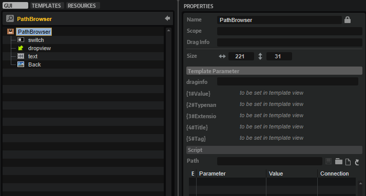

/ [HALion Developer Resource](../../HALion-Developer-Resource.md) / [HALion Macro Page](./HALion-Macro-Page.md) / [Templates](./Templates.md) /

# Path Browser

---

**On this page:**

[[_TOC_]]

---

## Description

The Path Browser is a preconfigured template that can be used to open folders and objects, such as sample files, for example. The template can be configured with the available [Template Parameters](#template-parameters). The look of the controls can be adapted freely by changing the components inside the template. The template also accepts the drop of folders or files from sources like the Explorer or Finder. When clicking the open icon, the OS file browser opens that lets you choose the folder and file. By Clicking OK this file path is set for the parameter that is connected to the Value parameter of the template.

**To explore the functionality and connections:**

1. Load the [Init Basic Controls.vstpreset](../vstpresets/Init%20Basic%20Controls.vstpreset) from the [Basic Controls](./Exploring-Templates.md#basic-controls) library.
2. Open the **Macro Page Designer**, go to the **GUI Tree** and navigate to "Pages > Path & Preset Page". 
3. Select "Sample Path - PathBrowser" and click **Edit Element**  to examine the template.

## Template Properties

|Poperty|Description|
|:-|:-|
{{#include ./_Properties.md:name}}
{{#include ./_Properties.md:position-size}}
{{#include ./_Properties.md:attach}}
{{#include ./_Properties.md:tooltip}}
{{#include ./_Properties.md:template}}

## Template Parameters

|Parameters|Description|
|:-|:-|
|**Value**|Connect the parameter that requires a path and file name here.|
|**Typename**|Allows you to specify the name of the file type filter that will be shown in the OS file browser.|
|**Extension**|Allows you to specify a file type filter like .wav or .aiff, so that the OS file browser only shows files of that type.|
|**Title**|Allows you to specify the title of the OS file browser that will be shown in the caption.|
|**Tag**|Allows you to specify an unique identifier that is used to memorize the location at which you left the OS file browser the last time. All path browsers that use this tag will point to the same last location.|

## Components inside the Template

### Controls and Subtemplates

|Item|Description|
|:-|:-|
|**switch:**|A [Switch](./Switch.md) that opens the OS file browser. Its Value must be set to ``@Browser``.|
|**dropview:**|A [Drop](./Drop.md) control for dropping files and folders. Its Value must be set to ``@Path``. The regular expression for the Accept Filter uses the file extension that is specified by the Extension parameter of the template.|
|**text:**|A [Text](./Text.md) control for displaying the path. Its Value must be set to ``@Path``.|
|**Back:**|An [Image](./Image.md) control that provides the background bitmap for the path.|
