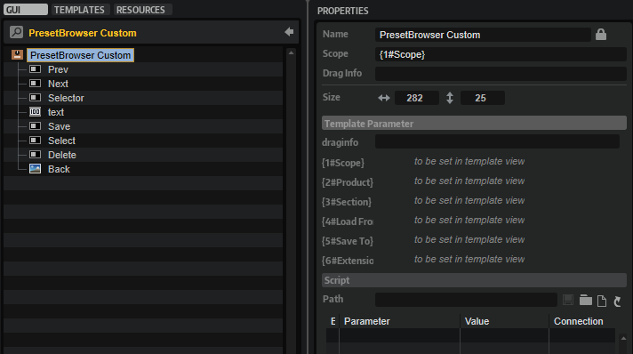

/ [HALion Developer Resource](../../HALion-Developer-Resource.md) / [HALion Macro Page](./HALion-Macro-Page.md) / [Templates](./Templates.md) /

# Preset Browser Custom

---

**On this page:**

[[_TOC_]]

---

## Description

PresetBrowser Custom is a preconfigured template that can be used to manage subpresets, such as the presets of a MIDI script module or an audio effect, for example. The Scope parameters determines for which module, effect, or zone the preset management applies. The optional Section determines for which part of a zone the preset management applies. The parameters Product, Load From, and Save To define the locations for loading and saving presets. The look of the controls can be adapted freely by changing the components inside the template. The template contains switches for Load, Save, and Delete which open the corresponding dialogs.

**To explore the functionality and connections:**

1. Load the [Init Basic Controls.vstpreset](../vstpresets/Init%20Basic%20Controls.vstpreset) from the [Basic Controls](./Exploring-Templates.md#basic-controls) library.
2. Open the **Macro Page Designer**, go to the **GUI Tree** and navigate to "Pages > Path & Preset Page". 
3. Select "Subpresets LFO - Custom" and click **Edit Element**  to examine the template.

## Template Properties

|Poperty|Description|
|:-|:-|
{{#include ./_Properties.md:name}}
{{#include ./_Properties.md:position-size}}
{{#include ./_Properties.md:attach}}
{{#include ./_Properties.md:tooltip}}
{{#include ./_Properties.md:template}}

## Template Parameters

The template provided with the Init Basic Controls.vstpreset uses LFO1 of the zone as example. The following description uses the Multi Delay effect as example. This way you have two examples you can try out for getting a better understanding of the PresetBrowser Custom template.

|Parameters|Description|
|:-|:-|
|**Scope**|The Scope parameter determines for which module or effect the preset management applies. For example, by setting Scope to ``@bus:0/@0:Multi Delay`` the preset management applies to the first effect named Multi Delay in the first bus.|
|**Product**|Product specifies the root folder for the location of the subpresets, both for loading and saving. Set this to ``HALion`` if you want to load presets from the standard file path for subpresets. Load From (see below) must be set to the path of the folder that contains the subpresets for the specified effect, e.g., ``Fx/Delay/Multi Delay`` for the subpresets of the Multi Delay. When saving User subpresets, these will be written to ./Documents/Steinberg/HALion/Sub Presets/ plus the path specified by Load From, e.g., ./Documents/Steinberg/HALion/Sub Presets/Fx/Delay/Multi Delay. They are displayed with a user icon in the preset selector.
If you wish to deliver your own subpresets as part of your library, you can set Product to the name of your instrument, e.g., ``MyProductName``. Thereby, only the subpresets for ``MyProductName`` will be shown in the preset selector. The location of the subpresets inside the VST Sound of your library must match the path defined by Product and Load From, otherwise the preset selector will not see these subpresets. Assuming Load From is again set to ``Fx/Delay/Multi Delay``: Then, the subpresets must be added to the folder ./*``MyProductName``*/Sub Presets/*``Fx/Delay/Multi Delay``* inside the VST Sound. If the user saves subpresets, these will be written to ./Documents/Steinberg/*``MyProductName``*/Sub Presets/*``Fx/Delay/Multi Delay``* on hard disk. They are displayed with a user icon in the preset selector.

You can also include both, the HALion root folder and the root folder of your instrument, by setting Product to ``MyProductName``&vert;``HALion``. The preset selector will then show the content of both locations. The path for saving a User subpreset will use the first entry specified by ``MyProductName`` as root folder.
|
|**Section**|Sections divide parameters into related units. For example, the parameters of zones are divided into sections like Filter, Amp, etc. The Section determines for which parameters the preset management applies. The section names can be found in the Parameter List. For example, set Section to ``Amp Env`` to load/save subpresets only for the amp envelope of a zone. If Section is not set, the preset management applies for the entire module, effect, or zone. Defining Section creates a subfolder in the subpreset path that corresponds to the name of the section. Sections can also be used within scripts. See [onLoadSubPreset](../../HALion-Script/pages/onLoadSubPreset.md) and [onSaveSubPreset](../../HALion-Script/pages/onSaveSubPreset.md) for details.|
|**Load From**|Load From specifies the subpath to the location of the subpresets inside the root folder. The root folder is set by Product (see above). You can specify this subfolder freely. However, if you want to see the factory subpresets, Load From must be set to the path that corresponds to the module or effect specified by Scope and Product must contain ``HALion``.
Any subpresets you want to distribute with your library must be added to the corresponding location inside the VST Sound. For example, if Load From is set to ``Fx/Delay/Multi Delay`` and Product is set just to ``MyProductName``, the subpresets inside the VST Sound must be located at ./*``MyProductName``*/Sub Presets/*``Fx/Delay/Multi Delay``*.
|
|**Save To**|Allows you to specify the subpath to the location where the subpresets will be saved by default.<ul><li>If Product has only one entry, either ``Halion`` or the name of your instrument, e.g., ``MyProductName``, then the path of Load From will be included and prepend the path of Save To. See configurations 1 and 2 in the table below.</li><li>If Product has two entries, e.g., ``MyProductName``&vert;``HALion``, then only the path of Save To will be used. In this case it makes sense to set Save To to something like this: ``MyProductName``/``MySubfolder``. See configuration 3 in the table below.</li><li>If you need further control over the content locations, you can specify the required subfolder together with the Product: ``MyProductName/Fx/Delay/Multi Delay``&vert;``HALion/Fx/Delay/Multi Delay``. See configuration 4 in the following table.</ul>|
|**Extension**|Allows you to specify a file type filter, so that preset browser only shows files of that type. By default, the preset selector uses .halpreset as file type, which is the common file type for HALion subpresets. If you want to load VST presets, e.g., to exchange layers using a script, set the file type to .vstpreset.|

### Content Locations for Different Configurations

|#|Configuration|Content visible in Preset Selector|Default Save Path|
|:-|:-|:-|:-|
|1|
**Product** = ``HALion``

**Load From** = ``Fx/Delay/Multi Delay``

**Save To** = ``MySubfolder``
|Only subpresets from HALion, including any subpresets the user has saved on hard disk.|./Documents/Steinberg/HALion/Sub Presets/Fx/Delay/Multi Delay/MySubfolder|
|2|
**Product** = ``MyProductName``

**Load From** = ``Fx/Delay/Multi Delay``

**Save To** = ``MySubfolder``
|Only subpresets from the specified library, including any subpresets the user has saved with the instrument on hard disk.|./Documents/Steinberg/MyProductName/Sub Presets/Fx/Delay/Multi Delay/MySubfolder|
|3|
**Product** = ``MyProductName``&vert;``HALion``

**Load From** = ``Fx/Delay/Multi Delay``

**Save To** = ``MyProductName/MySubfolder``
|All subpresets from HALion, the specified library and any subpresets the user has saved on hard disk.|./Documents/Steinberg/MyProductName/Sub Presets/MyProductName/MySubfolder|
|4|
**Product** = ``MyProductName/Fx/Delay/Multi Delay``&vert;``HALion/Fx/Delay/Multi Delay``

**Load From** = deactivate, leave empty 

**Save To** = ``MySubfolder``
|All subpresets from HALion, the specified library and any subpresets the user has saved on hard disk.|./Documents/Steinberg/MyProductName/Sub Presets/Fx/Delay/Multi Delay/MySubfolder|

>&#10069; The location of the subpresets inside the VST Sound must match the path defined by Product and Load From, otherwise the preset selector will not see these subpresets. If libraries deliver subpresets in multiple VST Sounds, all subpresets with the same path will be shown together in the preset selector.

## Components inside the Template

### Controls and Subtemplates

|Item|Description|
|:-|:-|
|**Prev**|A [Switch](./Switch.md) control to load the previous preset. Its Value must be set to ``@SubPresetPrev``.|
|**Next**|A [Switch](./Switch.md) control to load the next preset. Its Value must be set to ``@SubPresetPrev``.|
|**Selector**|A [Switch](./Switch.md) control to open the preset selector. Its Value must be set to ``@SubPresetSelectPopup``.|
|**text**|A [Text](./Text.md) control to display the name of the preset. Its Value must be set to ``@SubPresetName``.|
|**Save**|A [Switch](./Switch.md) control to open the save dialog. Its Value must be set to ``@SubPresetSave``.|
|**Select**|A [Switch](./Switch.md) control to open the preset selector. Its Value must be set to ``@SubPresetSelectPopup``.|
|**Delete**|A [Switch](./Switch.md) control to open the delete dialog. Its Value must be set to ``@SubPresetDelete``.|
|**Back**|An [Image](./Image.md) control that provides the background bitmap for the preset name.|