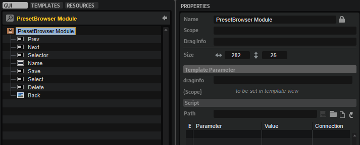

/ [HALion Developer Resource](../../HALion-Developer-Resource.md) / [HALion Macro Page](./HALion-Macro-Page.md) / [Templates](./Templates.md) /

# Preset Browser

---

**On this page:**

[[_TOC_]]

---

## Description

PresetBrowser Module is a preconfigured template that can be used to manage subpresets, such as the presets of a MIDI script module or an audio effect, for example. The Scope parameter determines for which module or effect the preset management applies. The look of the controls can be adapted freely by changing the components inside the template. The template contains switches for Load, Save, and Delete which open the corresponding dialogs.

The PresetBrowser Module template uses the default file path for loading and saving subpresets. User subpresets will be saved to the Documents folder of your OS in the corresponding folder of the module or effect you specified by Scope. You can see the full file path by opening the Save dialog. If you wish to deliver your own subpresets as part of your library, the location of your subpresets inside the VST Sound must match this path, otherwise the preset selector will not see them.

**To explore the functionality and connections:**

1. Load the [Init Basic Controls.vstpreset](../vstpresets/Init%20Basic%20Controls.vstpreset) from the [Basic Controls](./Exploring-Templates.md#basic-controls) library.
2. Open the **Macro Page Designer**, go to the **GUI Tree** and navigate to "Pages > Path & Preset Page". 
3. Select "Subpresets Delay - Module" or "Subpresets FlexPhraser - Module" and click **Edit Element**  to examine the template.

## Template Properties

|Poperty|Description|
|:-|:-|
{{#include ./_Properties.md:name}}
{{#include ./_Properties.md:position-size}}
{{#include ./_Properties.md:attach}}
{{#include ./_Properties.md:tooltip}}
{{#include ./_Properties.md:template}}

## Template Parameters

|Parameters|Description|
|:-|:-|
|**Scope**|The Scope parameter determines for which module or effect the preset management applies. For example, by setting Scope to ``@bus:0/@0:Tube Compressor`` the preset management applies to the first effect named Tube Compressor in the first bus.|

## Components inside the Template

### Controls and Subtemplates

|Item|Description|
|:-|:-|
|**Prev**|A [Switch](./Switch.md) control to load the previous preset. Its Value must be set to ``@SubPresetPrev``.|
|**Next**|A [Switch](./Switch.md) control to load the next preset. Its Value must be set to ``@SubPresetPrev``.|
|**Selector**|A [Switch](./Switch.md) control to open the preset selector. Its Value must be set to ``@SubPresetSelectPopup``.|
|**Name**|A [Text](./Text.md) control to display the name of the preset. Its Value must be set to ``@SubPresetName``.|
|**Save**|A [Switch](./Switch.md) control to open the save dialog. Its Value must be set to ``@SubPresetSave``.|
|**Select**|A [Switch](./Switch.md) control to open the preset selector. Its Value must be set to ``@SubPresetSelectPopup``.|
|**Delete**|A [Switch](./Switch.md) control to open the delete dialog. Its Value must be set to ``@SubPresetDelete``.|
|**Back**|An [Image](./Image.md) control that provides the background bitmap for the preset name.|