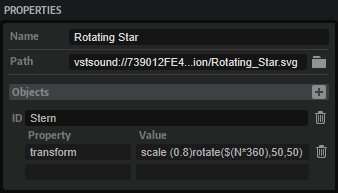

/ [HALion Developer Resource](../../HALion-Developer-Resource.md) / [HALion Macro Page](./HALion-Macro-Page.md) / [Resources](./Resources.md) /

# SVG

{{#include ../../_Version.md:halion700}}

## Description

A Scalable Vector Graphics (SVG) resource requires a standard SVG file and can be used in all controls as an alternative to [Bitmap](./Bitmap.md) resources. In the simplest case the SVG is used as it is, without any further changes, but it is also possible to modify it in the **Macro Page Designer**. The various subobjects that make up the SVG, such as groups and paths, can be manipulated individually. Each object can be addressed by its object ID and the pairs of properties and values. These values can either be static numbers or Lua expressions that can be used to calculate values. In the Lua expression you can use ``N``, the normalized control value, ``V``, the value of the connected parameter, or ``S``, the string representation of the connected parameter. This enables you to animate the properties of the SVG objects such as color, rotation, position, etc. when used in [Knobs](./Knob.md), [Sliders](./Slider.md), [Switches](./Switch.md), or [Animation](./Animation.md) controls. Only the aforementioned controls support animation. The Lua expression must be entered as follows: ``$(expression)``. In the following screenshot you can see the Lua expression ``$(N*360)``, for example.

## Properties

|Poperty|Description|
|:-|:-|
|**Name**|The name of the SVG resource.|
|**Path**|Specifies the path and filename of the used SVG file.|
|**Objects**|Click the + button to add an object that you want to modify.|
|**ID**	|Specifies the ID of the object inside the SVG. Objects that should be changeable must have an ID. Some SVG editors require you to name an object for it to get an ID, some assign IDs automatically. To be sure, check the SVG file in a text editor.|
|**Property**|Specifies the property that you want to change. For example, ``fill`` allows you to change the fill color of the object. Please refer to the SVG specification to learn more about properties.|
|**Value**|Specifies the value of the property. For example, ``white`` as a standard SVG color, or ``rgb(255,00,00)`` as a user-defined color. Please refer to the SVG specification to learn more about how to define values for particular properties.
You can also use [Color](./Color.md) resources that are defined in the macro page. To use a [Color](./Color.md) resource the value must be set like this: ``$cr(color resource name)``.
|

## Steinberg-specific SVG Property

|Poperty|Description|
|:-|:-|
|**smtg:radiusScaling**|This is a Steinberg-specific property that allows you to modify the SVG 'rect' property, so that the corner radius is not scaled with the control element. Set the value to 0 to turn off radius scaling.|