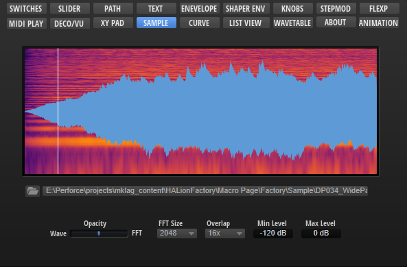
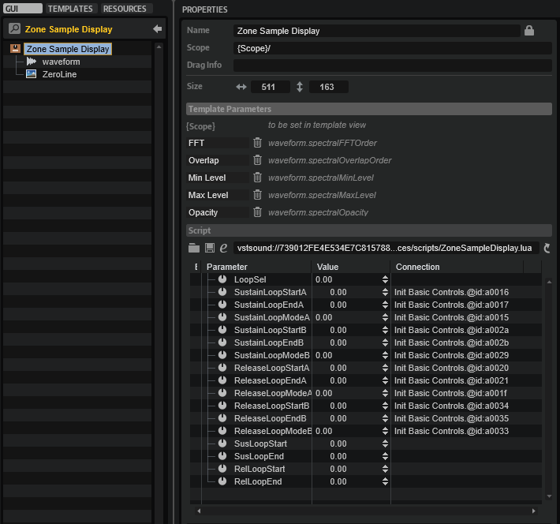

/ [HALion Developer Resource](../../HALion-Developer-Resource.md) / [HALion Macro Page](./HALion-Macro-Page.md) / [Templates](./Templates.md) /

# Sample Display

---

**On this page:**

[[_TOC_]]

---



## Description

The Sample Display template contains a [Waveform](./Waveform.md) control for displaying the sample data of the connected zone. The template has a script attached that matches the display of the [Waveform](./Waveform.md) control with the corresponding SampleOsc parameters of the zone. For example, the script shows or hides the looped regions, depending on whether the loop is active or not, and it decides which loop regions to display, depending on the selected loop A or B for the release and sustain loops respectively. The template itself only provides a Scope parameter to determine which zone to display. The template works for Sample and Grain Zones.

**To explore the functionality and connections:**

1. Load the [Init Basic Controls.vstpreset](../vstpresets/Init%20Basic%20Controls.vstpreset) from the [Basic Controls](./Exploring-Templates.md#basic-controls) library.
2. Open the **Macro Page Designer**, go to the **GUI Tree** and navigate to "Pages > Sample Page". 
3. Select "Sample Display" and click **Edit Element**  to examine the template.

## Template Properties

|Poperty|Description|
|:-|:-|
{{#include ./_Properties.md:name}}
{{#include ./_Properties.md:position-size}}
{{#include ./_Properties.md:attach}}
{{#include ./_Properties.md:tooltip}}
{{#include ./_Properties.md:template}}

## Template Parameters

|Parameters|Description|
|:-|:-|
|**Scope**|Allows you to determine the zone with the sample data to be displayed. The template works for Sample and Grain Zones. If a Sample Zone is connected, the Play Pos property on the [Waveform](./Waveform.md) control inside the template must be set to ``@id:a0064``, for Grain Zones this must be set to ``@id:100064``.|

## Components inside the Template



### Controls and Subtemplates

|Item|Description|
|:-|:-|
|**waveform**|The [Waveform](./Waveform.md) control for displaying the sample data. If a Sample Zone is connected, the Play Pos property must be set to ``@id:a0064``, for Grain Zones this must be set to ``@id:100064``. The loop properties must be connected to the corresponding script parameters: ``@SusLoopStart``, ``@SusLoopEnd``, ``@RelLoopStart``, and ``@RelLoopEnd``. All other properties must be connected to the corresponding parameters of the zone.|
|**ZeroLine**|An [Image](./Image.md) control that provides the bitmap for the zero line of the sample display.|

### UI Script

```lua
kSamplesMax = 0x7fffffff;

function onLoopChanged()
	local susMode, susStart, susEnd, relMode, relStart, relEnd;
	if LoopSel == 0 then
		susMode, susStart, susEnd = SustainLoopModeA, SustainLoopStartA, SustainLoopEndA;
		relMode, relStart, relEnd = ReleaseLoopModeA, ReleaseLoopStartA, ReleaseLoopEndA;
	else                                                       
		susMode, susStart, susEnd = SustainLoopModeB, SustainLoopStartB, SustainLoopEndB;
		relMode, relStart, relEnd = ReleaseLoopModeB, ReleaseLoopStartB, ReleaseLoopEndB;
	end
	if susMode == 0 then
		susStart, susEnd = 0, 0;
	end
	if relMode == 0 then
		relStart, relEnd = 0, 0;
	end
	
	SusLoopStart, SusLoopEnd = susStart, susEnd;
	RelLoopStart, RelLoopEnd = relStart, relEnd;
end

defineParameter("LoopSel", "Loop Select", 0, 0, 1, onLoopChanged);

defineParameter("SustainLoopStartA", "Zone Sustain Loop Start A", 0, 0, kSamplesMax, onLoopChanged);
defineParameter("SustainLoopEndA",   "Zone Sustain Loop End A",   0, 0, kSamplesMax, onLoopChanged);
defineParameter("SustainLoopModeA",  "Zone Sustain Loop Mode A",  0, 0, 10, onLoopChanged);

defineParameter("SustainLoopStartB", "Zone Sustain Loop Start B", 0, 0, kSamplesMax, onLoopChanged);
defineParameter("SustainLoopEndB",   "Zone Sustain Loop End B",   0, 0, kSamplesMax, onLoopChanged);
defineParameter("SustainLoopModeB",  "Zone Sustain Loop Mode B",  0, 0, 10, onLoopChanged);

defineParameter("ReleaseLoopStartA", "Zone Release Loop Start A", 0, 0, kSamplesMax, onLoopChanged);
defineParameter("ReleaseLoopEndA",   "Zone Release Loop End A",   0, 0, kSamplesMax, onLoopChanged);
defineParameter("ReleaseLoopModeA",  "Zone Release Loop Mode A",  0, 0, 10, onLoopChanged);

defineParameter("ReleaseLoopStartB", "Zone Release Loop Start B", 0, 0, kSamplesMax, onLoopChanged);
defineParameter("ReleaseLoopEndB",   "Zone Release Loop End B",   0, 0, kSamplesMax, onLoopChanged);
defineParameter("ReleaseLoopModeB",  "Zone Release Loop Mode B",  0, 0, 10, onLoopChanged);

defineParameter("SusLoopStart", "Display Sustain Loop Start", 0, 0, kSamplesMax);
defineParameter("SusLoopEnd",   "Display Sustain Loop End",   0, 0, kSamplesMax);
defineParameter("RelLoopStart", "Display Release Loop Start", 0, 0, kSamplesMax);
defineParameter("RelLoopEnd",   "Display Release Loop End",   0, 0, kSamplesMax);
```
