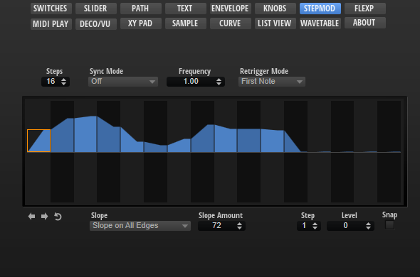

/ [HALion Developer Resource](../../HALion-Developer-Resource.md) / [HALion Macro Page](./HALion-Macro-Page.md) / [Templates](./Templates.md) /

# Step Modulator(Template)

---

**On this page:**

[[_TOC_]]

---

## Description

The StepModulator template contains controls for adjusting the steps and their slopes, for shifting the steps left or right and for reversing the steps. To guarantee the operation of these controls, the preconfigured properties must not be modified. The look and the size of the controls can be modified freely. All controls for functions that are not needed for your instrument can be omitted on your macro page.

**To explore the functionality and connections:**

1. Load the [Init Basic Controls.vstpreset](../vstpresets/Init%20Basic%20Controls.vstpreset) from the [Basic Controls](./Exploring-Templates.md#basic-controls) library.
2. Open the **Macro Page Designer**, go to the **GUI Tree** and navigate to "Pages > Step Modulator Page". 
3. Select "StepModulator" and click **Edit Element**  to examine the template.

>&#10069; The other control templates inside the Step Modulator Page group are directly connected to the Step Modulator of the zone and do not require detailed explanation.

## Template Properties

|Poperty|Description|
|:-|:-|
{{#include ./_Properties.md:name}}
{{#include ./_Properties.md:position-size}}
{{#include ./_Properties.md:attach}}
{{#include ./_Properties.md:tooltip}}
{{#include ./_Properties.md:template}}

## Template Parameters

|Parameter|Description|
|:-|:-|
|**Step1-32**|Connect these to the corresponding steps (Step1 to Step32) of the StepMod section of the zone.|
|**Steps**|Connect this to the Steps parameter of the StepMod section of the zone.|
|**Slope**|Connect this to the Slope parameter of the StepMod section of the zone.|
|**Slope Amt**|Connect this to the SlopeAmount parameter of the StepMod section of the zone.|

## Components inside the Template

### UI Variables

These variables are defined to allow the communication between the stepmodulator control and other controls in the template.

|Variable|Description|Type|Range|
|:-|:-|:-|:-|
|**level12**|Level in fractions of -12 to 12 semitones (used when Snap is on).|float|-12.0 - 12.0|
|**level**|Level of the selected node.|float|0 - 100.0|
|**index**|Index of the selected node.|integer|1 - 32|
|**snap**|Activates snap lines.|integer|0, 1|
|**shiftleft**|Shifts the pattern to the left.|integer|	0, 1|
|**shiftright**|Shifts the pattern to the right.|integer|0, 1|
|**reverse**|Reverses the pattern.|integer|0, 1|

### Controls and Subtemplates

To guarantee the operation of the controls and subtemplates, the preconfigured properties must not be modified. The look and the size of the controls can be modified freely. All controls for functions that are not needed for your instrument can be omitted on your macro page.

|Item|Description|
|:-|:-|
|**Snap**|A [Switch](./Switch.md) control to activate the Snap option. Its Value must be set to ``@snap``.|
|**Lev/Lev12**|This [Stack](./Stack.md) contains two value box templates. The [Stack](./Stack.md) switches between Level100 and Level12 using the [UI variable](#ui-variables) ``@snap``.<ul><li>**Lev100:** A value box template that is connected to the step modulator by the [UI variable](#ui-variables) ``@level``. It controls the level of the selected step in the range from 0 to 100 %. The template is active if Snap is off.</li><li>**Lev12:** A value box template that is connected to the step modulator by the [UI variable](#ui-variables) ``@level12``. It controls the level of the selected step in fractions of -12 to 12 semitones. The template is active if Snap is on.</li></ul>|
|**Index**|A value box template that is connected to the step modulator by the [UI variable](#ui-variables) ``@index``. It selects the step to be edited by the value boxes.|
|**stepmodulator**|For details see [Step Modulator](./Step-Modulator.md) control.|
|**image**|An [Image](./Image.md) control that provides the bitmap for the frame of the step modulator.|
|**ShiftLeft**|A [Switch](./Switch.md) control that is connected to the Shift Left parameter of the step modulator by the [UI variable](#ui-variables) ``@shiftleft``.|
|**ShiftRight**|A [Switch](./Switch.md) control that is connected to the Shift Right parameter of the step modulator by the [UI variable](#ui-variables) ``@shiftright``.|
|**Reverse**|A [Switch](./Switch.md) control that is connected to the Reverse parameter of the step modulator by the [UI variable](#ui-variables) ``@reverse``.|
