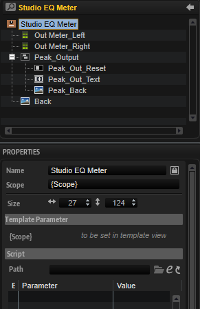

/ [HALion Developer Resource](../../HALion-Developer-Resource.md) / [HALion Macro Page](./HALion-Macro-Page.md) / [Templates](./Templates.md) /

# Studio EQ Meter

---

**On this page:**

[[_TOC_]]

---

## Description

The Studio EQ Meter template contains all necessary controls for displaying the output meters of the Studio EQ effect module. The controls are connected by corresponding UI variables. To guarantee the operation of the controls the preconfigured properties must not be modified. The look and the size of the controls can be modified freely including their ressources. Controls that are not needed for your instrument can be omitted on your macro page.

**To explore the functionality and connections:**

1. Load the [Init Basic Controls.vstpreset](../vstpresets/Init%20Basic%20Controls.vstpreset) from the [Basic Controls](./Exploring-Templates.md#basic-controls) library.
2. Open the **Macro Page Designer**, go to the **GUI Tree** and navigate to "Pages > Deco and Meter Page". 
3. Select "Studio EQ Meter" and click **Edit Element**  to examine the template.

## Template Properties

|Poperty|Description|
|:-|:-|
{{#include ./_Properties.md:name}}
{{#include ./_Properties.md:position-size}}
{{#include ./_Properties.md:attach}}
{{#include ./_Properties.md:tooltip}}
{{#include ./_Properties.md:template}}

## Template Parameters

|Parameters|Description|
|:-|:-|
|**Scope**|Determines to which EQ the controls should connect. For example, ``@bus:0/@0:Studio EQ`` connects the controls to the first EQ named Studio EQ in the first bus.|

## Components inside the Template

### Controls and Subtemplates

|Item|Description|
|:-|:-|
|**Out_Meter_Left**|A [Meter](./Meter.md) control that is connected by ``@VUOutL`` with the left output channel of the EQ.|
|**Out_Meter_Right**|A [Meter](./Meter.md) control that is connected by ``@VUOutR`` with the right output channel of the EQ.|
|**Peak_Output**|A [Group](./Group.md) with three elements:<ul><li>**Peak_Out_Reset:** A [Switch](./Switch.md) control that resets the peak value of the ouput meter. Its Value must be set to ``@ResetOutputVU``.</li><li>**Peak_Out_Text:** A [Text](./Text.md) control that displays the peak value of the output meter. Its Value must be set to ``@VUOutMax``.</li><li>**Peak_Back:** An [Image](./Image.md) control that provides the background bitmap for the peak value.</li></ul>|
|**Back**|An [Image](./Image.md) control that provides the background bitmap for the meter.|
