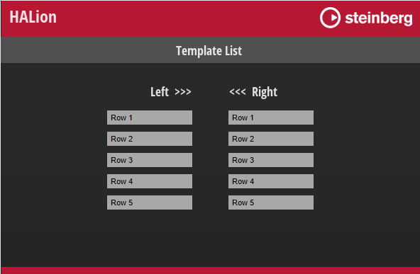

/ [HALion Developer Resource](../../HALion-Developer-Resource.md) / [HALion Macro Page](./HALion-Macro-Page.md) / [Controls](./Controls.md) /

# Template List

---

**On this page:**

[[_TOC_]]

---

## Description

A Template List can be used to create child templates from a single referenced template, where each instance of the referenced template can be used to control different parameter scopes, for example. The look of the Template List rows and columns is determined by the referenced template which you can choose in the Template property. Depending on the Layout property, the templates are arranged in a row, a column, or in a grid. The templates are arranged without spacing or graphic separators. If spacing or graphic separators are desired, they must be part of the referenced template.

>&#10069; For a better understanding of template lists, read the tutorial [Creating a Template List](../../HALion-Tutorials-Guidelines/pages/Creating-a-Template-List.md).

## Properties

|Poperty|Description|
|:-|:-|
|**Name**|The name of the element. This name will be displayed in the GUI Tree and it serves as 'viewname' argument in the [Template List Callbacks](#template-list-callbacks).|
{{#include ./_Properties.md:position-size}}
{{#include ./_Properties.md:attach}}
|**Layout**  {{#include ../../_Version.md:halion610}}|<ul><li>**Horizontal:** Activate this option to arrange the child templates horizontally in a row.</li><li>**Vertical:** Activate this option to arrange the child templates vertically in a column.</li><li>**Grid:** Activate this option to arrange the child templates in a two-dimensional grid.</li></ul>
|**Alignment**  {{#include ../../_Version.md:halion610}}|Here you can set how the child templates are positioned in the Template List area.<ul><li>**Center:** The child templates are added to the list in their original size. The row, column, or grid is then centered inside the Template List area.</li><li>**Left:** The child templates are added to the list in their original size. The row, column, or grid is then positioned to the left of the Template List area.</li><li>**Right:** The child templates are added to the list in their original size. The row, column, or grid is then positioned to the right of the Template List area.</li><li>**Fill Height:** The child templates are resized to fill the Template List area vertically.  {{#include ../../_Version.md:halion700}}</li><li>**Fill Width:** The child templates are resized to fill the Template List area horizontally.  {{#include ../../_Version.md:halion700}}</li><li>**Fill:** All cells in the list are resized equally horizontally and vertically to match the Template List area. The content of the child templates is then positioned and resized according to the Scale and Attachment settings of the contained controls.</li></ul>|
{{#include ./_Tooltip.md}}
|**Value**|Allows you to read the index of the focused child template. This is useful to synchronize the selection focus across several lists, for example.|
|**Style**|<ul><li>**H-Scroll:** Shows a horizontal scrollbar. This setting is not available with Alignment set to Fill or Fill Height.</li><li>**V-Scroll:** Shows a vertical scrollbar. This setting is not available with Alignment set to Fill or Fill Width.</li><li>**Order:** Set this option if you want to be able to change the order of the child templates via drag and drop. This option activates only the graphic reordering and only if at least the Template List callback [onTemplateListViewDrop](#ontemplatelistviewdrop) has been implemented. If you want the change of the graphical order to affect the program, e.g., if you want to change the order of alternating layers, this functionality must be programmed in a script. For more information about the available callbacks, see [Template List Callbacks](#template-list-callbacks).</li><li>**Custom SB:** Set this option if you want to use custom scrollbars. For custom scrollbars, you must assign corresponding bitmap resources in the Scrollbars section. The height of the horizontal scrollbar and the width of the vertical scrollbar depend on the maximum width/height in pixels of the Hor Back and Ver Back bitmaps. For example, if Hor Back is set to a height of 30 pixels and Ver Back to 36 pixels, both will use 36 pixels.<ul><li>**Note:** Scrollbars can only be scaled in their original orientation, i.e., vertical scrollbars scale only vertically and horizontal scrollbars only horizontally.</li></ul></li></ul>|
|**Focus Var**|Allows you to specify a variable name, e.g., ``MyFocusVariable``, that can be used inside the referenced template, e.g., to switch the focus of a [Stack](./Stack.md) or an [Animation](./Animation.md) control. You can access this variable inside the referenced template with ``@MyFocusVariable``. It is set to 1, if the element has the focus, 0 otherwise.|
|**Index Var**|Allows you to specify a variable name, e.g., ``MyIndexVariable``, that can be used inside the referenced template to display the index of the list entry. You can access this variable inside the referenced template with ``@MyIndexVariable``. It is set to the index of the element in the list.|
|**Scrollbars**|Allows you to assign the [Bitmap](./Bitmap.md) resources that are required to draw the custom scrollbars.<ul><li>**Up:** Up button..</li><li>**Up Press:** Up button Pressed.</li><li>**Down:** Down button.</li><li>**Down Press:** Down button Pressed.</li><li>**Ver Back:** Vertical scrollbar background.</li><li>**Ver Handle:** Vertical scrollbar handle.</li><li>**Handle Top:** Top section of the vertical handle.</li><li>**Handle Bot:** Bottom section of the vertical handle.</li><li>**Left:** Left button.</li><li>**Left Press:** Left button Pressed.</li><li>**Right:** Right button.</li><li>**Right Press:** Right button Pressed.</li><li>**Hor Back:** Vertical scrollbar background.</li><li>**Hor Handle:** Vertical scrollbar handle.</li><li>**Handle Left:** Left section of the horizontal handle.</li><li>**Handle Right:** Right section of the horizontal handle.</li></ul>|

[Jump to Top ](#template-list)

## Template List Callbacks

 {{#include ../../_Version.md:halion700}}

To enable the graphic reordering, the Order option must be active and either [onTemplateListViewDrop](#ontemplatelistviewdrop) or [onTemplateListDrop](#ontemplatelistdrop) must be implemented in a UI script.

>&#10069;  In order for the [onTemplateListDrop](#ontemplatelistdrop) function to be called, the Drag Info property of the template referenced in the Template List must be set.

### onTemplateListViewDrop

This callback is called when the drop is done. If you need more advanced control over the drag and drop operation, you can use the callbacks described below as an alternative.

>**onTemplateListViewDrop(viewname, fromindex, toindex)**

|Argument|Description|Value Type|
|:-|:-|:-|
|**viewname**|The name of the Template List. Evaluate this to distinguish between different lists.|string|
|**fromindex**|Index of the dragged element.|integer|
|**toindex**|New index of the dropped element.|integer|

[Jump to Top ](#template-list)

>&#10069; The callback [onTemplateListViewDrop](#ontemplatelistviewdrop) is a simplified callback that replaces the callbacks [onTemplateListDropFeedback](#ontemplatelistdropfeedback), [onTemplateListDrop](#ontemplatelistdrop) and [onTemplateListDropDone](#ontemplatelistdropdone) from below. The callback [onTemplateListViewDrop](#ontemplatelistviewdrop) cannot be combined with the callbacks just mentioned.


### onTemplateListGetDragInfo

>**onTemplateListGetDragInfo(viewname, draginfo, index)**

#### Description

Callback for the source of the drag operation when the operation starts. The string in ``draginfo`` is taken from the Drag Info property of the template referenced in the Template List. The Drag Info property must be set inside the referenced template. To enable the graphic reordering of the elements, the Order option must be active and at least the [onTemplateListDrop](#ontemplatelistdrop) callback must be implemented in a UI script. The [onTemplateListDrop](#ontemplatelistdrop) callback can be omitted if no graphic reordering is required.

#### Arguments

|Argument|Description|Value Type|
|:-|:-|:-|
|**viewname**|The name of the Template List that started the drag operation. Evaluate this to distinguish between different lists.|string|
|**draginfo**|The string specified by the Drag Info property of the template referenced in the Template List.|string|
|**index**|The index of the dragged element.|string|

#### Return Values

The function can return a table with the following keys:

|Return Value|Description|Value Type|
|:-|:-|:-|
|**copy**|Set this to ``true`` if copying is allowed, ``false`` if not. If 'copy' is ``false`` the **Alt/Cmd**-key for copying cannot be used. The default for 'copy' is ``false``.|boolean|
|**move**|Set this to ``true`` if moving is allowed, ``false`` if not. If 'move' is ``false`` the elements in the list will not be reordered when dragging. The default for 'move' is ``true``.|boolean|
|**info**|The draginfo argument of the subsequent callbacks is determined by this return value. By default, 'info' returns the string specified by the Drag Info property of the template referenced in the Template List. By modifying the 'info' return value you can control the response of the subsequent callbacks.|string|
|**files**|A table with file paths for evaluation by external software when the drop operation is executed there.|table with file paths as strings|

>&#10069; If both of the 'copy' and 'move' return values are set to ``true``, the 'copy' argument in the callbacks [onTemplateListDrop](#ontemplatelistdrop), [onTemplateListDropFeedback](#ontemplatelistdropfeedback), and [onTemplateListDropDone](#ontemplatelistdropdone) will depend upon whether the **Alt/Cmd**-key was utilized during the drag operation. The 'copy' argument in these callbacks will be ``true`` if the **Alt/Cmd**-key was used and ``false`` if it was not. If one or both of the 'copy' and 'move' return values are ``false``, the use of the **Alt/Cmd**-key has no effect, and the 'copy' argument in the mentioned callbacks will depend solely on the 'copy' return value.

[Jump to Top ](#template-list)

### onTemplateListDrop

>**onTemplateListDrop(viewname, draginfo, toindex, offset, copy)**

#### Description

Callback for the target of the drag operation when the drop is executed. In order for the function to be called, the Drag Info property of the template referenced in the Template List must be set. Otherwise, the reordering will not work, even if the Order option of the Template List is active.

#### Arguments

|Argument|Description|Value Type|
|:-|:-|:-|
|**viewname**|The name of the targeted Template List. Evaluate this to distinguish between different lists.|string|
|**draginfo**|This string is specified by the 'info' return value of the [onTemplateListGetDragInfo](#ontemplatelistgetdraginfo) callback when the drag operation starts.|string|
|**toindex**|Index of the targeted element.|integer|
|**offset**|The value -1, 0, or 1 indicates if the drop is before, on, or behind the targeted element.|integer|
|**copy**|Indicates if the drag is a copy operation.|boolean|

[Jump to Top ](#template-list)


### onTemplateListDropFeedback

>**onTemplateListDropFeedback(viewname, draginfo, toindex, offset, copy)**

#### Description

Callback for the target of the drag operation when an element is held over it. If implemented it can control the graphical feedback for the potential drop operation by returning a template to indicate the drop destination or reject dropping the element.

#### Arguments

|Argument|Description|Value Type|
|:-|:-|:-|
|**viewname**|The name of the targeted Template List. Evaluate this to distinguish between different lists.|string|
|**draginfo**|This string is specified by the 'info' return value of the [onTemplateListGetDragInfo](#ontemplatelistgetdraginfo) callback when the drag operation starts.|string|
|**toindex**|The index of the targeted element.|integer|
|**offset**|The value -1, 0, or 1 indicates if the drop is before, on, or behind the targeted element.|integer|
|**copy**|Indicates if drag is a copy operation.|boolean|

#### Return Values

The function can return a table with the following keys:

|Return Value|Description|Value Type|
|:-|:-|:-|
|**accept**|Set this to ``true`` to allow or ``false`` to reject the drop operation. The default is ``false``.|boolean|
|**template**|Name of a template that will be displayed as 'indicator' for the drop operation. The default is ``""``.|string|	
|**index**|Index of the targeted element, where the 'indicator' should be displayed.|string|
|**insert**|Set this to ``true`` if the 'indicator' should be placed before instead of on the element. The default is ``false``.|boolean|
|**resize**|Set this to ``true`` if the 'indicator' should be resized to the size of the targeted element. The default is ``false``.|boolean|

>&#10069; When using onTemplateListDropFeedback: Since the default of ``accept`` is ``false``, you must at least return ``accept=true``.

[Jump to Top ](#template-list)


### onTemplateListDropDone

>**onTemplateListDropDone(viewname, draginfo, index, copy)**

This callback is called when the drop operation is complete. Since the arguments of the callback refer to the source of the drag operation, it can be used to make modifications to the corresponding source Template List using additional functions.

#### Arguments

|Argument|Description|Value Type|
|:-|:-|:-|
|**viewname**|The name of the Template List that started the drag operation.|string|
|**draginfo**|This string is specified by the 'info' return value of the [onTemplateListGetDragInfo](#ontemplatelistgetdraginfo) callback when the drag operation starts.|string|
|**index**|Index of the dragged element.|integer|
|**copy**|Indicates if the drag was a copy operation.|string|

[Jump to Top ](#template-list)

>&#10069; If you want the change of the order of graphical elements to affect the program structure, e.g. the order of alternating layers or the order of effects within a bus, this must be implemented separately with dedicated functions.

## Example

The subsequent example is presented as illustrative guide to kickstart your own solution-building process.



**To explore the example:**

1. Load [Template List.vstpreset](../vstpresets/Template%20List.vstpreset).
1. Open the **Macro Page Designer**, activate **Show/Hide Script Output Messages** .
1. Click **Test Macro Page** , then drag and drop elements from the left to the right Template List and vice versa.
1. Use the **Alt/Cmd**-key to copy elements.
1. Read the output messages of the script.

Reading the output messages of the script should help to understand how the callbacks work and how to use them.

```lua
-- Create row names through a parameter.
rowNames = {}
 
for i = 1, 5 do 
 rowNames[i] = "Row "..tostring(i) 
end 
 
defineParameter{name="RowNames", strings=rowNames,}

currentViewname = ""

-- The following example accepts dropping of elements only from other template lists.

function onTemplateListGetDragInfo(viewname, draginfo, index)
	print("onTemplateListGetDragInfo:", "viewname = "..viewname, "draginfo = "..draginfo, "index = "..index)
	currentViewname = viewname
	return{info = index, copy=true, move=true}
end

function onTemplateListDropFeedback(viewname, draginfo, toindex, offset, copy)
	print("onTemplateListDropFeedback:", "viewname = "..viewname, "draginfo = "..draginfo, "toindex = "..toindex, "offset = "..offset, "copy = "..tostring(copy))
	local acceptDrop = false
	if viewname ~= currentViewname then
	acceptDrop = true
	end
	return{accept=acceptDrop, insert=false, template="DropFrame", resize=true,}
end

function onTemplateListDrop(viewname, draginfo, toindex, offset, copy)
	print("onTemplateListDrop:", "viewname = "..viewname, "draginfo = "..draginfo, "toindex = "..toindex, "offset = "..offset, "copy = "..tostring(copy))
	if viewname ~= currentViewname then
		local fromindex = tonumber(draginfo)
		if copy then
			rowNames[toindex] = rowNames[fromindex]
		else
			local rowName = table.remove(rowNames, fromindex)
			table.insert(rowNames, toindex, rowName)
		end
		defineParameter{name="RowNames", strings=rowNames,}
	end
end

function onTemplateListDropDone(viewname, draginfo, index, copy)
	print("onTemplateListDropDone:", "viewname = "..viewname, "draginfo = "..draginfo, "index = "..index, "copy = "..tostring(copy))
end
```