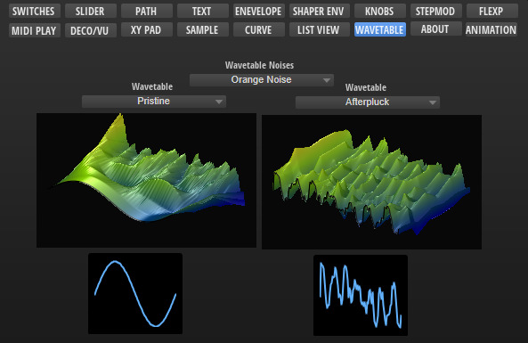

/ [HALion Developer Resource](../../HALion-Developer-Resource.md) / [HALion Macro Page](./HALion-Macro-Page.md) / [Templates](./Templates.md) /

# Wavetable Noise Selector

---

**On this page:**

[[_TOC_]]

---

## Description

The Wavetable Noise Selector is a preconfigured template that can be used to select sample files for the noise of a Wavetable Zone. The template can be configured with the available [Template Parameters](#template-parameters). The Scope parameter determines for which Wavetable Zone the noise selector applies. The Product parameter defines the source folders of the sample files to be displayed in the noise selector. The look of the controls can be adapted freely by changing the components inside the template.

**To explore the functionality and connections:**

1. Load the [Init Basic Controls.vstpreset](../vstpresets/Init%20Basic%20Controls.vstpreset) from the [Basic Controls](./Exploring-Templates.md#basic-controls) library.
2. Open the **Macro Page Designer**, go to the **GUI Tree** and navigate to "Pages > Wavetable Page". 
3. Select "WT Noise Selector" and click **Edit Element**  to examine the template.

## Template Properties

|Poperty|Description|
|:-|:-|
{{#include ./_Properties.md:name}}
{{#include ./_Properties.md:position-size}}
{{#include ./_Properties.md:attach}}
{{#include ./_Properties.md:tooltip}}
{{#include ./_Properties.md:template}}

## Template Parameters

|Parameters|Description|
|:-|:-|
|**Scope**|Determines for which Wavetable Zone the noise selector applies. For example, by setting Scope to ``@0:Zone 1`` the noise selector applies to the first zone with the name Zone 1 that is found in the Program Tree.|
|**Product**|The Product parameter defines the source folders of the sample files to be displayed in the noise selector. Set this to ``HALion`` if you want to load sample files from the default file paths, which includes factory and user sample files. If you wish to deliver your own sample files as part of your library, you can set Product to the name of your instrument, e.g., ``MyProductName``. Thereby, only the sample files for ``MyProductName`` will be shown in the noise selector. If Product is set to ``MyProductName``: Then, the sample files must be added to the folder ./*``MyProductName``*/Sub Presets/*``Wavetable/Noises``* inside the VST Sound, otherwise the noise selector will not see these sample files. You can also include both, the HALion root folder and the root folder of your instrument, by setting Product to ``MyProductName``&vert;``HALion``. The noise selector will then show the content of both locations.|
|**Label**|A [Label](./Label.md) control for displaying a label above the menu.|

>&#10069; If you need further control over the content locations, you can specify the required subfolder together with the Product: ``MyProductName/MyNoises``&vert;``HALion/MyNoises``. See configuration 4 in the following table.

### Content Locations for Different Configurations

|#|Product/Content|Default File Paths|
|:-|:-|:-|
|1|
**Product** = ``HALion``

Only sample files from HALion, including any sample files the user has saved on hard disk.
|
**Hard Disk:**

./Documents/Steinberg/HALion/Sub Presets/Wavetable/Noises
|
|2|
**Product** = ``MyProductName``

Only sample files from the specified library, including any sample files the user has saved on hard disk.
|
**VST Sound:**

./MyProductName/Sub Presets/Wavetable/Noises

**Hard Disk:**

./Documents/Steinberg/MyProductName/Sub Presets/Wavetable/Noises
|
|3|
**Product** = ``MyProductName``&vert;``HALion``

All sample files from HALion, the specified library and any sample files the user has saved on hard disk.
|
**VST Sound:**

./MyProductName/Sub Presets/Wavetable/Noises

**Hard Disk:**
./Documents/Steinberg/HALion/Sub Presets/Wavetable/Noises

./Documents/Steinberg/MyProductName/Sub Presets/Wavetable/Noises
|
|4|
**Product** = ``MyProductName/MyNoises``&vert;``HALion/MyNoises``

All sample files from HALion, the specified library and any sample files the user has saved on hard disk.
|
**VST Sound:**

./MyProductName/Sub Presets/Wavetable/Noises/MyNoises

**Hard Disk:**

./Documents/Steinberg/HALion/Sub Presets/Wavetable/Noises/MyNoises

./Documents/Steinberg/MyProductName/Sub Presets/Wavetable/Noises/MyNoises
|

>&#10069; The location of the sample files inside the VST Sound must match the path defined by Product, otherwise the noise selector will not see these sample files. If libraries deliver sample files in multiple VST Sounds, all sample files with the same path will be shown together in the noise selector.

## Components inside the Template

### Controls and Subtemplates

|Item|Description|
|:-|:-|
|**group WT**|A [Group](./Group.md) that contains all necessary elements for the noise selector.
**group noise:** Another [Group](./Group.md) that contains:<ul><li>**switch select:** A [Switch](./Switch.md) control for opening the noise selector. Its Value must be set to ``@SubPresetSelectPopup``.</li><li>**text:** A [Text](./Text.md) control for displaying the name of the selected sample file. Its Value must be set to ``@SubPresetName``.</li><li>**Back:** An [Image](./Image.md) control that provides the background bitmap for the name of the sample file.</li></ul>
|
|**label**|A [Label](./Label.md) control for displaying a label above the menu. Its Text property is exported and the default is set to ``Wavetable Noises``.|
