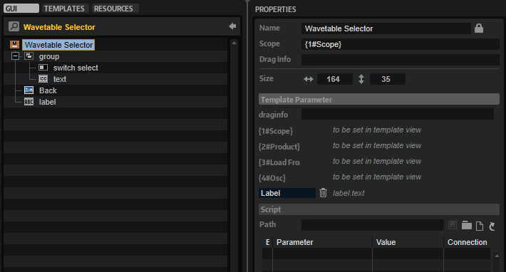

/ [HALion Developer Resource](../../HALion-Developer-Resource.md) / [HALion Macro Page](./HALion-Macro-Page.md) / [Templates](./Templates.md) /

# Wavetable Selector

---

**On this page:**

[[_TOC_]]

---

## Description

The Wavetable Selector is a preconfigured template that can be used to select the wavetables for Osc 1 and Osc 2 of the Wavetable Zone. The template can be configured with the available [Template Parameters](#template-parameters). The Scope parameter determines for which Wavetable Zone the wavetable selector applies. The Product and Load From parameters define the source folders of the wavetables to be displayed in the selector. The Osc parameter determines the oscillator of the Wavetable Zone for which the wavetable selector applies. The look of the controls can be adapted freely by changing the components inside the template.

**To explore the functionality and connections:**

1. Load the [Init Basic Controls.vstpreset](../vstpresets/Init%20Basic%20Controls.vstpreset) from the [Basic Controls](./Exploring-Templates.md#basic-controls) library.
2. Open the **Macro Page Designer**, go to the **GUI Tree** and navigate to "Pages > Wavetable Page". 
3. Select "WT Selector Osc1" or "WT Selector Osc2" and click **Edit Element**  to examine the template.

## Template Properties

|Poperty|Description|
|:-|:-|
{{#include ./_Properties.md:name}}
{{#include ./_Properties.md:position-size}}
{{#include ./_Properties.md:attach}}
{{#include ./_Properties.md:tooltip}}
{{#include ./_Properties.md:template}}

## Template Parameters

|Parameters|Description|
|:-|:-|
|**Scope**|Determines for which Wavetable Zone the noise selector applies. For example, by setting Scope to ``@0:Zone 1`` the noise selector applies to the first zone with the name Zone 1 that is found in the Program Tree.|
|**Product**|The Product parameter defines the root folder of the wavetables to be displayed in the noise selector. Set this to ``HALion`` if you want to load wavetables from the default file paths, which includes factory and user wavetables. If you wish to deliver your own wavetables as part of your library, you can set Product to the name of your instrument, e.g., ``MyProductName``. Thereby, only the wavetables for ``MyProductName`` will be shown in the noise selector. If Product is set to ``MyProductName``: Then, the sample files must be added to the folder ./*``MyProductName``*/Sub Presets/*``Wavetable/Wavetables``* inside the VST Sound, otherwise the noise selector cannot access these sample files. You can also include both, the HALion root folder and the root folder of your instrument, by setting Product to ``MyProductName``&vert;``HALion``. The noise selector will then show the content of both locations.|
|**Load From**|Load From specifies the subpath to the location of the wavetables inside the root folder. The root folder is set by Product (see above). You can specify this subfolder freely. However, if you want to see the factory subpresets, Load From must be left empty and Product must contain ``HALion``.
Any subpresets you want to distribute with your library must be added to the corresponding location inside the VST Sound. For example, if Load From is set to ``MyWavetables`` and Product is set just to ``MyProductName``, the subpresets inside the VST Sound must be located at ./*``MyProductName``*/Sub Presets/*``MyWavetables``*.
|
|**Osc**|Determines the oscillator of the Wavetable Zone for which the wavetable selector applies. This must be set either to 1 or 2, which refers to Osc 1 or Osc 2 respectively.|
|**Label**|A [Label](./Label.md) control for displaying a label above the menu.|

 >&#10069; If you need further control over the content locations, you can specify the required subfolder together with the Product: ``MyProductName/MyWavetables``&vert;``HALion/MyWavetables``. Load From must not be set in this case. See configuration 4 in the following table.

### Content Locations for Different Configurations

|#|Configuration/Content|Default File Paths|
|:-|:-|:-|
|1|
**Product** = ``HALion``

**Load From** = ``MyWavetables``

Only wavetables from HALion, including any wavetables the user has saved on hard disk.
|
**Hard Disk:**

./Documents/Steinberg/HALion/Sub Presets/Wavetable/Wavetables/MyWavetables
|
|2|
**Product** = ``MyProductName``

**Load From** =  ``MyWavetables``

Only wavetables from the specified library, including any wavetables the user has saved on hard disk.
|
**VST Sound:**

./MyProductName/Sub Presets/Wavetable/Wavetables/MyWavetables

**Hard Disk:**

./Documents/Steinberg/MyProductName/Sub Presets/Wavetable/Wavetables/MyWavetables
|
|3|
**Product** = ``MyProductName``&vert;``HALion``

**Load From** =  ``MyWavetables``

All wavetables from HALion, the specified library and any wavetables the user has saved on hard disk.
|
**VST Sound:**

./MyProductName/Sub Presets/Wavetable/Wavetables/MyWavetables

**Hard Disk:**
./Documents/Steinberg/HALion/Sub Presets/Wavetable/Wavetables/MyWavetables

./Documents/Steinberg/MyProductName/Sub Presets/Wavetable/Wavetables/MyWavetables
|
|4|
**Product** = ``MyProductName/MyWavetables``&vert;``HALion/MyWavetables``

**Load From** = deactivate, leave empty

All wavetables from HALion, the specified library and any wavetables the user has saved on hard disk.
|
**VST Sound:**

./MyProductName/Sub Presets/Wavetable/Wavetables/MyWavetables

**Hard Disk:**

./Documents/Steinberg/HALion/Sub Presets/Wavetable/Wavetables/MyWavetables

./Documents/Steinberg/MyProductName/Sub Presets/Wavetable/Wavetables/MyWavetables
|

>&#10069; The location of the wavetables inside the VST Sound must match the path defined by Product and Load From, otherwise the wavetable selector cannot access these wavetables. If libraries deliver wavetables in multiple VST Sounds, all wavetables with the same path will be shown together in the wavetable selector.

## Components inside the Template

### Controls and Subtemplates

|Item|Description|
|:-|:-|
|**group**|A [Group](./Group.md) that contains all necessary elements for the noise selector.<ul><li>**switch select:** A [Switch](./Switch.md) control for opening the wavetable selector. Its Value must be set to ``@SubPresetSelectPopup``.</li><li>**text:** A [Text](./Text.md) control for displaying the name of the selected wavetable. Its Value must be set to ``@WavetableName``.</li></ul>|
|**Back**|An [Image](./Image.md) control that provides the background bitmap for the name of the sample file.|
|**label**|A [Label](./Label.md) control for displaying a label above the menu. Its Text property is exported and the default is set to ``Wavetable``.|
