/ [HALion Developer Resource](../../HALion-Developer-Resource.md) / [HALion Script](./HALion-Script.md) / [Advanced Topics](./Advanced-Topics.md) /

# Debugging with LDT

---

**On this page:**

[[_TOC_]]

**External links:**

* [Eclipse LDT](https://www.eclipse.org/ldt/)
* [Java SE 8 JRE](https://www.oracle.com/technetwork/java/javase/downloads/jre8-downloads-2133155.html)
* [Java SE 8 JDK](https://www.oracle.com/technetwork/java/javase/downloads/jdk8-downloads-2133151.html)
* [Debugging a Lua program](https://wiki.eclipse.org/LDT/User_Area/User_Guides/User_Guide_1.3#Debugging_a_Lua_program)

---


HALion uses [Lua Development Tools (LDT)](https://www.eclipse.org/ldt/) by [Eclipse Foundation](https://www.eclipse.org/) as the front end for debugging. LDT is an open source software for Windows and Mac OSX that provides you with an integrated development environment (IDE) for Lua with tools like code assistance, debugging, syntax coloring, code formatting, and many more. LDT allows you to debug scripts that run in HALion. After configuring Attach Debug in LDT, you can connect a Lua Script module for debugging its script. In LDT you can monitor the script step by step, inspect variables and evaluate expressions. This way you can identify and remove errors from your script more easily.

More information about the LDT and support from the Eclipse community can be found here:

<https://wiki.eclipse.org/LDT>

## Installing LDT

LDT can be downloaded from here:

<https://www.eclipse.org/ldt/>

* After downloading the package for your system, unpack the files into a folder of your choice.

>&#10069; In addition, the Java SE 8 JRE (Windows) or the Java SE 8 JDK (Mac OSX) must be installed.

**Windows**

The Java SE 8 JRE can be downloaded from here:

<https://www.oracle.com/technetwork/java/javase/downloads/jre8-downloads-2133155.html>

**Mac OSX**

The Java SE 8 JDK can be downloaded from here:

<https://www.oracle.com/technetwork/java/javase/downloads/jdk8-downloads-2133151.html>

>&#10069; Mac OSX might tell you that you need to install the legacy Java SE 6 runtime. Please ignore the message and install the Java SE 8 JDK instead.

## Setting Up a Debug Session

Before starting a debug session, some preparations are required. In the following, you will be guided through all the necessary steps.

### Starting LDT

**Windows**

* Double-click **LuaDevelopmentTools.exe**.

**Mac OSX**

* Double-click the **Eclipse** application.

### Selecting a Workspace

Upon start of LDT the Eclipse Launcher will ask you to select a directory as workspace.

* Choose a location for **Workspace** and click **Launch**.

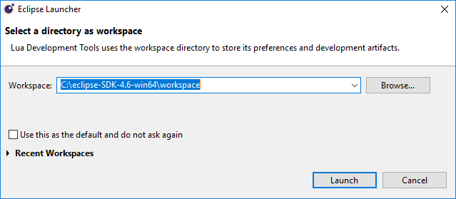

### Creating a Project

1. Open **File > New > Project..**, select **Lua Project** and click **Next >**.
1. Enter a **Project name**.
1. Select **Create project at existing location (from existing source)** and set **Directory** to the location of your scripts.

    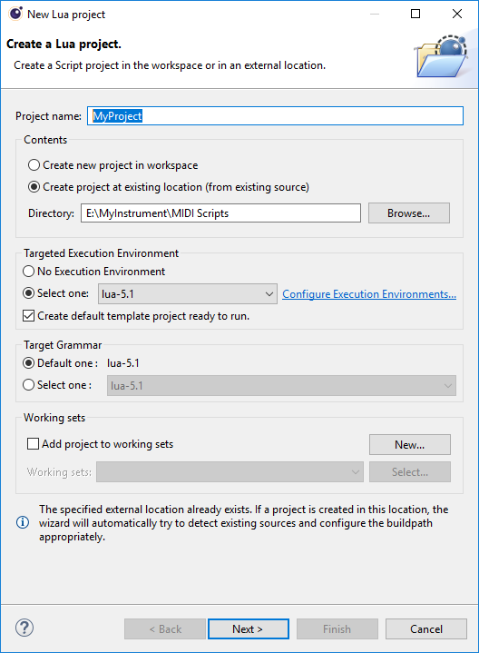

1. Click **Next >**. The contents of the specified directory will be scanned. You can ignore the warning that says, "Your project has no source folder defined."
1. Click **Finish**.

    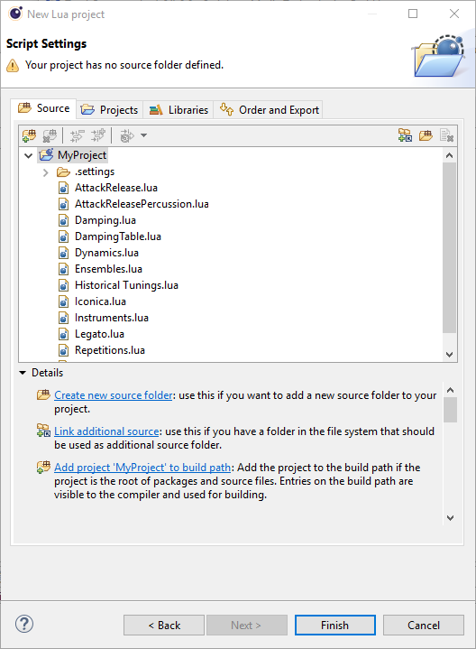

The Lua scripts that have been found will appear in the Script Explorer of LDT. You can load them via double-click.

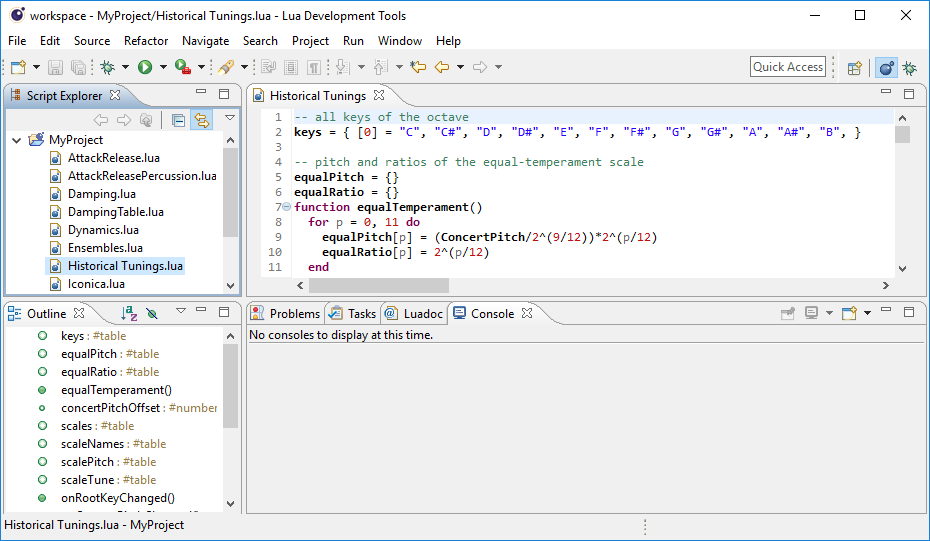

### Configuring Attach Debug

In order for incoming debug sessions to be accepted, you must create a **Lua Attach to Application** launch configuration.

1. Open **Run > Debug Configurations...**
1. Select **Lua Attach to Application** and click the **New** button to create a configuration of this type.
1. Enter a name and click **Apply**.
1. Click **Close**, since we do not want to debug at the moment.

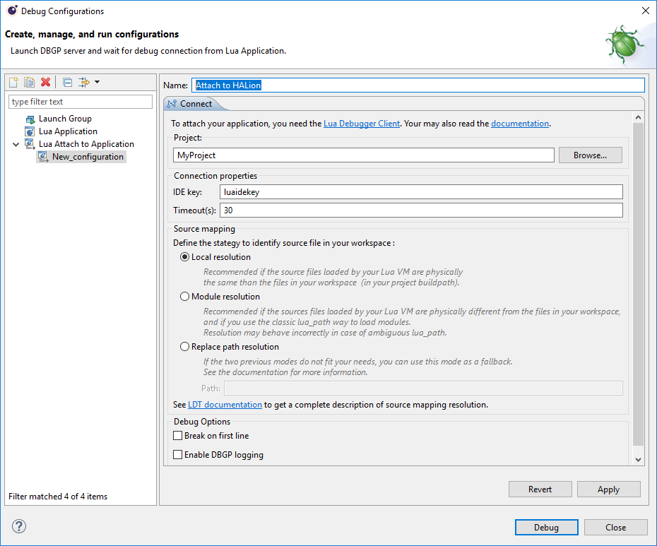

### Changing the Debug Port on Mac

On Mac, you must change the debug server port before you can start a debug session.

1. Open **Lua  Development Tools Product > Preferences...** and go in **Dynamic Languages > Debug**.
1. Change **Port** to "Custom" and enter the value "10001".
1. Click **Apply and Close**.

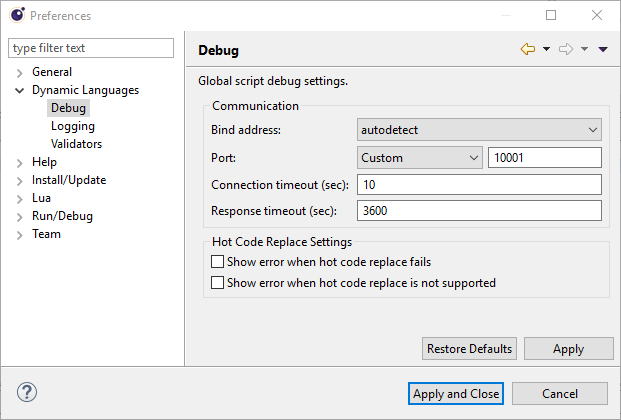

>&#10069; Do not change the debug server port on Windows.

## Starting a Debug Session

Please load the following code example for your first debug session.

### Loading the Code Example

Create a new Lua file in LDT.

1. In **File > New > Other...**, select **Lua File** and click **Next >**.
1. Enter a file name and click **Finish**.

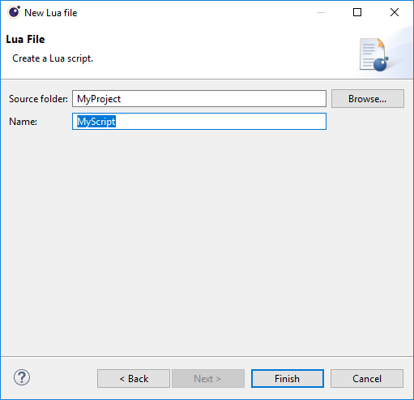

>&#10069; New Lua files will be saved to the directory that you specified for the Lua project.

* Copy the following code example to the editor area of LDT.

#### Example

```lua
function onNote(ev)
  print(ev)
  postEvent(ev)
end
```
* Click  to save the script file in LDT.

Now it is time to start HALion and to load the script.

1. Open HALion, create a Program with a Synth zone and a Lua Script module.
1. Load the script file from the location where you saved it.

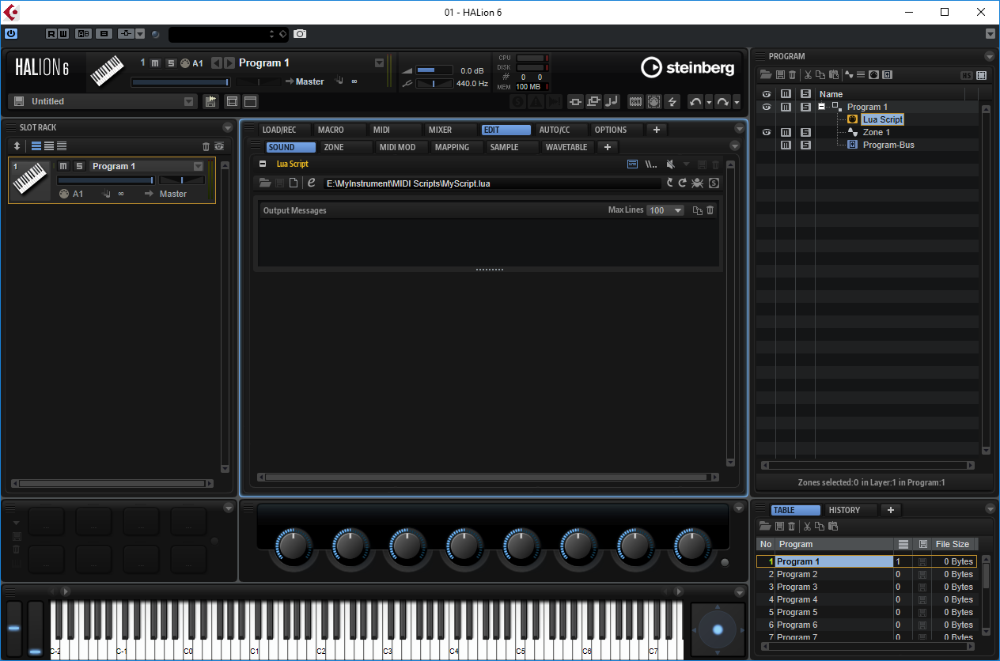

>&#10069; The script running in the Lua Script module of HALion must be loaded from the same location where LDT saved it. This ensures that the script in LDT and HALion are physically the same file. Otherwise the debugger cannot establish a connection between LDT (debugger server) and the Lua Script module (debugger client).

### Opening the Debug Perspective

Most of the debug functionality can be found in the Debug perspective of LDT.

* Click  in the top right corner of the editor area.
* Alternatively, in **Window > Perspective > Open Perspective > Other...**, select **Debug** and click **Open**.

Breakpoints can be set by double-clicking the margin.

* Double-click the margin in line two, for example.

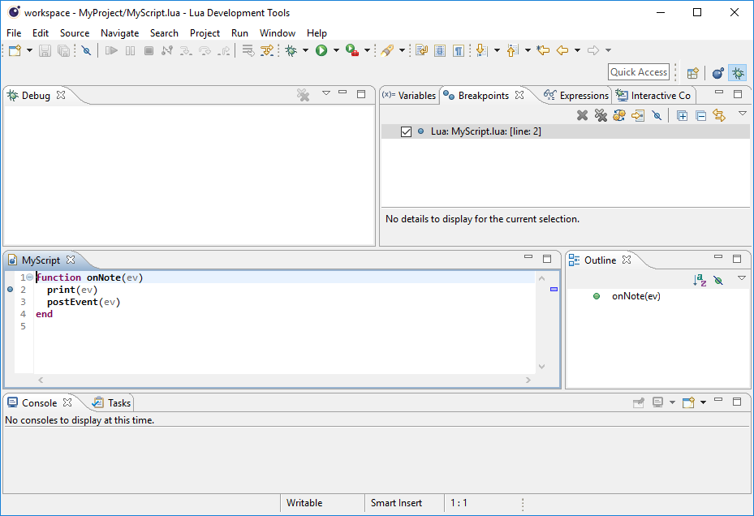

### Connecting the Lua Script module with LDT

The following steps will establish a connection between LDT (debugger server) and the Lua Script module (debugger client).

1. Open HALion, go to the Lua Script module and click the **Connect to Debugger** button . This defines the Lua Script module as debugger client. The **Connect to Debugger** button turns blue  to indicate that it waits for the debugger server.
1. Open LDT and go to **Run > Debug Configurations...** In **Lua Attach to Application**, select the configuarion you have previously created.
1. Click **Debug** to start the debugger server.

The **Connect to Debugger** button in HALion turns green if the debugger server and client are connected .

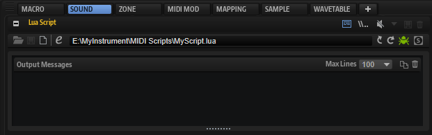

As a basic test, try the following steps with the code example from above and a breakpoint in line two:

1. Play a MIDI note. LDT will break into the onNote function.

    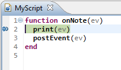

1. Click Resume  or press (F8) to continue the script. HALion prints the event and outputs the note.

## Stopping a Debug Session

To stop the debug session:

* Open the Lua Script module in HALion and click the **Connect to Debugger** button .

The **Connect to Debugger** button turns gray  and the Debug area in LDT says the Lua Attach to Application session has \<terminated\>.

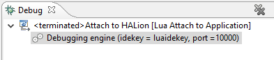

## Using the LDT Debugger

From now on, the debug session can be started from the Debug menu  on the LDT toolbar.

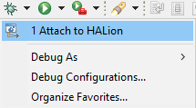

Tips for using the LDT debugger can be found here:

[Debugging a Lua program](https://wiki.eclipse.org/LDT/User_Area/User_Guides/User_Guide_1.3#Debugging_a_Lua_program)
