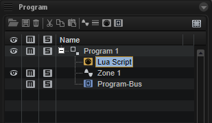
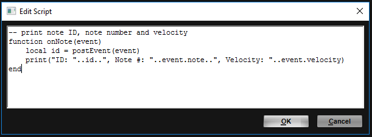
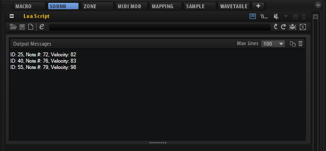

/ [HALion Developer Resource](../..//HALion-Developer-Resource.md) / [HALion Script](./HALion-Script.md) / [Getting Started](./Getting-Started.md) /

# Exploring the Code Examples

---
**On this page:**

[[_TOC_]]

---

Many of the classes and functions that are are described in the [Class Reference](./Class-Reference.md) and on the [Reference](./Reference.md) pages provide working code examples. The code examples use syntax highlighting. Comments are displayed in green, functions in magenta and values in blue, for example. See [Lua Syntax Highlighting](./Lua-Syntax-Highlighting.md) for more details.

#### Example

```lua
-- "Hello world!" Lua script
print("Hello world!")
```
The easiest way to explore the code examples is to copy the code to the clipboard and to paste it to the internal script editor of the Lua Script MIDI module. Please read below how to do this.

[Jump to Top ](#exploring-the-code-examples)

## Program for Code Examples

If not stated otherwise, the following simple program will be sufficient for exploring the code examples in HALion.
1. Download the program [Explore Code Examples.vstpreset](../vstpresets/Explore%20Code%20Examples.vstpreset)
1. Drag the program to the **Slot Rack**.

This describes how you create the program manually.
1. Select an empty program in the **Program Table**.
1. In the **Program Tree**, click **Create New MIDI Module**  and select **Lua Script**.
1. In the Program Tree, click **Create New Zone**  and select **Synth Zone**.
1. Load the program to the **Slot Rack**.

This is how your program should look like in the program tree.



[Jump to Top ](#exploring-the-code-examples)

## Loading the Code Examples

The program described above should be loaded in the **Slot Rack**.

1. Open a page with a code example, for example, [onNote](./onNote.md).
1. Double-click the code example to select all lines and press **Ctrl/Cmd-C** to copy the code to the clipboard.
1. Go to HALion and select **Lua Script** in the **Program Tree**.
1. Open the section for the **Lua Script MIDI module**, either in the **Sound** or in the **MIDI Modules** editor.
1. Click **Edit Script** to open the internal **Script Editor**.
1. Give the **Script Editor** the window focus and press **Ctrl/Cmd-V** to paste the code from the clipboard.
1. Click **OK** to activate the script.



Depending on the code example, you usually have to play a note or send a MIDI controller to get a sound or output message from the script. Typically, the description of the feature and the comments in the code will give you enough hints for what to do. In the above example, [onNote](./onNote.md) prints the note ID, the MIDI note number and the MIDI velocity, each time you play a note.



[Jump to Top ](#exploring-the-code-examples)