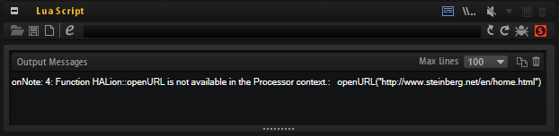

/ [HALion Developer Resource](../../HALion-Developer-Resource.md) / [HALion Script](./HALion-Script.md) / [Diving Deeper](./Diving-Deeper.md) /

# Threads in HALion

---

**On this page:**

[[_TOC_]]

---

HALion provides two threads:

* Parameter changes and the storage of them are handled by the **Controller** thread.
* MIDI event processing and sound reproduction happen in the **Processor** thread.

You can think of these threads as two sections of code that are exectued in concurrency by HALion. Basically, the two threads are needed to split longer lasting function calls from timing critical function calls. The functions that are called in the **Controller** thread are executed only as fast as required, while the functions that are called in the **Processor** thread are executed within an ASIO block.

The information whether a function can be called in the **Controller** thread, the **Processor** thread, or in both threads, can be found on the [Reference](./Reference.md) pages below the description of each function.

It looks like this:

>**Available in:** Controller, Processor.

## Script Error - Wrong Thread

If you call a function in the wrong thread, the script module will output an error message.

#### Example 1

```lua
--[[
  Example for a script error when calling a function in the wrong thread.
  The onNote callback runs in the Processor thread. openURL runs in the Controller thread.
  Therefore, openURL cannot be called in onNote. The script produces a script error when playing a note.
--]]
 
function onNote(event)     
  openURL("http://www.steinberg.net/en/home.html")
end
```
The output message for the script error of the above example looks like this:



If this ever happens to you, please review your code and try to place the function call elsewhere in your script. Alternatively, you could use [runAsync](./runAsync.md).

## Using runAsync

By calling [runAsync](./runAsync.md) in the **Processor** thread you can invoke a function that is executed in the **Controller** thread. The execution of [runAsync](./runAsync.md) takes at least one audio block, or longer, depending on the function that was called. The callback that called [runAsync](./runAsync.md) is put on hold until the function has completed. Please be aware of this when using [runAsync](./runAsync.md).

#### Example 2

```lua
-- Using runAsync to call openURL within onNote.
 
function onNote(event)
  runAsync(function() openURL("http://www.steinberg.net/en/home.html") end)
end
```

## Using runSync

By calling [runSync](./runSync.md) in the **Controller** thread, you can invoke a function that is executed in the **Processor** thread. For example, by calling [runSync](./runSync.md) in a parameter change callback, you can invoke an event function like [playNote](./playNote.md), [releaseVoice](./releaseVoice.md), [controlChange](./controlChange.md), etc. The callback that called [runSync](./runSync.md) is not stopped and continues its execution. The specified function will be exectued in the next audio block.

```lua
-- Fade all voices, triggered by a script parameter.

defineSlotLocal("noteIDs")
noteIDs = {}
  
function onNote(event)
  local id = postEvent(event)
  table.insert(noteIDs, id)
end
  
function syncFadeAllVoices()
  for i, id in ipairs(noteIDs) do
      fade(id, nil, 0, 1000, true)
  end
  noteIDs = {}
end
  
function fadeAllVoices()
  if fadeVoices then
    runSync(syncFadeAllVoices, 1)
  end
end
  
defineParameter("fadeVoices", "Fade All Voices", false, fadeAllVoices)
```
