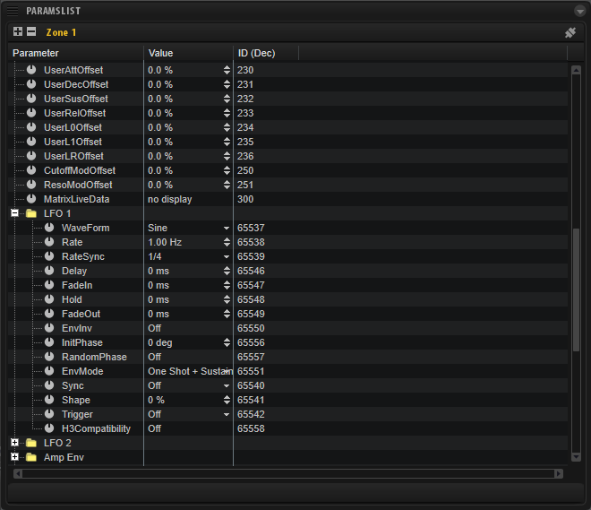

/ [HALion Developer Resource](../../HALion-Developer-Resource.md) / [HALion Script](./HALion-Script.md) / [Advanced Topics](./Advanced-Topics.md) /

# Working with Parameters

---

**On this page:**

[[_TOC_]]

---

## Properties of Parameters

Every parameter has a [ParameterDefinition](./ParameterDefinition.md) object that describes the properties of a parameter. For example, you can retrieve the minimum, maximum, or default value of a parameter by reading the corresponding fields of the [ParameterDefinition](./ParameterDefinition.md) object (see [getParameterDefinition](./getParameterDefinition.md) for details). The fields of the [ParameterDefinition](./ParameterDefinition.md) object can only be read and not be modified.

The actual value of a parameter is not part of the [ParameterDefinition](./ParameterDefinition.md) object. It can be modified using the functions [getParameter](./getParameter.md) and [setParameter](./setParameter.md) or [getParameterNormalized](./getParameterNormalized.md) and [setParameterNormalized](./setParameterNormalized.md).

## Addressing Parameters

Functions like [getParameter](./getParameter.md), [setParameter](./setParameter.md) or [getParameterDefinition](./getParameterDefinition.md) address the desired parameter by its name or ID.

### Adressing Parameters by Name

Please do not mix up the parameter's label on the UI with its name in the engine. Sometimes, the label and the name of a parameter are the same, but most of the time they are different.

>&#10069; Throughout this documentation "name of parameter..." refers to its name in the engine and not its label on the UI.

The name of a parameter can be found in HALion's **Parameter List**. The **Parameter List** gives you a detailed overview of the parameters of the currently selected element in the **Program Tree**. The following screenshot shows parts of the parameters of a zone.



The **Parameter** column lists the names of the parameters. Parameters that belong together can be grouped into functional sections, represented by the folders in the **Parameter** column.

* Parameters that do not belong to a section can be addressed directly. In the screenshot above, "UserAttOffset" addresses the attack offset of the user envelope in the zone, for example.
* Parameters that belong to a section need the name of the section as prefix, for example, the shape parameter of LFO 1 in the zone has the name "LFO 1.Shape".

#### Example 1

```lua
function onLoadIntoSlot()
  local zones = this.program:findZones(true)
  if zones[1] then
    print("LFO 1.Shape: "..tostring(zones[1]:hasParameter("LFO 1.Shape")))
    print("lfo 1.shape: "..tostring(zones[1]:hasParameter("lfo 1.shape")))
  end
end
```

>&#10069; Addressing a parameter by its name is case sensitive.

### Adressing Parameters by ID

The ID of a parameter can also be found in the **Parameter List**. By default, the **Parameter List** does not show the ID.

* To add the ID column to the **Parameter List**, right-click a column header and select **ID (Dec)**.

The ID of "LFO 1.Shape" is 65542, for example.

#### Example 2

```lua
local lfo1ShapeID = 65542
function onLoadIntoSlot()
  local zones = this.program:findZones(true)
  if zones[1] then
    print("LFO 1.Shape: "..tostring(zones[1]:hasParameter(lfo1ShapeID)))
  end
end
```

Addressing parameters by name needs more computing time and might be a disadvantage for timing critical scripts. To optimize your script, you can read the ID of a parameter with [getParameterDefinition](./getParameterDefinition.md) during the initialization of the script and use this instead.

#### Example 3

```lua
-- Read the ID of the parent layer's level parameter.

local paramID = this.parent:getParameterDefinition("Level").id
 
-- Print the value of the parent layer's level parameter with each note-on.

function onNote(event)
    postEvent(event)
    print("Level = "..this.parent:getParameter(paramID))
end
```

## Using setParameter

The functions [setParameter](./setParameter.md) and [setParameterNormalized](./setParameterNormalized.md) address parameters also by name or ID.

#### Example 4

```lua
-- Set the value of the Level parameter of the parent layer.

function onLoadIntoSlot()
    this.parent:setParameter("Level", 0) -- set via name
    this.parent:setParameter(38, 0) -- set via ID
end
```
