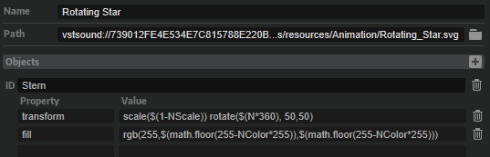
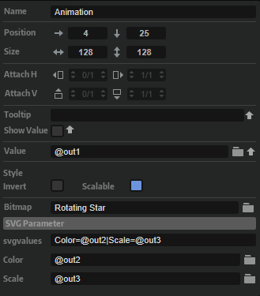
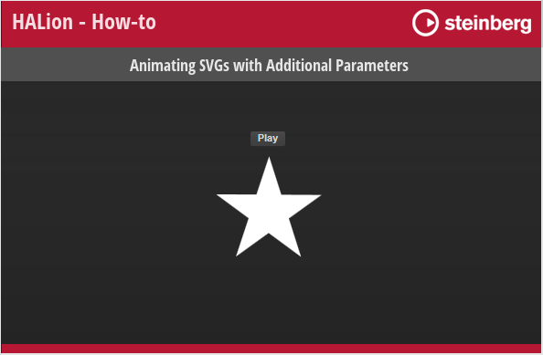
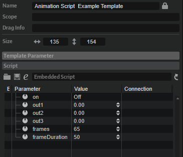

/ [HALion Developer Resource](../../HALion-Developer-Resource.md) / [HALion Tutorials & Guidelines](./HALion-Tutorials-Guidelines.md) / [How-tos](./How-tos.md) /

# Animating SVGs with Additional Parameters

---

**On this page:**

[[_TOC_]]

---

[Animation](../../HALion-Macro-Page/pages/Animation.md) controls can have more than one animatable SVG property.

## Defining Additional SVG Parameters

 To define additional parameters, you must use a Lua expression with the V, N, or S variable extended by a name variable. {{#include ./_Lua-Expressions.md:paragraph1}}
 
 {{#include ./_Lua-Expressions.md:paragraph2}}
|**Name**|A definable name for the variable.|

{{#include ./_Lua-Expressions.md:paragraph3}}

>**$(VName) | $(NName) | $(SName)**

The additional parameters must be defined in the respective SVG resource like this.



These additional SVG resource attributes are introduced as supplementary values within an [Animation](../../HALion-Macro-Page/pages/Animation.md) control. They can be connected to engine, MIDI script, or UI script parameters, analogous to other control values.



This integration empowers the manipulation of SVG elements and their subordinate objects through diverse avenues. Each associated parameter governs a specific facet of the animation. For instance, one parameter might change object rotation, while another parameter concurrently adjusts dimensions, color properties, and so forth.

>&#10069; To animate SVGs without the utilization of UI scripts, see [Animating Switches Using SVGs](./Animating-Switches-Using-SVGs.md) for details.

## Animating Additional SVG Parameters

{{#include ./_Excerpts.md:single-example}}

### Example VST Preset

* [Animating SVGs with Additional Parameters.vstpreset](../vstpresets/Animating%20SVGs%20with%20Additional%20Parameters.vstpreset)



**To explore the templates in this example:**

1. Load [Animating SVGs with Additional Parameters.vstpreset](../vstpresets/Animating%20SVGs%20with%20Additional%20Parameters.vstpreset).
1. Open the **Macro Page Designer**, go to the **GUI Tree** and select the Animation Script Example template. 
1. Click **Edit Element**  to examine the template.
1. Inside the template, select the [Animation](../../HALion-Macro-Page/pages/Animation.md) control. Look which [Bitmap](../../HALion-Macro-Page/pages/Bitmap.md) resource has been assigned.
1. Go to the **Resources Tree** and select the corresponding SVG resource. Look for the IDs, properties and values as listed below.

### Changing Multiple SVG Properties

**Resource:** Rotating Star.

|ID|Property|Value|
|:-|:-|:-|
|Stern|transform|``scale($(1-NScale))``|

**Description:** The star is faded out by scaling it from original to minimum size. The name of the additional parameter is 'Scale'.

|ID|Property|Value|
|:-|:-|:-|
|Stern|transform|``rotate($(N*360), 50,50)``|

**Description:** The star is rotated by 360 degrees. It does not need a name variable, because it uses the 'Value' parameter of the [Animation](../../HALion-Macro-Page/pages/Animation.md) control.

|ID|Property|Value|
|:-|:-|:-|
|Stern|transform|``rgb(255,$(math.floor(255-NColor*255)),$(math.floor(255-NColor*255)))``|

**Description:** The color fades from white to red. The name of the additional parameter is 'Color'.

The script has three outputs which are connected to the corresponding SVG properties. The speed for each animation is defined inside the script. The script is attached to the Animation Script Example Template.



```lua
defineParameter{name = "on", default = false, onChanged = function() animate() end}   
defineParameter{name = "out1", default = 0, min = 0, max = 1}   
defineParameter{name = "out2", default = 0, min = 0, max = 1}   
defineParameter{name = "out3", default = 0, min = 0, max = 1}   
defineParameter{name = "frames", default = 65, min = 1, max = 1000, type = "integer"}   
defineParameter{name = "frameDuration", default = 50, min = 20, max = 10000, type = "integer"}   
  
-- The calcPhasor function returns a closure that maintains the counter value
-- and increments it by the specified increment.  
function calcPhasor(increment)  
    local counter = 0  
  
    return function()  
        counter = (counter + increment) % 1  
        return counter  
    end  
end  

function animate()
    -- Create phasors with different speed.
    local phasor1 = calcPhasor(1/frames)        -- Full speed.  
    local phasor2 = calcPhasor(1/(frames*2))    -- Half speed. 
    local phasor3 = calcPhasor(2*1/frames)      -- Double speed. 
    -- Call the phasor functions repeatedly. 
    while on do  
        out1 = phasor1()  
        out2 = phasor2()  
        out3 = phasor3()  
        wait(frameDuration)  
    end  
    out1, out2, out3 = 0, 0, 0  
end  
```
