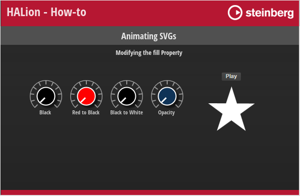

/ [HALion Developer Resource](../../HALion-Developer-Resource.md) / [HALion Tutorials & Guidelines](./HALion-Tutorials-Guidelines.md) / [How-tos](./How-tos.md) /

# Animating SVGs

---

**On this page:**

[[_TOC_]]

---

By harnessing the capabilities of Lua expressions, you can animate controls that incorporate Scalable Vector Graphics (SVGs). Through the manipulation of SVG properties using Lua expressions, you gain control over how the values of these properties are modified within the control itself. This enables you to create dynamic and visually appealing animations that enhance the user experience.

## Lua Expressions

An expression begins with ``$`` followed by ``()``. Everything inside the brackets will be evaluated and returns the effective value for the property.

>**$(expression)**

You can use the following variables in Lua expressions:

|Variable|Description|
|:-|:-|
|**N**|The normalized value (0 to 1.0) of the control itself.|
|**V**|The value as sent by the connected engine parameter.|
|**S**|A string as sent by the connected parameter|

Strings are set either by a stringlist variable or by MIDI script or UI script parameters. The ability to use the string output of a parameter allows you to transmit even a sequence of values, such as the path of an object, for example.

## Examples

### Modifying the fill Property

#### Example VST Preset

* [Animating SVGs 1.vstpreset](../vstpresets/Animating%20SVGs%201.vstpreset)

**To explore the templates in this example:**

1. Load [Animating SVGs 1.vstpreset](../vstpresets/Animating%20SVGs%201.vstpreset).
1. Open the **Macro Page Designer**, go to the **GUI Tree** and select the template you wish to explore. 
1. Click **Edit Element**  to examine the template.
1. Select a [Knob](../../HALion-Macro-Page/pages/Knob.md) control, for example. Look which [Bitmap](../../HALion-Macro-Page/pages/Bitmap.md) resource has been assigned.
1. Go to the **Resources Tree** and select the corresponding SVG resource. Look for fill the properties as listed below.

**Knob Black**

``fill rgb(0,0,0)``

Static color, in this case black.

**Knob Red to Black**

``fill rgb($(math.floor((1-N)*255)),0,0)``

The normalized value (0 to 1.0) of the control scales the red channel from 255 to 0. This creates a fade from red to black.

**Knob Black to White**

``fill rgb($(math.floor(N*255)),$(math.floor(N*255)),$(math.floor(N*255)))``

The normalized value (0 to 1.0) of the control scales all channels from 0 to 255. This creates a fade from black and white.

**Knob Opacity**

``fill hsla (220,75%,62%,$(1-N))``

The normalized value of the control scales the opacity from 1.0 to 0.

**Animation Star**

``fill $(S)``

An animation control changes its color to the value delivered by the string output of a connected script parameter.
