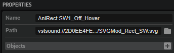
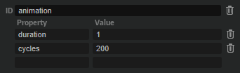
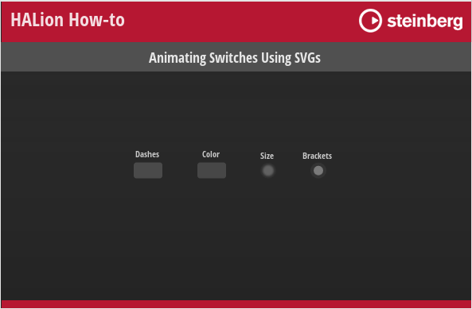

/ [HALion Developer Resource](../../HALion-Developer-Resource.md) / [HALion Tutorials & Guidelines](./HALion-Tutorials-Guidelines.md) / [How-tos](./How-tos.md) /

# Animating Switches Using SVGs

{{#include ../../_Version.md:halion700}}

---

**On this page:**

[[_TOC_]]

---

Using SVGs as resources for the different states of a [Switch](../../HALion-Macro-Page/pages/Switch.md) control allows for state-specific animations, to enhance the visibility of each state. The state-specific animations are defined by using Lua expressions in the resource properties of the SVG that is assigned to each state. The SVG resources to be animated require an [animation object](#adding-an-animation-object) that defines the duration and number of cycles for the animation. This integration enables the manipulation of SVG objects without the need to use UI scripts.

>&#10069; See [Animating SVGs with Additional Parameters](./Animating-SVGs-with-Additional-Parameters.md) for details on using UI scripts for animations.

## Adding an Animation Object

Before you can define the animation in the SVG resource properties, you must add an additional animation object to the SVG resource you want to animate.

1. Go to the **Resource Tree** and select the SVG resource you want to animate.
2. In the the **Objects** line, click **+**.

3. Set the ID of the object to ``animation``.
4. Add a ``duration`` property and set its value to '1'.
5. Add a ``cycles`` property and set its value to '200'.

In this example, one cycle of the animation takes 1 second and the animation is played for 200 cycles. The settings should be sufficient to keep the animation running, even if you hover the mouse over the switch for a longer time, for example. Depending on the application of your animation, you can increase or decrease these values.

|Property|Description|Type|
|:-|:-|:-|
|**duration**|This property defines how long it takes to play one cycle of the animation in seconds.|float|
|**cycles**| This property defines how often the animation is played. The minimum number of cycles must be greater than 0.|integer|

## Defining the Animation

The animations are defined in the SVG resource properties by using Lua expressions. {{#include ./_Lua-Expressions.md:paragraph1}}

Assuming the presence of an [animation object](#adding-an-animation-object), you can use the following variables in Lua expressions:

|Variable|Description|
|:-|:-|
|**Duration**|Corresponds to the value set by the ``duration`` property.|
|**T**|The overal time since the start of the animation in seconds.|
|**t**|The normalized time (0 to 1.0) within the current cycle.|
|**Cycle**|The number of completed cycles, starting at 0. The ``cycles`` property defines the maximum.|

## Animating Switches

{{#include ./_Excerpts.md:multiple-examples}}

### Example VST Preset

* [Animating Switches Using SVGs.vstpreset](../vstpresets/Animating%20Switches%20Using%20SVGs.vstpreset)

**To explore the templates in this example:**

1. Load [Animating Switches Using SVGs.vstpreset](../vstpresets/Animating%20Switches%20Using%20SVGs.vstpreset).
1. Open the **Macro Page Designer**, go to the **GUI Tree** and select the template you wish to explore. 
1. Click **Edit Element**  to examine the template.
1. Inside the template, select the [Switch](../../HALion-Macro-Page/pages/Switch.md) control. Take a look at which [Bitmap](../../HALion-Macro-Page/pages/Bitmap.md) resources have been assigned to the different states of the switch.
1. Go to the **Resources Tree** and select the corresponding SVG resource. Look for the IDs, properties and values as listed below.

### Animated Dashed Line

#### Dashes Switch

In this example, the same animation is used for the on and off states of the switch.

**Resources:** AniRect SW1_Off_Hover, AniRect SW1_On_Hover.

|ID|Property|Value|
|:-|:-|:-|
|Rect|stroke-dashoffset|``$(1+t*20)``|

**Description:** A dashed line moves counterclockwise around the switch when you hold the mouse over the switch. By using ``$(1-t*20)`` the dashed line moves clockwise around the switch.

### Animated Colors

In this example, different animations are used for the on and off states of the switch.

#### Colors Switch

**Resource:** AniRect SW2_Off_Hover.

|ID|Property|Value|
|:-|:-|:-|
|Rect|fill|``hsla(100,0%,$(100-math.cos(t*6.28)*72)%,1)``|

**Description:** The color periodically fades between grey and white when you hold the mouse over the switch while the switch is in the off state.

**Resource:** AniRect SW2_On_Hover.

|ID|Property|Value|
|:-|:-|:-|
|Rect|fill|``hsla(214, $(100-math.cos(t*6.28)*40)%, $(80-math.cos(t*6.28)*20)%, 1)``|

**Description:** The color periodically fades between white and blue when you hold the mouse over the switch while the switch is in the on state.

### Animated Size

In this example, different animations are used for the on and off states of the switch.

#### Size Switch

**Resource:** AniRect SW5_Off_Hover.

|ID|Property|Value|
|:-|:-|:-|
|Circle|r|``$(7-math.abs(0.5-t)*10)``|
|feGaussianBlur1740|stdDeviation|``$(1-math.abs(0.5-t)*2)``|

**Description:** The radius of the circle and the deviation of the blur change periodically when you hold the mouse over the switch while the switch is in the off state. The color is grey and the inner circle is smaller than the blur. The 'r' property describes the radius of the 'Circle' element. A negative value for 'r' must be avoided with ``math.abs``. The 'stdDeviation' attribute defines the standard deviation for the blur.

**Resource:** AniRect SW5_On_Hover.

|ID|Property|Value|
|:-|:-|:-|
|Circle|r|``$(7-math.abs(0.5-t)*6)``|
|feGaussianBlur1740|stdDeviation|``$(1-math.abs(0.5-t)*2)``|

**Description:** The radius of the circle and the deviation of the blur change periodically when you hold the mouse over the switch while the switch is in the on state. The color is green and the inner circle is larger than in the off state. The 'r' property describes the radius of the 'Circle' element. A negative value for 'r' must be avoided with ``math.abs``. The 'stdDeviation' attribute defines the standard deviation for the blur.

### Animated Brackets

In this example, multiple properties get animated for each state and different animations are used for the on and off states of the switch. 

#### Brackets Switch

**Resource:** AniRect SW6_Off_Hover.

|ID|Property|Value|
|:-|:-|:-|
|Circle|fill|``hsla(100,0%,$(100-math.abs(0.5-t)*144)%,1)``|
|Circle|r|``$(6-math.abs(0.5-t)*4)``|
|ArrowL|transform|``translate ($(-10+t*20))``|
|ArrowL|fill|``hsla(100,0%,80%,$(1-t*0.9))``|
|ArrowR|transform|``translate ($(10-t*20))``|
|ArrowR|fill|``hsla(100,0%,80%,$(1-t*0.9))``|

**Description:** The switch blinks periodically in white and round brackets are moving from the outside to the inside when you hold the mouse over the switch while the switch is in the off state. The 'r' property describes the radius of the 'Circle' element. A negative value for 'r' must be avoided with ``math.abs``.

**Resource:** AniRect SW6_On_Hover.

|ID|Property|Value|
|:-|:-|:-|
|Circle|fill|``hsla(154,40%,$(50-math.abs(0.5-t)*40)%,1)``|
|Circle|r|``$(6-math.abs(0.5-t)*4)``|
|ArrowL|transform|``translate ($(-10+t*20))``|
|ArrowL|fill|``hsla(154,40%,50%,$(1-t*0.9))``|
|ArrowR|transform|``translate ($(12-t*20))``|
|ArrowR|fill|``hsla(154,40%,50%,$(1-t*0.9))``|

**Description:** The switch blinks periodically in green and round brackets are moving from the outside to the inside when you hold the mouse over the switch while the switch is in the off state. The 'r' property describes the radius of the 'Circle' element. A negative value for 'r' must be avoided with ``math.abs``.
