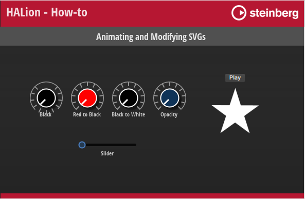

/ [HALion Developer Resource](../../HALion-Developer-Resource.md) / [HALion Tutorials & Guidelines](./HALion-Tutorials-Guidelines.md) / [How-tos](./How-tos.md) /

# Animating and Modifying SVGs

---

**On this page:**

[[_TOC_]]

---

By harnessing the capabilities of Lua expressions, you can animate controls that incorporate Scalable Vector Graphics (SVGs). Through the manipulation of SVG properties using Lua expressions, you gain control over how the values of these properties are modified within the control itself. This enables you to create dynamic and visually appealing animations that enhance the user experience.

## Lua Expressions

{{#include ./_Lua-Expressions.md:lua-expressions}}

## Animating and Modifying SVG Properties

{{#include ./_Excerpts.md:multiple-examples}}

### Example VST Preset

* [Animating and Modifying SVGs.vstpreset](../vstpresets/Animating%20and%20Modifying%20SVGs.vstpreset)



**To explore the templates in this example:**

1. Load [Animating and Modifying SVGs.vstpreset](../vstpresets/Animating%20and%20Modifying%20SVGs.vstpreset).
1. Open the **Macro Page Designer**, go to the **GUI Tree** and select the template you wish to explore. 
1. Click **Edit Element**  to examine the template.
1. Inside the template, select a [Knob](../../HALion-Macro-Page/pages/Knob.md) control, for example. Look which [Bitmap](../../HALion-Macro-Page/pages/Bitmap.md) resource has been assigned.
1. Go to the **Resources Tree** and select the corresponding SVG resource. Look for the IDs, properties and values as listed below.

### Changing the Fill Color of an Object

#### Knob Black

**Resource:** Knob11_Scale2_Green.

|ID|Property|Value|
|:-|:-|:-|
|Knob|fill|``rgb(0,0,0)``|

**Description:** Static color, in this case black. The original color of the control was green.

#### Knob Red to Black

**Resource:** Knob11_Scale2_Red.

|ID|Property|Value|
|:-|:-|:-|
|Knob|fill|``rgb($(math.floor((1-N)*255)),0,0)``|

**Description:** The normalized value (0 to 1.0) of the control scales the red channel from 255 to 0. This creates a fade from red to black.

#### Knob Black to White

**Resource:** Knob11_Scale2_Blue.

|ID|Property|Value|
|:-|:-|:-|
|Knob|fill|``rgb($(math.floor(N*255)),$(math.floor(N*255)),$(math.floor(N*255)))``|

**Description:** The normalized value (0 to 1.0) of the control scales all channels from 0 to 255. This creates a fade from black to white.

>&#10069; rgb values must be integer values, therefore ``math.floor`` is used in the examples above.

#### Knob Opacity

**Resource:** Knob11_Scale2_Blue_1.

|ID|Property|Value|
|:-|:-|:-|
|Knob|fill|``hsla (220,75%,62%,$(1-N))``|

**Description:** The normalized value of the control scales the opacity from 1.0 to 0.

#### Rotating Star

**Resource:** Rotating Star

|ID|Property|Value|
|:-|:-|:-|
|Stern|fill|``$(SColor)``|

**Description:** An animation control changes its color to the value set by the string output of the connected script parameter. ``$(SColor)``is an additional SVG Parameter, see [Animating SVGs with Additional Parameters](./Animating-SVGs-with-Additional-Parameters.md) for details. The following script switches between two colors.

```lua
function onSwitchChanged() 
    if Switch then
        this:setParameter("FillColor", "rgb(255,0,0)")
    else
        this:setParameter("FillColor", "rgb(255,255,255)")
    end
end

defineParameter("Switch", nil, false, onSwitchChanged)
defineParameter("FillColor", nil, "rgb(255,255,255)")
```

### Changing the Rotation of an Object

#### Knob Black

**Resource:** Knob11_Scale2_Green.

|ID|Property|Value|
|:-|:-|:-|
|LineMain|transform|``rotate(180,32,32)``|

**Description:** The object is rotated by a fixed amount of 180 degrees around the center at x,y = 32,32 pixels. In this case, the scale is turned up side down.

#### Knob Black, Knob Red to Black, Knob Black to White, Knob Opacity

**Resource:** Knob11_Scale2_Green, Knob11_Scale2_Red, Knob11_Scale2_Blue and Knob11_Scale2_Blue_1.

|ID|Property|Value|
|:-|:-|:-|
|KnobLine|transform|``rotate($(-135+N*270),32,32)``|

**Description:** A knob control rotates the object by 270 degrees with a start offset of -135 degrees, around the center at x,y = 32,32 pixels. In this case, the indicator of the control is rotated displaying the current value.

### Changing the Position of an Object

#### Slider

**Resource:** Circle.

|ID|Property|Value|
|:-|:-|:-|
|Circle|transform|``translate(-0.5,0.5)``|

**Description:** The upper left corner of the object is moved by a fixed amount, -0.5 pixels down and 0.5 pixels to the right. Here, it places the handle of the slider at the correct position.

### Changing the Path of an Object

#### Slider

**Resource:** LightStrip H3Uni.

|ID|Property|Value|
|:-|:-|:-|
|Path|d|``M 0 9.5 L $(N*100) 9.5``|

**Description:** Draws a horizontal line using the normalized value of the control.
