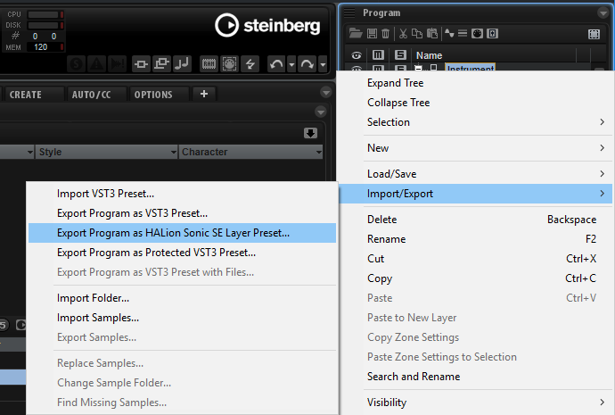

# Creating Instruments

---

**On this page:**

[[_TOC_]]

---

This page provides you with more details on how to build instruments in HALion that work in HALion Sonic (SE), why you must export them as HALion Sonic SE Layer preset, and why you should do the final sound design in HALion Sonic.

HALion Sonic (SE) has one compact, easy-to-use interface, as opposed to HALion, which has a much more advanced interface that is fully customizable. HALion Sonic (SE)'s streamlined interface hides any parameters of HALion that are not needed for a VST workstation. Apart from the visible differences on the interface, there are also differences in the program structure between HALion Sonic (SE) and HALion. The program structure of the instrument that you build in HALion must fulfill some requirements in order to work in HALion Sonic (SE).

## HALion Program Structure

Libraries usually contain instruments that are designed for a special purpose.

A typical instrument consists of the following:

* Several zones organized in layers.
* A macro page that gives access to the most important parameters.
* A Lua Script MIDI module and/or other MIDI modules.
* A bus and insert effects.

The program structure of your instrument in the **Program Tree** of HALion might look as simple as this:

## HALion Sonic (SE) Requirements

The program structure of your instrument must fulfill the following requirements to work in HALion Sonic (SE):

* The macro page must be attached to the top element in the Program Tree. In the example above, this would be the element Instrument. HALion Sonic (SE) will not see the macro page if it is not attached to the top element.

{{#include _Maximum-Macro-Page-Size.md}}

* The last element in the Program Tree must be one bus with a maximum of four insert effects. In the example above, this would be the element Instrument-Bus. There must be only one bus at the top level. Several busses at the top level are not allowed. The maximum number of insert effects per Layer in HALion Sonic (SE) is limited to four. The insert effects are optional. In the example above, the Instrument-Bus does not have any insert effects. In fact, it is good practice to leave the bus empty in HALion and assign the insert effects later on the Inserts tab in HALion Sonic.

>&#10069; If you export a Program as HALion Sonic SE Layer preset and the program structure does not comply with these requirements, HALion will warn you that the Layer preset will not be accepted by HALion Sonic (SE).

The following elements can be added freely to the program structure:

* You can add as many sublayers and zones as you want.
* You can place MIDI modules below the top element or inside of sublayers as needed.
* You can add additional busses with insert effects inside of sublayers. These effects become an integral part of your instrument. To adjust the effect, you must add controls on the macro page and connect them to the effect parameters.

The following picture shows the instrument from above, with an additional bus and insert effect.

If you follow these guidelines, your instrument will be compatible with HALion Sonic (SE):

* Except for the topmost and the last element in the Program Tree, the program structure can be set up as needed for your instrument.
* Inside the "Instrument" element, you are free to add any element you want.
* You must set up a macro page that provides access to the important parameters. The macro page must be attached to the topmost element.
*The "Instrument-Bus" is already part of HALion Sonic (SE) program structure. You can assign up to four insert effects to it.

## HALion Sonic (SE) Program Structure

When you design your instrument in HALion, it is created as a Program and saved as VST3 Program preset. The final sound design is usually done in HALion Sonic. However, before you can load your instrument in HALion Sonic, you must export it as HALion Sonic SE Layer preset. The export in HALion Sonic SE format allows you to load and test your instrument in HALion Sonic SE.

The layout of HALion Sonic (SE)'s interface and features requires some specific MIDI modules and busses. When you load a Layer preset in HALion Sonic (SE), any missing MIDI modules, busses, etc. that are required for HALion Sonic (SE) to operate are added automatically. For example, if the Instrument-Bus was missing in the example above, HALion Sonic (SE) would add this bus when loading the Layer preset, because it is needed for the Inserts tab in HALion Sonic.

The following picture shows the program structure of the example instrument after these steps:

* In HALion, export the instrument with Export Program as HALion Sonic SE Layer Preset.
* Load the exported Layer in HALion Sonic and save it as Program preset.
* Load this Program preset in HALion.

The Trigger Pads, two FlexPhrasers and a Program-Bus were added, because HALion Sonic (SE) requires them.

>&#10069; If you load a Program preset from HALion Sonic (SE) in HALion, do not export the Program preset as HALion Sonic SE Layer preset again. If you do so and load this preset in HALion Sonic (SE), the MIDI modules will be added again and the preset will not be compatible anymore. You must use the HS Edit mode instead. See Using HS Edit Mode for details.

Once your instrument is finished, the final sound design can start.

## Final Sound Design

The exported HALion Sonic SE Layer preset usually serves as your init preset for doing the final sound design in HALion Sonic.

Doing the final sound design in HALion Sonic has the following advantages:

* The required elements are added automatically.
* You have access to the Program tab, which allows you to combine up to four instruments, for example.
* You have access to the Inserts tab, which allows you to assign insert effects to the layers and the program.
* Additional parameters from HALion are hidden and cannot be adjusted by mistake.

>&#10069; You could also do the final sound design in HALion Sonic SE. But, then you would not have access to HALion Sonic's Program and Inserts tab, which limits the sound design possibilities.

After the sound design, you can save your finished sound as HALion Sonic Program preset. In this step you should tag your presets in the **MediaBay**. See the [MediaBay Guideline](./MediaBay-Guideline.md) for more details.

It is recommended to save your sounds as Program presets rather than HALion Sonic SE Layer presets, because Steinberg users mainly use the Program filter when browsing for presets in the **MediaBay**.

In HALion in the **Library Creator**, if you choose to build your library as HALion Sonic SE library, all HALion Sonic presets are converted to HALion Sonic SE presets.

## Correcting Settings

To correct settings in your instrument, choose one of the two following ways:

### Using Export Program as HALion Sonic SE Layer preset

If you need to correct settings in the phase of testing your instrument in HALion Sonic (SE) and if you have not done any serious sound design or saved further presets yet:

1. Go back to the original HALion Program preset of your instrument.
1. Correct settings as required and save the edits to the original HALion Program preset.
1. Export the instrument again as HALion Sonic SE Layer preset.

### Using HALion Sonic Edit Mode

If you need to correct settings in the phase of sound design and you already created HALion Sonic (SE) Program presets:

<ol><li>Load the HALion Sonic (SE) Program preset of your instrument. The HALion Sonic Edit Mode will be activated. This ensures that you cannot accidentally change the program structure that is required by HALion Sonic (SE).

>&#10069; Do not deactivate HS Edit mode, it cannot be activated manually.</li>

<li>Correct settings as appropriate and save the Program preset. If the HALion Sonic Edit Mode is active, the preset will be saved in the HALion Sonic (SE) preset format.</li></ol>

The HALion Sonic Edit Mode can be switched off permanently with the corresponding setting on the Options page. When loading HALion Sonic (SE) Program presets, the HALion Sonic Edit Mode will only be activated if the setting on the Options page is turned on. See [HALion Sonic Edit Mode](https://steinberg.help/halion/v6/en/halion/topics/global_functions_and_settings/options_editor_edit_section_r.html) for details.