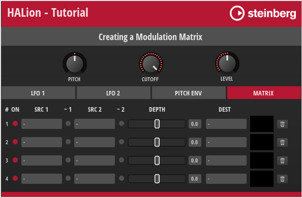

/ [HALion Developer Resource](../../HALion-Developer-Resource.md) / [HALion Tutorials & Guidelines](./HALion-Tutorials-Guidelines.md) / [Tutorials](./Tutorials.md) /

# Creating a Modulation Matrix

---

**On this page:**

[[_TOC_]]

---

HALion offers a wealth of modulation sources and destinations, more than a standard instrument needs. For your particular instrument, it is usually necessary to limit the selection of modulation sources and destinations to the ones you really need. This tutorial describes how to create and customize a modulation matrix using a [Template List](../../HALion-Macro-Page/pages/Template-List.md). The modulation matrix in this tutorial has a configurable number of rows and uses only some of the available modulation sources and destinations. The number of rows and the selection of modulation sources and destinations are defined in the UI and MIDI scripts, respectively. The menus for modulation sources and destinations use [Custom Multi Level Menus](./Custom-Multi-Level-Menus-II.md) that you can define. This means that only the defined modulation sources and destinations will appear in these menus.



The macro page provides controls for the destinations Pitch, Cutoff and Level. Page tabs provide access to the controls of the sources LFO 1, LFO 2, and Pitch Env, as well as the modulation matrix. You can assign sources and destinations using the menus in the modulation matrix or by using drag and drop.

* Drag the page tab of the desired source to the destination of your choice.

The next available row in the modulation matrix will be used for the drag and drop assignment. If there aren't any free rows available, you won't be able to drag and drop sources. You'll see a symbol appear before the sources that lets you know.

[Jump to Top ](#creating-a-modulation-matrix)

## Example VST Preset

* [Creating a Modulation Matrix 01.vstpreset](../vstpresets/Creating%20a%20Modulation%20Matrix%2001.vstpreset)

The modulation matrix in this example uses both UI and MIDI script functionality. The corresponding scripts are provided, but not explained in detail line by line. Instead, the connections and interactions between the UI elements and the UI and MIDI scripts are explained so that you can adjust the number of rows and customize the look of the modulation matrix without the risk of introducing errors. See [How the Elements Interact](#how-the-elements-interact).

The following section describes how to access [Templates](../../HALion-Macro-Page/pages/Template.md) and edit UI and MIDI scripts.

* Load [Creating a Modulation Matrix 01.vstpreset](../vstpresets/Creating%20a%20Modulation%20Matrix%2001.vstpreset).

{{#include ./_Excerpts.md:to-explore-templates}}

{{#include ./_Excerpts.md:to-edit-ui-scripts}}

**To edit the MIDI script:**

1. In the **Program Tree**, select the Mod Matrix MIDI Module.
1. Go to the Sound editor and click **Edit Script**  to open the internal script editor.

The instructions that follow use the internal script editor.

[Jump to Top ](#creating-a-modulation-matrix)

## Prerequisites

* An instrument with macro page.
* Load [Creating a Modulation Matrix 01.vstpreset](../vstpresets/Creating%20a%20Modulation%20Matrix%2001.vstpreset) and your instrument side-by-side into HALion.

[Jump to Top ](#creating-a-modulation-matrix)

## Overview of Workflows

* Add Resonance and Pan as additional destinations and the User Env as an additional source.
* Implement the drag and drop functionality to assign the additional destinations and source.
* Add the additional destinations and source to the modulation matrix menus and the associated UI and MIDI scripts.
* Increase the number of rows in the modulation matrix.
* Add the parameters of the User Env as destinations to the modulation matrix menus and the associated MIDI script.

[Jump to Top ](#creating-a-modulation-matrix)

## Adding More Destinations

At the top of the macro page are the Pitch, Cutoff, and Level controls, which also serve as destinations (drop targets) for modulation sources. Let's add Resonance and Pan as additional destinations (drop targets).

[Jump to Top ](#creating-a-modulation-matrix)

### Add the Resonance Control and Drop Target

1. In the **Macro Page Designer**, go to the **GUI Tree** and navigate to the Upper branch.
2. Move the Cutoff group to Position X = 75.

#### Properties

|Property|Value|
|:-|:-|
|Position X|75|

3. Duplicate the Cutoff group, then rename the duplicate to "Resonance" and set it's Position X to 150.

#### Properties

|Property|Value|
|:-|:-|
|Name|Resonance|
|Position X|150|
|Position Y|0|

4. Go inside the new Resonance group and rename the knob template to "Resonance_1".

#### Properties

|Property|Value|
|:-|:-|
|Name|Resonance_1|

5. Set the template parameters of the knob as follows.

#### Template Parameters

|Template Parameter|Value|
|:-|:-|
|Value|@0:Layer/@0:Zone/@id:140003|
|Label|RESONANCE|
|Unit| |

This connects the knob to the zone's resonance parameter. Unit is not used.

6. Rename the [Drop](../../HALion-Macro-Page/pages/Drop.md) control to "DropResonance" and set its Value to "@DropResonance".

#### Properties

|Property|Value|
|:-|:-|
|Name|DropResonance|
|Value|@DropResonance|

The UI script uses the @DropResonance UI variable to resolve the source that is being dropped.

[Jump to Top ](#creating-a-modulation-matrix)

### Add the Pan Control and Drop Target

The following steps are almost identical to the previous ones, except that a different knob template is used in step 4.

1. In the **Macro Page Designer**, go to the **GUI Tree** and navigate to the Upper branch.
2. Move the Level group to Position X = 225.

#### Properties

|Property|Value|
|:-|:-|
|Position X|225|

3. Duplicate the Level group, then rename the duplicate to "Pan" and set it's Position X to 300.

#### Properties

|Property|Value|
|:-|:-|
|Name|Pan|
|Position X|300|

4. Go inside the new Pan group and rename the knob template to "Pan_1" and change its template reference to "KnobSVG7_Bi".

#### Properties

|Property|Value|
|:-|:-|
|Name|Pan_1|
|Template|KnobSVG7_Bi|

5. Set the template parameters of the knob as follows.

#### Template Parameters

|Template Parameter|Value|
|:-|:-|
|Value|@0:Layer/@0:Zone/@id:320014|
|Label|PAN|
|Unit| |

This connects the knob to the zone's pan parameter. Unit is not used.

6. Rename the [Drop](../../HALion-Macro-Page/pages/Drop.md) control to "DropPan" and set its Value to "@DropPan".

#### Properties

|Property|Value|
|:-|:-|
|Name|DropPan|
|Value|@DropPan|

The UI script uses the @DropPan UI variable to resolve the source that is being dropped.

[Jump to Top ](#creating-a-modulation-matrix)

### Add the Drop Targets to the UI Script

Now, you need to define the DropResonance and DropPan parameters in the UI script.

* Open the UI script in the internal script editor and replace the following lines

```lua
defineParameter("DropPitch",     nil, "", function() addModRow(DropPitch,     2) end)
defineParameter("DropCutoff",    nil, "", function() addModRow(DropCutoff,    3) end)
defineParameter("DropLevel",     nil, "", function() addModRow(DropLevel,     5) end)
```

with these lines:

```lua
defineParameter("DropPitch",      nil, "", function() addModRow(DropPitch,     2) end)
defineParameter("DropCutoff",     nil, "", function() addModRow(DropCutoff,    3) end)
defineParameter("DropResonance",  nil, "", function() addModRow(DropResonance, 4) end)
defineParameter("DropLevel",      nil, "", function() addModRow(DropLevel,     6) end)
defineParameter("DropPan",        nil, "", function() addModRow(DropPan,       8) end)
```
Each destination/drop target has its own parameter. When a source is dropped on a destination/drop target, the parameter's change callback calls ``addModRow`` with the string provided by the Drag Info property as the first argument. For more information about the Drag Info property, see [Drag Group](../../HALion-Macro-Page/pages/Drag-Group.md). The second argument is the index of the destination as defined in the MIDI script. See [Add Resonance and Pan to the MIDI Script](#add-resonance-and-pan-to-the-midi-script). The two arguments are used to make the assignment in the next available row of the modulation matrix.

[Jump to Top ](#creating-a-modulation-matrix)

### Add Resonance and Pan to the MIDI Script

You must add Resonance and Pan to the ``destinations`` table in the MIDI script. Otherwise, when you drop a source on the newly added destinations, the assignment won't be correct.

1. Go to the **Program Tree** and select the Mod Matrix MIDI Module.
1. Open the MIDI script in the internal script editor and add the lines marked with a comment.

```lua
destinations = {
	{ name = "-"                         , dest = ModulationDestination.unassigned },
	{ name = "Pitch"                     , dest = ModulationDestination.pitch },
	{ name = "Cutoff"                    , dest = ModulationDestination.cutoff },
	{ name = "Resonance"                 , dest = ModulationDestination.resonance }, -- Add this line.
	{ name = "Level"                     , dest = ModulationDestination.level },
	{ name = "Volume 1"                  , dest = ModulationDestination.volume1 },
	{ name = "Volume 2"                  , dest = ModulationDestination.volume1 },
	{ name = "Pan"                       , dest = ModulationDestination.pan }, -- Add this line.
	{ name = "LFO 1 Frequency"           , dest = ModulationDestination.lfo1Freq },
	{ name = "LFO 1 Shape"               , dest = ModulationDestination.lfo1Shape },
	{ name = "LFO 2 Frequency"           , dest = ModulationDestination.lfo2Freq },
	{ name = "LFO 2 Shape"               , dest = ModulationDestination.lfo2Shape },
	{ name = "Pitch Env Init Level"      , dest = ModulationDestination.pitchEnvStartLev },
	{ name = "Pitch Env Attack"          , dest = ModulationDestination.pitchEnvAttack },
	{ name = "Pitch Env Att Level"       , dest = ModulationDestination.pitchEnvAttLev },
	{ name = "Pitch Env Decay"           , dest = ModulationDestination.pitchEnvDecay },
	{ name = "Pitch Env Sustain"         , dest = ModulationDestination.pitchEnvSustain },
	{ name = "Pitch Env Release"         , dest = ModulationDestination.pitchEnvRelease },
	{ name = "Pitch Env Rel Level"       , dest = ModulationDestination.pitchEnvRelLev },
}
```

[Jump to Top ](#creating-a-modulation-matrix)

### Add Resonance and Pan to the Destination Menu

To make Resonance and Pan selectable in the modulation matrix, you must add them to the MenuDestRoot template. The MenuDestRoot template is a [Custom Multi Level Menu](./Custom-Multi-Level-Menus-II.md) with a MenuEntry template for each destination. The MenuDestRoot template pops up when you click the DestinationMenu template. The DestinationMenu template is part of the MatrixRow template which is part of the [Template List](../../HALion-Macro-Page/pages/Template-List.md) that creates the rows and controls for the modulation matrix.

A destination gets selected through the UI variable @MenuValue. MenuValue is a script parameter defined in the UI script of the MenuDestRoot template. Basically, MenuValue is a variable for the selected destination. It is exported and set by the Destination template parameter of the [Template List](../../HALion-Macro-Page/pages/Template-List.md) that creates the modulation matrix. MenuValue is also connected to the exclusive switch and the [Label](../../HALion-Macro-Page/pages/Label.md) control within the MenuEntry template. The exclusive switch controls whether an entry is displayed as selected or not, and the [Label](../../HALion-Macro-Page/pages/Label.md) control displays the name of the selected destination.

The OnValue of the MenuEntry template corresponds to the index in the ``destinations`` table as previously defined in the MIDI script. However, the index of OnValue starts at zero. Thus, OnValue is always one less than the index of the corresponding destination in the ``destinations`` table.

Together, MenuValue and OnValue control which destination is selected and displayed.

[Jump to Top ](#creating-a-modulation-matrix)

#### Edit the MenuDestRoot Template

1. Go to the **Templates Tree**, navigate to **library > Tutorial Controls > Popup > MenuDestRoot** and edit the template.
2. Select the Level template and set its properties and template parameters as follows.

#### Properties

|Property|Value|
|:-|:-|
|Position X|0|
|Position Y|76|

#### Template Parameters

|Template Parameter|Value|
|:-|:-|
|OnValue|4|
|Value|@MenuValue|
|Label|Level|

3. Duplicate the Level template, then rename the duplicate to "Pan" and set its properties and template parameters as follows.

#### Properties

|Property|Value|
|:-|:-|
|Name|Pan|
|Position X|0|
|Position Y|95|

#### Template Parameters

|Template Parameter|Value|
|:-|:-|
|OnValue|7|
|Value|@MenuValue|
|Label|Pan|

4. Select the Cutoff template and duplicate it, then rename the duplicate to "Resonance" and set its properties and template parameters as follows.

#### Properties

|Property|Value|
|:-|:-|
|Name|Resonance|
|Position X|0|
|Position Y|57|

#### Template Parameters

|Template Parameter|Value|
|:-|:-|
|OnValue|3|
|Value|@MenuValue|
|Label|Resonance|

5. Select the Volume 1 template and set its OnValue to 5.

#### Template Parameters

|Template Parameter|Value|
|:-|:-|
|OnValue|5|
|Value|@MenuValue|
|Label|Volume 1|

6. Select the Volume 2 template and set its OnValue to 6.

#### Template Parameters

|Template Parameter|Value|
|:-|:-|
|OnValue|6|
|Value|@MenuValue|
|Label|Volume 2|

>&#10069; If you want to learn more about multi-level pop-up menus, see [Custom Multi Level Menus](./Custom-Multi-Level-Menus-II.md).

At this point in the tutorial, the new destinations should work with drag and drop and be selectable from the modulation matrix.

[Jump to Top ](#creating-a-modulation-matrix)

## Adding an Additional Source

The page tabs labeled LFO 1, LFO 2 and PITCH ENV give you access to the controls for these modulation sources. They also work as [Drag Group](../../HALion-Macro-Page/pages/Drag-Group.md) controls. You can drag the page tabs to assign the modulation sources to modulation destinations. Let's add the User Env as an additional source to see how this works.

[Jump to Top ](#creating-a-modulation-matrix)

### Adjusting the Page Tabs

You need to adjust the position and size of the current page tabs before adding another.

1. In the **Macro Page Designer**, go to the **GUI Tree** and navigate to the Page Tabs branch.
2. Select the LFO 1 group and set the following properties.

#### Properties

|Property|Value|
|:-|:-|
|Position X|0|
|Width|115|

3. Select the LFO 2 group and set the following properties.

#### Properties

|Property|Value|
|:-|:-|
|Position X|118|
|Width|115|

4. Select the ENV 3 group and set the following properties.

#### Properties

|Property|Value|
|:-|:-|
|Position X|236|
|Width|115|

5. Select the MATRIX group and set the following properties.

#### Properties

|Property|Value|
|:-|:-|
|Position X|472|
|Width|115|

[Jump to Top ](#creating-a-modulation-matrix)

### Add the User Env Page Tab and Drag Group

1. Select the ENV 3 group and duplicate it. Set the properties of the duplicate as follows.

#### Properties

|Property|Value|
|:-|:-|
|Name|ENV 4|
|Position X|472|

2. Select **ENV 4 > Stack_4 > Drag_3 > Select Drag Group_3** and set Drag Info to "ENV4".

#### Properties

|Property|Value|
|:-|:-|
|Drag Info|ENV4|

3. Select **ENV 4 > Label PITCH ENV_1** and set the properties as follows.

#### Properties

|Property|Value|
|:-|:-|
|Name|Label USER ENV|
|Text|USER ENV|

4. Select **ENV 4 > Switch PITCH ENV_1** and set the properties as follows.

#### Properties

|Property|Value|
|:-|:-|
|Name|Switch USER ENV|
|OnValue|3|

5. Select **ENV 4 > MATRIX > Switch MATRIX** and set the properties as follows.

#### Properties

|Property|Value|
|:-|:-|
|OnValue|4|

6. Select **Variables > Pages** and set the Maximum to 4.

[Jump to Top ](#creating-a-modulation-matrix)

### Add the User Env Controls

1. Navigate to **Stack > Goup PITCH ENV**.
2. Duplicate Group PITCH ENV and rename it to "Group USER ENV".
3. Look inside Group USER ENV. Connect the Value of each control template to the following zone parameters.

|Template|Value|Zone Parameter|
|:-|:-|:-|
|Init_1|@0:Layer/@0:Zone/@id:ea|UserL0Offset|
|Attack_1|@0:Layer/@0:Zone/@id:e6|UserAttOffset|
|Att Level_1|@0:Layer/@0:Zone/@id:eb|UserL1Offset|
|Decay_1|@0:Layer/@0:Zone/@id:e7|UserDecOffset|
|Sustain_1|@0:Layer/@0:Zone/@id:e8|UserSusOffset|
|Release_1|@0:Layer/@0:Zone/@id:e9|UserRelOffset|
|Rel Level_1|@0:Layer/@0:Zone/@id:ec|UserLROffset|
|Velocity_1|@0:Layer/@0:Zone/@id:8001e|User Env.VelocityToLevel|

The controls on the USER ENV page are now connected to the user envelope.

>&#10069; In the [Example VST Preset](#example-vst-preset), the times and levels of the pitch and user envelopes are already set up to work correctly when using the zone's envelope offset parameters.

[Jump to Top ](#creating-a-modulation-matrix)

### Add the User Env to the UI Script

The ``translateModSource`` function in the UI script determines which source is being dropped.

* Open the UI script in the internal script editor and add the condition marked with a comment.

```lua
function translateModSource(str)
	-- The return values match the modulation sources in the MIDI script.
	if str == "LFO1" then return 2 end
	if str == "LFO2" then return 3 end
	if str == "ENV3" then return 4 end
	if str == "ENV4" then return 5 end -- Add this condition.
	return 1
end
```
The string ``"ENV4"`` must match the Drag Info of the [Drag Group](../../HALion-Macro-Page/pages/Drag-Group.md) control. See [Add the User Env Page Tab and Drag Group](#add-the-user-env-page-tab-and-drag-group). The return value must match the index of the User Env source in the ``sources`` table in the MIDI script. See [Add the User Env to the MIDI Script](#add-the-user-env-to-the-midi-script). The Drag Info and the associated return value define the source that is being dropped and then assigned in the modulation matrix.

[Jump to Top ](#creating-a-modulation-matrix)

### Add the User Env to the MIDI Script

You must add the User Env to the ``sources`` table in the MIDI script. Otherwise, you will not be able to assign it.

1. Go to the **Program Tree** and select the Mod Matrix MIDI Module.
1. Open the MIDI script in the internal script editor and add the line marked with a comment.

```lua
sources = {
	{ name = "-"                , src = ModulationSource.unassigned    },
	{ name = "LFO 1"            , src = ModulationSource.lfo1          },
	{ name = "LFO 2"            , src = ModulationSource.lfo2          },
	{ name = "Pitch Env"        , src = ModulationSource.pitchEnv      },
	{ name = "User Env"         , src = ModulationSource.userEnv       }, -- Add this line.
	{ name = "Key Follow"       , src = ModulationSource.keyFollow     },
	{ name = "Velocity"         , src = ModulationSource.noteOnVelocity},
	{ name = "Pitch Bend"       , src = ModulationSource.pitchBend     },
	{ name = "Mod Wheel"        , src = ModulationSource.modWheel      },
	{ name = "Aftertouch"       , src = ModulationSource.aftertouch    },
}
```
[Jump to Top ](#creating-a-modulation-matrix)

### Add the User Env to the Source Menu

To make the User Env selectable in the modulation matrix, you must add it to the MenuSourceRoot template. The MenuSourceRoot template is a [Custom Multi Level Menu](./Custom-Multi-Level-Menus-II.md) with a MenuEntry template for each source. The MenuSourceRoot template pops up when you click the SourceMenu template. The SourceMenu template is part of the MatrixRow template which is part of the [Template List](../../HALion-Macro-Page/pages/Template-List.md) that creates the rows and controls for the modulation matrix. 

A source gets selected through the UI variable @MenuValue. MenuValue is a script parameter defined in the UI script of the MenuSourceRoot template. Basically, MenuValue is a variable for the selected source. It is exported and set by the Source1 or the Source2 template parameter of the [Template List](../../HALion-Macro-Page/pages/Template-List.md) that creates the modulation matrix. MenuValue is also connected to the exclusive switch and the [Label](../../HALion-Macro-Page/pages/Label.md) control within the MenuEntry template. The exclusive switch controls whether an entry is displayed as selected or not, and the [Label](../../HALion-Macro-Page/pages/Label.md) control displays the name of the selected source.

The OnValue of the MenuEntry template corresponds to the index in the ``sources`` table as previously defined in the MIDI script. However, the index of OnValue starts at zero. Thus, OnValue is always one less than the index of the corresponding source in the ``sources`` table.

Together, MenuValue and OnValue control which source is selected and displayed.

[Jump to Top ](#creating-a-modulation-matrix)

#### Edit the MenuSourceRoot Template

1. Go to the **Templates Tree**, navigate to **library > Tutorial Controls > Popup** and edit **MenuSourceRoot**.
2. Select the Aftertouch template and set its properties and template parameters as follows.

#### Properties

|Property|Value|
|:-|:-|
|Position X|0|
|Position Y|171|

#### Template Parameters

|Template Parameter|Value|
|:-|:-|
|OnValue|9|
|Value|@MenuValue|
|Label|Aftertouch|

3. Select the Mod Wheel template and set its properties and template parameters as follows.

#### Properties

|Property|Value|
|:-|:-|
|Position X|0|
|Position Y|152|

#### Template Parameters

|Template Parameter|Value|
|:-|:-|
|OnValue|8|
|Value|@MenuValue|
|Label|Mod Wheel|

4. Select the Pitch Bend template and set its properties and template parameters as follows.

#### Properties

|Property|Value|
|:-|:-|
|Position X|0|
|Position Y|133|

#### Template Parameters

|Template Parameter|Value|
|:-|:-|
|OnValue|7|
|Value|@MenuValue|
|Label|Pitch Bend|

5. Select the Velocity template and set its properties and template parameters as follows.

#### Properties

|Property|Value|
|:-|:-|
|Position X|0|
|Position Y|114|

#### Template Parameters

|Template Parameter|Value|
|:-|:-|
|OnValue|6|
|Value|@MenuValue|
|Label|Velocity|

6. Select the Key Follow template and set its properties and template parameters as follows.

#### Properties

|Property|Value|
|:-|:-|
|Position X|0|
|Position Y|95|

#### Template Parameters

|Template Parameter|Value|
|:-|:-|
|OnValue|5|
|Value|@MenuValue|
|Label|Key Follow|

7. Duplicate the Pitch Env template, then rename the duplicate to "User Env" and set its properties and template parameters as follows.

#### Properties

|Property|Value|
|:-|:-|
|Name|User Env|
|Position X|0|
|Position Y|76|

#### Template Parameters

|Template Parameter|Value|
|:-|:-|
|OnValue|4|
|Value|@MenuValue|
|Label|User Env|

>&#10069; If you want to learn more about multi-level pop-up menus, see [Custom Multi Level Menus](./Custom-Multi-Level-Menus-II.md).

At this point in the tutorial, the new source should work with drag and drop and be selectable from the modulation matrix.

[Jump to Top ](#creating-a-modulation-matrix)

## Increasing the Number of Rows in the Modulation Matrix

Each time you drag a source to a destination, the ``findEmptyMatrixRow`` function in the UI script checks if there is an empty row available in the modulation matrix. If there aren't any free rows available, the ``CanDragMod`` variable in the UI script will be ``false`` and you won't be able to drag and drop sources. You'll see a symbol appear before the sources that lets you know. ``CanDragMod`` is connected to the [Stack](../../HALion-Macro-Page/pages/Stack.md) control of each page tab. Depending on ``CanDragMod`` the [Stack](../../HALion-Macro-Page/pages/Stack.md) switches between the symbol, dragging is not allowed, and the [Drag Group](../../HALion-Macro-Page/pages/Drag-Group.md), dragging is allowed. The [Stack](../../HALion-Macro-Page/pages/Stack.md) also changes the tooltips that give instructions.

* Drag and drop at least four sources to make the symbol appear. You won't be able to drag and drop further sources.

The current number of modulation rows is four. To avoid running out of modulation rows too early, let's increase the number of modulation rows to eight.

1. Open the UI script in the internal script editor and set the ``numRows`` variable to 8.

```lua
local numRows = 8
```

2. In the **GUI Tree**, navigate to **Stack > Group MATRIX > Template List**. Activate the V-Scroll Style.

The modulation matrix now has 8 rows, accessible via a vertical scrollbar.

The parameters for the modulation matrix are defined in the UI script by calling the ``defineAllRowNamesParameter`` function. The defined parameters are connected to the template parameters of the [Template List](../../HALion-Macro-Page/pages/Template-List.md). The [Template List](../../HALion-Macro-Page/pages/Template-List.md) creates the number of rows in the matrix equal to the number of values specified for each parameter.

[Jump to Top ](#creating-a-modulation-matrix)

### Display Depth in Semitones or Percent

Depending on whether or not Pitch has been assigned as a destination, the Depth parameter displays values either in semitones or in percent. Which of the two is displayed is controlled by a UI script that is embedded in the DepthSliderHorizontal template. The script defines a DestIndex parameter that is exported as a template parameter and is responsible for deciding whether the values are displayed as semitones or percent, depending on the selected destination. Currently, Pitch is the only destination that needs to display semitones. If there are other destinations that need to display semitones, you will need to add them to the ``isPitchDest`` table of the template's UI script. Have a look at the comments in the code below for details.

```lua
pitchRange = 60
pitchStretch = 3.1336

-- A table with all destinations that display their depth in semitones.
-- The indices in the isPitchDest table must match the indices of the pitch destinations
-- as previously defined in the destinations table in the MIDI script.

isPitchDest = {
	[1] = true, -- Pitch
}

function sinh(x)
    return (math.exp(x) - math.exp(-x)) / 2
end

function asinh(x)
    return math.log(x + math.sqrt(x * x + 1))
end

function onDepthChanged()
	-- Convert from depth to semitones if the destination uses pitch.
	if isPitchDest[DestIndex] then 
		Text = pitchRange * sinh(pitchStretch * 0.01 * Depth) / sinh(pitchStretch)
	else
		Text = Depth
	end
end

function onTextChanged()
	-- Convert from semitones to depth if the destination uses pitch.
	if isPitchDest[DestIndex] then
		Depth = 100 * asinh(Text * sinh(pitchStretch) / pitchRange) / pitchStretch
	else
		Depth = Text
	end
end

defineParameter("Depth", "", 0, -100, 100, 0.1, onDepthChanged)
defineParameter("Text", "", 0, -100, 100, 0.1, onTextChanged)
defineParameter("DestIndex", "", 0, 0, 1000, 1, onDepthChanged)
```

**To edit the UI script of the DepthSliderHorizontal template:**

1. Go to the **Templates Tree**, navigate to **Tutorial Controls > Matrix > DepthSliderHorizontal** and edit the template.
2. Click **Edit Script**  to open the internal script editor.
3. Add further destinations to the ``isPitchDest`` table. The indices in the ``isPitchDest``table must match the indices of the pitch destinations as previously defined in the ``destinations`` table in the MIDI script.

[Jump to Top ](#creating-a-modulation-matrix)

## Adding User Env Destinations

The parameters of the pitch envelope already exist as modulation destinations. Let's add the parameters of the user envelope as modulation destinations.

[Jump to Top ](#creating-a-modulation-matrix)

### Add the User Env to the MIDI Script

You need to add the parameters of the User Env to the ``destinations`` table in the MIDI script.

1. Go to the **Program Tree** and select the Mod Matrix MIDI Module.
1. Open the MIDI script in the internal script editor and append the following lines to the ``destinations`` table.

```lua
{ name = "User Env Init Level"      , dest = ModulationDestination.userEnvStartLev },
{ name = "User Env Attack"          , dest = ModulationDestination.userEnvAttack },
{ name = "User Env Att Level"       , dest = ModulationDestination.userEnvAttLev },
{ name = "User Env Decay"           , dest = ModulationDestination.userEnvDecay },
{ name = "User Env Sustain"         , dest = ModulationDestination.userEnvSustain },
{ name = "User Env Release"         , dest = ModulationDestination.userEnvRelease },
{ name = "User Env Rel Level"       , dest = ModulationDestination.userEnvRelLev },
```

[Jump to Top ](#creating-a-modulation-matrix)

### Add the User Env to the Destination Menu

You need to add the User Env parameters to the MenuDestRoot template to make them selectable as destinations in the modulation matrix. As with the Pitch Env, we want the User Env destinations to be in a submenu. The MenuDestRoot template uses the SubMenuEntry template and a Popup List Variable to accomplish this.

1. Go to the **Templates Tree**, navigate to **library > Tutorial Controls > Popup > MenuDestRoot** and edit the template.
2. Select the Pitch Env template and duplicate it, then rename the duplicate to "User Env" and set its properties and template parameters as follows.

#### Properties

|Property|Value|
|:-|:-|
|Name|User Env|
|Position X|60|
|Position Y|95|

#### Template Parameters

|Template Parameter|Value|
|:-|:-|
|OnValue|3|
|Value|@PopupVar|
|Label|User Env|

3. Navigate to **Variables > PopupVar** and add "MenuDestUserEnv" to the Popup List Variable.

The entries in the Popup List Variable correspond to the names of the templates to be opened when navigating through the menu.

4. Go back to the **Templates Tree** and navigate to **library > Tutorial Controls > Popup**. Duplicate the MenuDestPitchEnv template and rename the duplicate to "MenuDestUserEnv".
5. Edit MenuDestUserEnv and set the OnValue of the contained control templates as follows.

|Template|OnValue|
|:-|:-|
|Init Level|19|
|Attack|20|
|Att Level|21|
|Decay|22|
|Sustain|23|
|Release|24|
|Release Level|25|

The Value and Label template parameters for each control template are already set correctly.

>&#10069; If you want to learn more about multi-level pop-up menus, see [Custom Multi Level Menus](./Custom-Multi-Level-Menus-II.md).

At this point in the tutorial, the User Env destinations should be selectable from the modulation matrix.

[Jump to Top ](#creating-a-modulation-matrix)

## Final Example VST Preset

Here, you can find the Example VST Preset with all the editing steps applied.

* [Creating a Modulation Matrix 02.vstpreset](../vstpresets/Creating%20a%20Modulation%20Matrix%2002.vstpreset)

[Jump to Top ](#creating-a-modulation-matrix)

## How the Elements Interact

The previous tutorial should have given you an idea of how to customize a modulation matrix to suit your particular instrument. The following is a brief description of the connections and the exchange of messages between the various templates and the UI and MIDI scripts.

The UI script plays a central role in the modulation matrix and controls most of the actions. The comments in the UI script explain which UI elements are connected to script parameters and why they are needed. Reading the comments and looking at the associated UI elements will help you to understand how the modulation matrix works. The following screenshot shows the [Template List](../../HALion-Macro-Page/pages/Template-List.md), which creates the rows and controls for the modulation matrix, with its template parameters linked to the parameters of the UI script. These script parameters are defined in the ``defineAllRowNamesParameter`` function. They control which zone parameters are connected to the modulation matrix and can be adjusted from there.

[Jump to Top ](#creating-a-modulation-matrix)

### Drag and Drop Handling

When dropping a page tab of a source to a destination, the corresponding drop parameter is changed and the change callback calls the ``addModRow`` function.

```lua
-- The destination index must match the modulation destinations in the MIDI script.
defineParameter("DropPitch",     nil, "", function() addModRow(DropPitch,     2) end)
defineParameter("DropCutoff",    nil, "", function() addModRow(DropCutoff,    3) end)
defineParameter("DropResonance", nil, "", function() addModRow(DropResonance, 4) end)
defineParameter("DropLevel",     nil, "", function() addModRow(DropLevel,     6) end)
defineParameter("DropPan",       nil, "", function() addModRow(DropPan,       8) end)
```

The ``addModRow`` function has the Drag Info of the source and the index of the destination as arguments. The two arguments are used to make the assignment in the next available row of the modulation matrix.

```lua
function addModRow(srcstr, dest)
	local row = findEmptyMatrixRow()
	local src = translateModSource(srcstr)
	if row then
		local rowname = "ModRow"..row
		startUndoBlock("Add Modulation Source")
		midiModule:setParameter(rowname.."_Src1", src)
		midiModule:setParameter(rowname.."_Dest", dest)
		endUndoBlock()
	end
end
```

The ``findEmptyMatrixRow`` function called in the ``addModRow`` function checks if there is an empty row available in the modulation matrix and returns its index. Returns ``nil`` if there is no row available.

```lua
function findEmptyMatrixRow()
	for r = 1,numRows do
		local rname = "ModRow"..r
		if midiModule:getParameter(rname .. "_Src1") == 1 and midiModule:getParameter(rname .. "_Src2") == 1 then
			return r
		end
	end
	return nil
end
```
The ``translateModSource`` function called in the ``addModRow`` function uses the Drag Info to return the index of the modulation source that is being dropped.

```lua
function translateModSource(str)
	-- The return values must match the index of the modulation sources in the MIDI script.
	if str == "LFO1" then return 2 end
	if str == "LFO2" then return 3 end
	if str == "ENV3" then return 4 end
	if str == "ENV4" then return 5 end
	return 1
end
```

The if statement of the ``addModRow`` function sets the source and destination parameters of the MIDI script, which in turn assigns the modulation.

When assigning sources and destinations using the menus in the modulation matrix or by dragging and dropping, the MIDI script sets the ``AnySourceChanged`` parameter of the UI script, which calls the ``onAnySourcechanged`` function, which in turn checks if there are still rows available in the modulation matrix. If there aren't any free rows available, the ``CanDragMod`` variable will be ``false`` and you won't be able to drag and drop sources.

```lua
function onAnySourceChanged()
	CanDragMod = findEmptyMatrixRow() ~= nil
end

defineParameter{name = "AnySourceChanged", default=0, min=0, max=100, increment=1, onChanged=onAnySourceChanged}
defineParameter{name = "CanDragMod", default=true}
CanDragMod = findEmptyMatrixRow() ~= nil
```

>&#10069; Checking for empty modulation rows will only work if the ``AnySourceChanged`` parameter is connected to the MIDI script.

[Jump to Top ](#creating-a-modulation-matrix)

### Defining Modulation Sources and Detinations in the MIDI Script

The modulation sources and destinations you need for your particular instrument must be defined in the ``sources`` and ``destinations`` tables of the MIDI script. The tutorial above explained that the settings for the [Custom Multi Level Menus](./Custom-Multi-Level-Menus-II.md) must match the definitions of the sources and destinations in the MIDI script.

When loading the MIDI script, the ``defineAllModParameters`` function is called.

```lua
function defineAllModParameters()
	for r = 1,ModRows do
		local rname = "ModRow"..r
		defineParameter{name=rname.."_Src1", default=1, strings=sourceNames, automatable=false, onChanged=function() sourceChanged(r, 1) end}
		defineParameter{name=rname.."_Src2", default=1, strings=sourceNames, automatable=false, onChanged=function() sourceChanged(r, 2) end}
		defineParameter{name=rname.."_Dest", default=1, strings=destNames,   automatable=false, onChanged=function() destChanged(r) end}
	end
end
```
The function defines the parameters for each row that select the two possible modulation sources and the destination.

When a source is selected, the ``sourceChanged`` function is called, which sets either source 1 or source 2 in the specified row. The row and source are specified by the function's arguments.

```lua
function sourceChanged(row, unit)
	local srcname = "ModRow"..row.."_Src"..unit
	local src = _G[srcname]
	local mrow = zone:getModulationMatrixRow(row)
	if mrow and unit == 1 then
		mrow:setSource1(sources[src].src, sources[src].info, sources[src].info2)
		mrow:setParameter("Source1.Polarity", def_unipolar[sources[src].src] and 0 or 1)
	elseif mrow and unit == 2 then
		mrow:setSource2(sources[src].src, sources[src].info, sources[src].info2)
		mrow:setParameter("Source2.Polarity", def_unipolar[sources[src].src] and 0 or 1)
	end
	AnySourceChanged = (AnySourceChanged + 1) % 100
end
```

Depending on the selected source, the ``sourceChanged`` function sets the polarity to either uni- or bipolar. The ``def_unipolar`` table defines the sources that are normally unipolar. All other sources will be set to bipolar when selecting them.

```lua
def_unipolar = {
	[ModulationSource.unassigned] = true,
	[ModulationSource.ampEnv] = true,
	[ModulationSource.filterEnv] = true,
	[ModulationSource.noteOnVelocity] = true,
	[ModulationSource.modWheel] = true,
	[ModulationSource.aftertouch] = true,
	[ModulationSource.midiControl] = true,
	[ModulationSource.noteExpression] = true,
}
```

Finally, the ``sourceChanged`` function increases the ``AnySourceChanged`` parameter by one. This parameter must be connected to the identically named parameter of the MIDI script, which calls the ``onAnySourcechanged`` function, which in turn checks if there are still rows available in the modulation matrix. See [Drag and Drop Handling](#drag-and-drop-handling) for details.

When a destination is selected, the ``destChanged`` function is called, which assigns the destination in the specified row. 
```lua
function destChanged(row)
	local destname = "ModRow"..row.."_Dest"
	local mrow = zone:getModulationMatrixRow(row)
	if mrow then
		mrow:setParameter("Destination.Destination", destinations[_G[destname]].dest)
	end
end
```
[Jump to Top ](#creating-a-modulation-matrix)