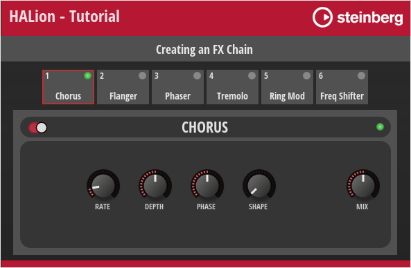

/ [HALion Developer Resource](../../HALion-Developer-Resource.md) / [HALion Tutorials & Guidelines](./HALion-Tutorials-Guidelines.md) / [Tutorials](./Tutorials.md) /

# Creating a Modulation Matrix

---

**On this page:**

[[_TOC_]]

---

This tutorial describes how to create an FX Chain using a [Template List](../../HALion-Macro-Page/pages/Template-List.md). The FX Chain provides several slots for loading a predefined set of effects using a [Custom Popup Menu](./Custom-Popup-Menus.md). Furthermore, you can rearrange effects with drag and drop.

