/ [HALion Developer Resource](../../HALion-Developer-Resource.md) / [HALion Tutorials & Guidelines](./HALion-Tutorials-Guidelines.md) / [Tutorials](./Tutorials.md) /

# Creating a Template List

---

**On this page:**

[[_TOC_]]

---

[Template Lists](../../HALion-Macro-Page/pages/Template-List.md) are versatile and powerful tools for creating controls with repeating elements, such as an effects rack with multiple slots, or a list of articulations that share a set of parameters. The main concept behind [Template Lists](../../HALion-Macro-Page/pages/Template-List.md) is based on creating repeating controls from a single template that is referenced and instantiated multiple times. Similar to programming, where for-loops can save many lines of code, [Template Lists](../../HALion-Macro-Page/pages/Template-List.md) save you from creating many individual templates. This tutortial describes the creation of a [Template List](../../HALion-Macro-Page/pages/Template-List.md) step by step. The example preset already contains the solution. For a better understanding, we recommend that you follow all the steps, as described below.

## Example VST Preset

* [Creating a Template List.vstpreset](../vstpresets/Creating%20a%20Template%20List.vstpreset)

## Prerequisites

1. Create a program with a synth zone. The simplest way to do this is to open the HALion Home Screen and to select **Create**>**Analog Synth**.
1. Open the **Macro Page Designer** and click **Create New Macro Page/Library**.

## Overview of Workflows

* Add a [Template List](../../HALion-Macro-Page/pages/Template-List.md) control.
* Create a template for the entries of the list.
* Add controls to the template and export the desired values as template parameters.
* Create variables for the desired entries in the list and connect them to the corresponding template parameters.

## Creating a Basic Template List

This first part of the tutorial illustrates only the creation of a basic template list without adding any further functionality.

1. In the **Macro Page Designer**, go to the **GUI Tree** and create a [Template List](../../HALion-Macro-Page/pages/Template-List.md). Name it 'BasicList', for example.
1. Go to the **Templates Tree** and create a [Template](../../HALion-Macro-Page/pages/Template.md). Name it 'RowEntry'.
1. Click **Edit Element**  to open the template.
1. Add a [Label](../../HALion-Macro-Page/pages/Label.md) and a [Decor](../../HALion-Macro-Page/pages/Decor-Control.md) control. The look of an entry is defined by the properties of the controls inside the template. Adjust the size and other properties of the controls as desired.
1. Select the [Label](../../HALion-Macro-Page/pages/Label.md) control and go to the **Properties** editor. For a better overview, activate **Show Properties as Column**.
1. Next to the Text property, click **Export Property**  to export it.<p>If the Text property is not shown, use the scroll bars to locate the parameter.</p><p>The exported Text property becomes a template parameter of the BasicList template list.</p> 
1. It's helpful to rename the exported Text property. Select RowEntry and go to the Template Parameter section of the **Properties** editor. Change the name of the exported Text property to 'Name'.<p></p>
1. Close the template and go back to the to the **GUI Tree**. Select the BasicList item, go to the **Properties** editor and set Template to 'RowEntry'.
1. Create a Variables folder, right-click it and create a String List variable. Name it 'RowNames'.
1. Select the String List variable, go to the **Properties** editor and create entries for each row that you want to display. Name the entries 'Zone 1', 'Zone 2', and 'Zone 3'.<p>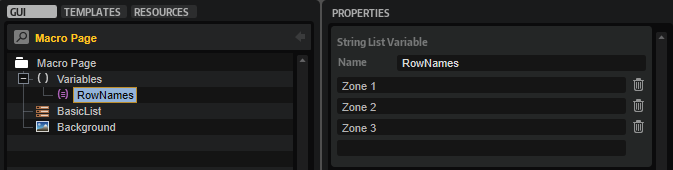</p>
1. Select the BasicList item, go to the **Properties** editor and set the Name template parameter to '@RowNames'. The list entries that you defined in step 9 should now be displayed with the look that you defined in step 4.
1. Adjust the position and size of the BasicList template list, if needed.<p>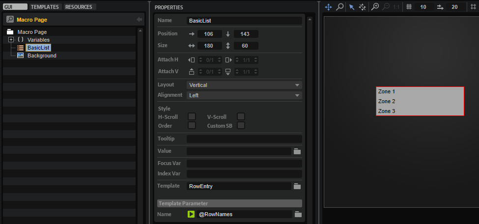</p>

## Adding Functionality

In this part of the tutorial, the variables Focus Var and Index Var of the [Template List](../../HALion-Macro-Page/pages/Template-List.md) will be used to highlight the selected row and to display the row index. We will also add two more synth zones to the program and further controls to the [Template List](../../HALion-Macro-Page/pages/Template-List.md) for adjusting these zones. The synth zones are only used as substitutes for the different articulations of an instrument, which are normally provided by different layers with samples for each articulation.

>&#10069; To follow the subsequent steps, [Creating a Basic Template List](#creating-a-basic-template-list) must be completed first.

1. Go to the **Program Tree** and add two more synth layers.
1. Open the **Zone Editor** and got to the **Oscillator** section, then switch off all oscillators except oscillator 1. Do this for all three zones. Choose different waveforms for oscillator 1 in each of the three zones.
1. Open the **Macro Page Designer**, select the BasicList template list and go to the **Properties** editor. Set Focus Var to 'RowFocus' and Index Var to 'RowIndex'. These two variables will be used later inside the RowEntry template to highlight the selected row and to display the row index.<p>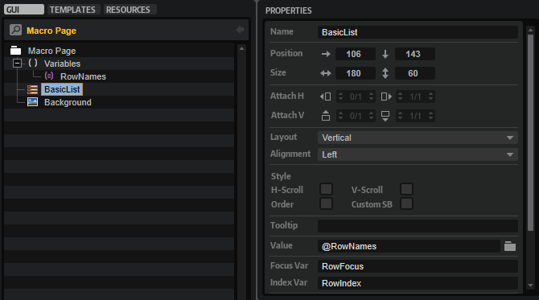</p>
1. Select the Variables folder and create a String List variable. Name it 'ZoneMute'. Go to the **Properties** editor and create the following entries: '@0:Zone 1/@id:66', '@0:Zone 2/@id:66', and '@0:Zone 3/@id:66'. The ZoneMute variable will be used later inside the RowEntry template to control the mute state of the focused zone.<p>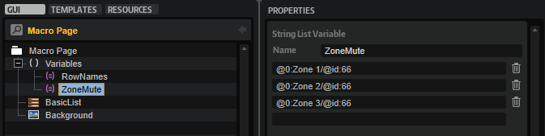</p>
1. Create another String List variable and name it 'ZoneCoarse'. Go to the **Properties** editor and create the following entries: '@0:Zone 1/@id:330002', '@0:Zone 2/@id:330002', and '@0:Zone 3/@id:330002'. The ZoneCoarse variable will be used later inside the RowEntry template to control the Coarse parameter of the oscillator of the focused zone.<p>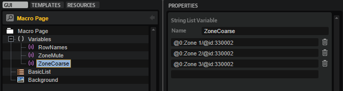</p>
1. Create one more String List variable and name it 'ZoneLevel'. Go to the **Properties** editor and create the following entries: '@0:Zone 1/@id:320001', '@0:Zone 2/@id:320001', and '@0:Zone 3/@id:320001'. The ZoneLevel variable will be used later inside the RowEntry template to control the level of the focused zone.<p></p>
1. Go to the **Templates Tree**, select the RowEntry template and click **Edit Element**  to open it.
1. Add a [Text](../../HALion-Macro-Page/pages/Text.md) control and name it 'RowIndex'. Position it before the [Label](../../HALion-Macro-Page/pages/Label.md) control that displays the row names. Set the Value to '@RowIndex'. Now, the index number of the row should be shown in the list.<p>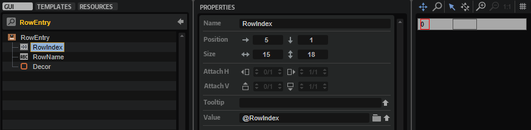</p>
1. Create a [Stack](../../HALion-Macro-Page/pages/Stack.md) control and drag the [Decor](../../HALion-Macro-Page/pages/Decor-Control.md) control into it. Rename the decor to 'DecorOff'. Copy the decor and rename it to 'DecorOn'. Go to the **Properties** editor and change the color of the DecorOn control to fully white. Select the [Stack](../../HALion-Macro-Page/pages/Stack.md) control and set its Value property to '@RowFocus'. Now, a row is highlighted when you click it.<p>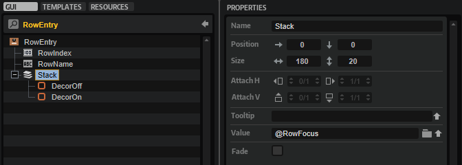</p>
1. Add a [Switch](../../HALion-Macro-Page/pages/Switch.md) control and set Mode to 'onoff'. Assign bitmaps for the different states of the switch. Alternatively, you can use a preconfigured switch template from the [Basic Controls](../../HALion-Macro-Page/pages/Exploring-Templates.md#basic-controls) library. Postition the switch between the RowIndex and the RowName controls. Next to the Value property, click **Export Property**  to export it. Select RowEntry and change the name of the exported Value property to 'Mute'.<p>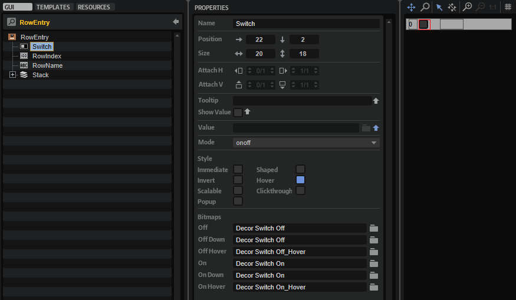</p>
1. Add a [Text](../../HALion-Macro-Page/pages/Text.md) control and name it 'CoarseVal'. Postition the control after the RowName control. Next to the Value property, click **Export Property**  to export it. Select RowEntry and change the name of the exported Value property to 'Coarse'.<p>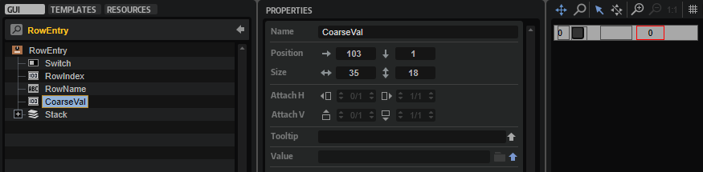</p>
1. Add another [Text](../../HALion-Macro-Page/pages/Text.md) control and name it 'LevelVal'. Postition the control after the CoarseVal control. Next to the Value property, click **Export Property**  to export it. Select RowEntry and change the name of the exported Value property to 'Level'.<p>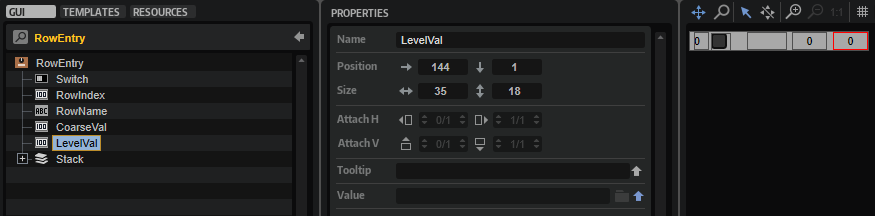</p>
1. Close the RowEntry template and go back to the **GUI Tree**. Select the BasicList item, go to the **Properties** editor and set the Template Parameters as follows: Set 'Mute' to '@ZoneMute', 'Coarse' to '@ZoneCoarse', and 'Level' to '@ZoneLevel'. Now, the rows will show the values of the connected parameters of the corresponding zones.<p>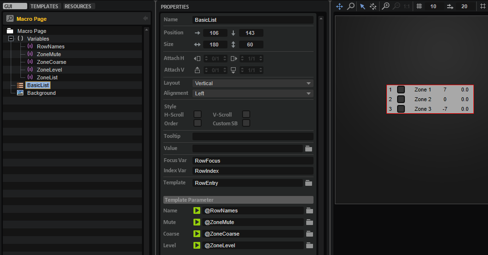</p>

>&#10069; The [Stack](../../HALion-Macro-Page/pages/Stack.md) from step 9 can contain further controls which change the appearance of a row completely, e.g., [Label](../../HALion-Macro-Page/pages/Label.md) and [Text](../../HALion-Macro-Page/pages/Text.md) controls with different colors, etc. For them to display the same parameters, their exported Value properties must share the same name.

## Setting the Scope for Controls outside the Template List

This last part of the tutorial describes how to use a [Template List](../../HALion-Macro-Page/pages/Template-List.md) for managing a common set of controls for different zones, or for the different articulations of an instrument, for example. The common controls exist only once and are not part of the template list. The focus of the template list is used to switch the scope of these controls, which connects them to the corresponding zone, or layer of an articulation.

>&#10069; To follow the subsequent steps, [Creating a Basic Template List](#creating-a-basic-template-list) and [Adding Functionality](#adding-functionality) must be completed beforehand.

1. Open the **Macro Page Designer**, select the Variables folder and create a String List variable. Name it 'ZoneList'. Go to the **Properties** editor and create the following entries: '@0:Zone 1/', '@0:Zone 2/', and '@0:Zone 3/'. The ZoneList variable will be used later to set the focus for a set of common controls.<p>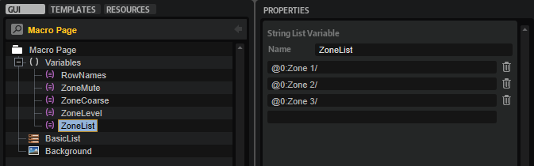</p>
1. Create a [Group](../../HALion-Macro-Page/pages/Group.md) and set the Scope property to '@ZoneList'.
1. Add two knobs from the [Basic Controls](../../HALion-Macro-Page/pages/Exploring-Templates.md#basic-controls) library to the group, one for the Coarse and one for the Level parameter of the zones. Set the Value property of the Coarse knob to '@id:330002' and the Value property of the Level knob to '@id:320001'. Name the labels of the knobs 'Coarse' and 'Level', respectively.<p>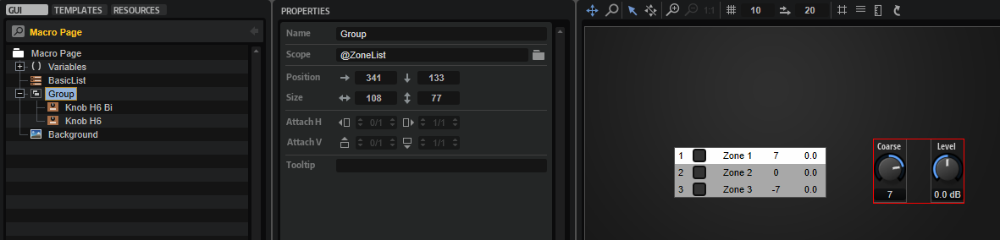</p>
1. Select the BasicList template list and set its Value property also to '@ZoneList'. Now, the scope of the knob controls is determined by the focused row in the template list.<p>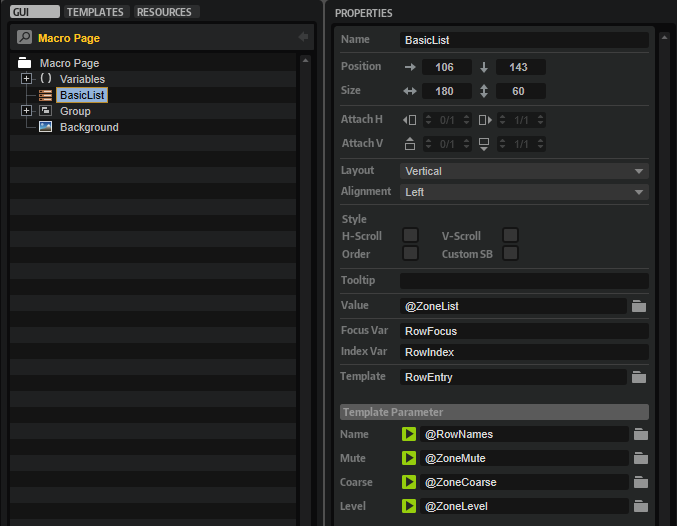</p>
1. Finally, create four [Label](../../HALion-Macro-Page/pages/Label.md) controls, name them 'Mute', 'Name', 'Coarse', and 'Level', and place them above the corresponding columns of the [Template List](../../HALion-Macro-Page/pages/Template-List.md).<p>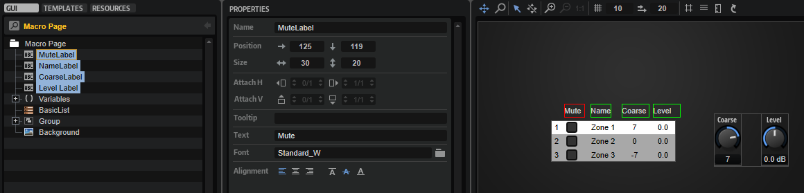</p>

## Using UI Script Parameters Instead of UI Variables

Instead of using UI Variables for defining the entries of the [Template List](../../HALion-Macro-Page/pages/Template-List.md), you can use a [string list parameter](../../HALion-Script/pages/Creating-Parameters.md#parameter-characteristics) that you have defined in a UI script.

1. Create a UI script and define a [string list parameter](../../HALion-Script/pages/Creating-Parameters.md#parameter-characteristics).
1. Connect the [string list parameter](../../HALion-Script/pages/Creating-Parameters.md#parameter-characteristics) with the corresponding template parameter of the [Template List](../../HALion-Macro-Page/pages/Template-List.md).

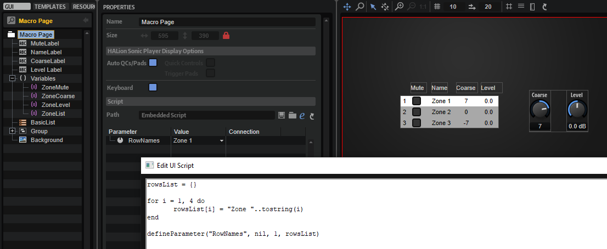

### Example

```lua
rowsList = {}

for i = 1, 4 do
	rowsList[i] = "Zone "..tostring(i)
end

defineParameter("RowNames", nil, 1, rowsList)
```