/ [HALion Developer Resource](../../HALion-Developer-Resource.md) / [HALion Tutorials & Guidelines](./HALion-Tutorials-Guidelines.md) / [Tutorials](./Tutorials.md) /

# Creating an FX Chain

---

**On this page:**

[[_TOC_]]

---

This tutorial describes how to create an FX Chain using a [Template List](../../HALion-Macro-Page/pages/Template-List.md). The FX Chain provides several slots for loading a predefined set of effects using a [Custom Popup Menu](./Custom-Popup-Menus.md). Furthermore, you can rearrange effects using drag and drop.

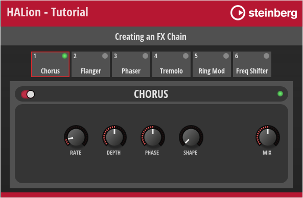

>&#10069; For an example of a classic FX Rack instead of an FX Chain, see [Creating an FX Rack](./Creating-an-FX-Rack.md).

## Example VST Preset

* [Creating an FX Chain 01.vstpreset](../vstpresets/Creating%20an%20FX%20Chain%2001.vstpreset)

The FX Chain in this example uses both UI and MIDI script functionality. The corresponding scripts are provided, but not explained in detail line by line. Instead, the connections and interactions between the UI elements and the UI and MIDI scripts are explained so that you can adjust the number of slots and customize the look of the FX Chain without the risk of introducing errors. See [How the Elements Interact](#how-the-elements-interact).

The following section describes how to access [Templates](../../HALion-Macro-Page/pages/Template.md) and edit UI and MIDI scripts.

* Load [Creating an FX Chain 01.vstpreset](../vstpresets/Creating%20an%20FX%20Chain%2001.vstpreset).

{{#include ./_Excerpts.md:to-explore-templates}}

{{#include ./_Excerpts.md:to-edit-ui-scripts}}

**To edit the MIDI script:**

1. In the **Program Tree**, select the FX Chain MIDI Module.
1. Go to the Sound editor and click **Edit Script**  to open the internal script editor.

The instructions that follow use the internal script editor.

## Prerequisites

* You have an instrument with a macro page.
* You have loaded both the preset [Creating an FX Chain 01.vstpreset](../vstpresets/Creating%20an%20FX%20Chain%2001.vstpreset) and your instrument into HALion.

## Workflow Overview

* Adjust the number of slots in the UI script.
* Add further effects to the UI script and create templates for them. 
* Copy the bus and effects from the [Example VST Preset](#example-vst-preset) to your instrument.
* Copy the templates and resources from the [Example VST Preset](#example-vst-preset) to your macro page.
* Copy the code of the UI and MIDI scripts from the [Example VST Preset](#example-vst-preset) into the corresponding scripts of your instrument.
* Change the look of the FX Chain to match the look of your instrument.

## Adjusting the Number of Slots

The FX Chain in the [Example VST Preset](#example-vst-preset) has six slots. You can adjust the number of slots in the FX Chain by setting the ``numFxSlots`` variable in the UI script to the desired value.

Let's increase the number of slots from six to seven:

1. In the **Macro Page Designer**, open the UI script in the internal script editor.
2. Set the ``numFxSlots`` variable to 7.

```lua
-- FX Chain handling.

numFxSlots = 7

```
3. In the **GUI Tree**, select the 'FX Chain' [Template List](../../HALion-Macro-Page/pages/Template-List.md). Set the position and size as follows.

|Property|Value|
|:-|:-|
|Position X|21|
|Position Y|100|
|Width|555|
|Height|55|

4. Update the UI, for example, by selecting a different program and then returning to the [Example VST Preset](#example-vst-preset). This will rebuild the macro page and apply your changes.

The FX Chain should now have seven slots on the macro page.

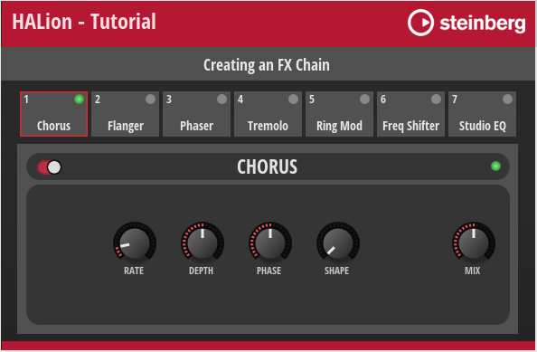

## Adding Further Effects

To add additional effects, you need to edit the UI script, as well as modify and create the relevant [Templates](../../HALion-Macro-Page/pages/Template.md). Let's add ``"Distortion"`` to the selection of available effects.

### Editing the UI Script

We will use the Clipper effect as a distortion. Therefore, we define ``fxType = "Clipper"`` and ``name = "Distortion"``. The value of ``fxType`` is used for loading the effect upon initialization and the value of ``name`` is used for naming the effect in the **Program Tree**. Functions and templates will also refer to this name.

1. In the **Macro Page Designer**, open the UI script in the internal script editor.
1. In the ``effects`` table, between the entries for ``"Freq Shifter"`` and ``"Studio EQ"``, insert the following lines:

```lua
{ name = "Distortion",
  fxType = "Clipper",
  settings = {
    outputgain = 0.5,
    hpcutoff = 0,
    hardclip = 0,
    Oversample = 1,
    lpcutoff = 1,
    hardclipoffset = 0,
    inputgain = 0.5,
  },
},	

```

The code example above lists only the lines of code that need to be added to the ``effects`` table. The table lists the available effects and their parameters with names and default settings. The normalized range from 0 to 1 is used for the default settings. The default settings will be used when initializing the effects.

>&#10069; For a code example on how to write effects and their settings to a table, see [Snapshot Effects](./Snapshot-Effects.md).

### Creating a Template for the FX Slot

Each effect has its own template that is displayed in the slot when the effect is selected. Let's create a slot template for the Distortion effect by reusing an existing one.

1. In the **Templates Tree**, navigate to 'library/FX Chain/FX Slots'.
2. Copy and paste an existing slot template to the 'FX Slots' folder. You can copy any slot template except the 'FX_Slot' and 'FX_Slot_No_FX' templates.
3. Rename the new template to 'FX_Slot_Distortion' and click **Edit Element** .

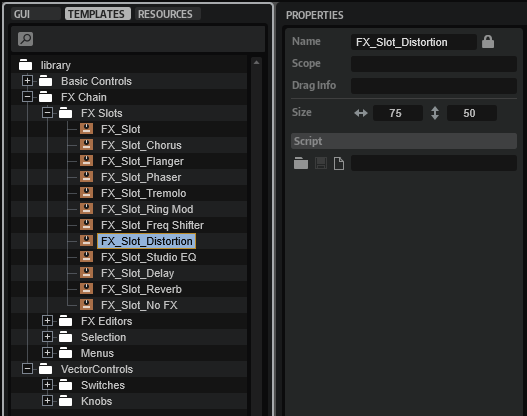

4. In the **GUI Tree**, navigate to 'FX_Slot_Distortion/FX Type'. Set the Text property as follows.

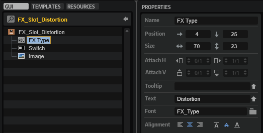

#### FX Type

|Property|Value|
|:-|:-|
|Text|Distortion|

### Creating a Template for the FX Panel

The Distortion effect needs an FX panel. Let's create one by reusing an existing effect template.

1. In the **Templates Tree**, navigate to 'library/FX Chain/FX Editors'.
2. Copy and paste an existing effect template to the 'FX Editors' folder. You can copy any effect template except the 'FX_Editor_No_FX' template.
3. Rename the new template to 'FX_Editor_Distortion' and click **Edit Element** .

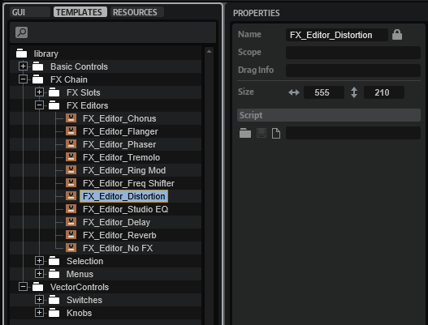

4. Adjust the **Properties** of the controls and templates as described below.

#### Switch, On and Disable

The Switch, On, and Disable elements must all be connected to the Distortion's Bypass parameter. The easiest way to connect the Bypass parameter is by using drag and drop from the **Parameter List**. For this, you need to select the Distortion effect in the **Program Tree** and open the **Parameter List**.

1. In the **GUI Tree**, select the 'Switch' element and drag the Distortion's Bypass parameter from the **Parameter List** onto the **Value** field.
1. Select the 'On' element, go to the **Template Parameters** section and drag the Distortion's Bypass parameter from the **Parameter List** onto the **Value** field.
1. Select the 'Disable' element and drag the Distortion's Bypass parameter from the **Parameter List** onto the **Value** field.


#### Label

For displaying the correct title:

* Select the 'Label' element and set its Text to "DISTORTION".

|Property|Value|
|:-|:-|
|Text|DISTORTION|

#### Knob Templates

Seven knobs are required for the distortion, six knobs for tone control and one knob for the dry/wet mix.

1. In the **GUI Tree**, navigate to 'FX_Editor_Distortion/Disable/Controls'. Set position and size as follows.

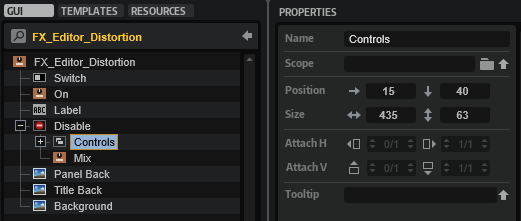

|Property|Value|
|:-|:-|
|Position X|15|
|Position Y|40|
|Width|435|
|Height|63|

2. Duplicate the knob templates until you have six of them inside the 'Controls' [Group](../../HALion-Macro-Page/pages/Group.md).
3. Set the properties of the knob templates as follows.

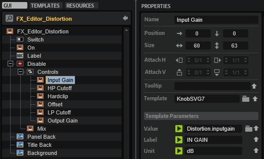

**Knob 1**

|Property|Value|
|:-|:-|
|Name|Input Gain|
|Position X|0|
|Position Y|0|
|Width|60|
|Height|63|

**Knob 2**

|Property|Value|
|:-|:-|
|Name|HP Cutoff|
|Position X|75|
|Position Y|0|
|Width|60|
|Height|63|

**Knob 3**

|Property|Value|
|:-|:-|
|Name|Hardclip|
|Position X|150|
|Position Y|0|
|Width|60|
|Height|63|

**Knob 4**

|Property|Value|
|:-|:-|
|Name|Offset|
|Position X|225|
|Position Y|0|
|Width|60|
|Height|63|

**Knob 5**

|Property|Value|
|:-|:-|
|Name|LP Cutoff|
|Position X|300|
|Position Y|0|
|Width|60|
|Height|63|

**Knob 6**

|Property|Value|
|:-|:-|
|Name|Output Gain|
|Position X|375|
|Position Y|0|
|Width|60|
|Height|63|

Each knob's template parameters must be configured so that they will have the correct display and connection. The easiest way to connect a parameter is by using drag and drop from the **Parameter List**. To do this, you need to select the Distortion effect in the **Program Tree** and open the **Parameter List**.

4. For each knob, drag the respective Distortion parameter from the **Parameter List** onto the **Value** field of the Template Parameter and set the Label and Unit of the Template Parameters as follows.

**Knob Template Input Gain**

|Template Parameter|Value|
|:-|:-|
|Value|Distortion.inputgain|
|Label|IN GAIN|
|Unit|dB|

**Knob Template HP Cutoff**

|Template Parameter|Value|
|:-|:-|
|Value|Distortion.hpcutoff|
|Label|HIGHPASS|
|Unit|Hz|

**Knob Template Hardclip**

|Template Parameter|Value|
|:-|:-|
|Value|Distortion.hardclip|
|Label|HARDCLIP|
|Unit|%|

**Knob Template Offset**

|Template Parameter|Value|
|:-|:-|
|Value|Distortion.hardclipoffset|
|Label|OFFSET|
|Unit|%|

**Knob Template LP Cutoff**

|Template Parameter|Value|
|:-|:-|
|Value|Distortion.lpcutoff|
|Label|LOWPASS|
|Unit|Hz|

**Knob Template Output Gain**

|Template Parameter|Value|
|:-|:-|
|Value|Distortion.outputgain|
|Label|OUT GAIN|
|Unit|dB|

5. The Mix knob template is the seventh and last knob that you have to adjust. Drag the Distortion's Mix parameter from the **Parameter List** onto the **Value** field of the Template Parameter and set Label and Unit as follows.

**Knob Template Mix**

|Template Parameter|Value|
|:-|:-|
|Value|Distortion.mix|
|Label|MIX|
|Unit|%|

6. Finally, update the UI, for example, by selecting a different program and then returning to the [Example VST Preset](#example-vst-preset). This will rebuild the macro page and apply your changes.

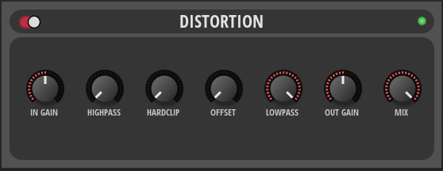

To add more effects, repeat the steps described above, starting with [Adding Further Effects](#adding-further-effects), and adjust the values to match the particular effect.

## Final Example VST Preset


Here, you can find the Example VST Preset with all the editing steps applied.

* [Creating an FX Chain 02.vstpreset](../vstpresets/Creating%20an%20FX%20Chain%2002.vstpreset).

## How the Elements Interact

The UI script plays a central role in the FX Chain and controls most of its actions. The comments in the UI script explain which UI elements are connected to script parameters and why they are needed. Reading the comments and looking at the associated UI elements will help you to understand how the FX Chain works. The following screenshot shows the FX Chain template with its Template Parameters linked to the parameters of the UI script. These script parameters control how the effects chain is displayed on the macro page.

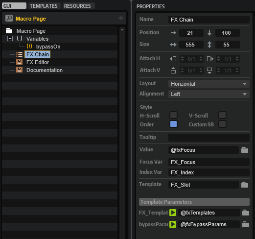

The UI script also contains print functions that are commented out. The print functions can be used to track the function calls.

1. Go to the **Macro Page Designer**.
1. Open the UI script in the internal script editor and remove the comments ``--`` before each print function. 
1. To monitor the UI script's output messages, click **Show/Hide Script Output Messages** .
1. Activate **Test Macro Page** .
1. Operate the FX Chain in the **Macro Page Designer** (not the **Macro Page Editor**).

>&#10069; You must operate the FX Chain in the **Macro Page Designer**, otherwise the output messages will not be correct.

Below follows a brief description of the connections and the message exchange within the FX Chain.

### FX Handling

1. When an effect is loaded into a slot, the ``"fxMenuSelect`` parameter of the UI script is changed and the ``onFxMenuChanged`` function is called.
1. The ``onFxMenuChanged`` function of the UI script sets the ``selectFx`` parameter of the MIDI script, which uses a table to transfer information about which effect to load. The ``selectFx`` parameter calls the ``onSelectFx`` function in the MIDI script, which loads the effect on the bus.
1. After the ``onSelectFx`` function of the MIDI script has loaded the effect, the ``sendUpdateBus`` parameter is set. The ``sendUpdateBus`` parameter of the MIDI script is connected to the ``updateBus`` parameter of the UI script.
1. When the ``updateBus`` parameter of the UI script is changed, the ``onBusChanged`` function is called and the associated parameters and templates of the FX Chain are updated by calling ``defineFxSwitchesParam`` and ``defineFxMenuParam``.
1. After the ``onBusChanged`` function of the UI script has updated the FX Chain templates, the ``onFxFocusChanged`` function is called. The FX Editor template uses [Dynamic Template References](./Dynamic-Template-References.md), i.e., the template it displays is defined by the ``@fxEditor`` UI variable. The ``onFxFocusChanged`` function defines the effect panel by setting the ``@fxEditor`` UI variable of the FX Editor template to the corresponding effect template.

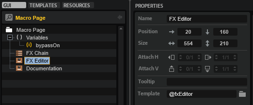

### FX Drag and Drop Handling

1. When an effect is dragged onto a new position in the FX Chain, the ``onTemplateListViewDrop`` function of the UI script is called.
1. The ``onTemplateListViewDrop`` function of the UI script sets the ``moveFx`` parameter of the MIDI script. This calls the ``onMoveFx`` function of the MIDI script, which repositions the effect on the bus.
1. After the ``onMoveFx`` function has moved the effect, the ``sendUpdateBus`` parameter is set. The ``sendUpdateBus`` parameter of the MIDI script is connected to the ``updateBus`` parameter of the UI script.

All other steps are the same as in the [FX Handling](#fx-handling) section, starting with step four.

## Transferring the FX Chain to Your Instrument

To integrate the FX Chain into your macro page, you need to do the following:

1. Copy the bus and effects from the **Program Tree** to your instrument. The program structure of your instrument must match the structure of the [Example VST Preset](#example-vst-preset) and your macro page must be attached to the topmost element in the **Program Tree**.

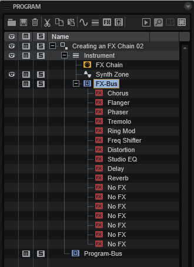

2. Copy all the templates from the example VST preset that you edited in the steps above and paste them to the **Templates Tree** of your macro page. The templates in the example VST preset use [Resources](../../HALion-Macro-Page/pages/Resources.md) from the [Basic Controls](../../HALion-Macro-Page/pages/Exploring-Templates.md#basic-controls) and [Vector Controls](../../HALion-Macro-Page/pages/Exploring-Templates.md#additional-and-vector-controls) libraries. In a later step, you can change these resources to match the look of your instrument.

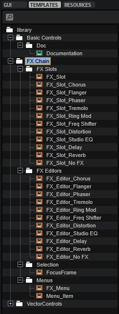

3. Copy the Templates and Variables from the **GUI Tree** of the example VST preset to your macro page.

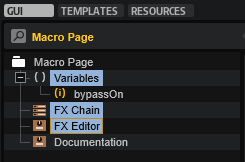

4. Copy the code from the UI and MIDI scripts to the respective scripts of your instrument.
5. Connect the ``sendUpdateBus`` parameter of the MIDI script with the ``updateBus`` parameter of the UI script.

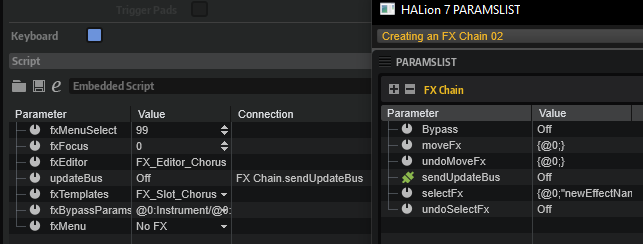

>&#10069; The FX Chain will only work if this connection exists.

6. Finally, update the UI, for example, by selecting a different program and then selecting your instrument again. This will rebuild the macro page and apply your changes.

## FX Chain with Custom Look

You can customize the look and feel of your instrument entirely by using your own [Resources](../../HALion-Macro-Page/pages/Resources.md). As an example, the FX chain of Electric Bass is shown in the following screenshot.

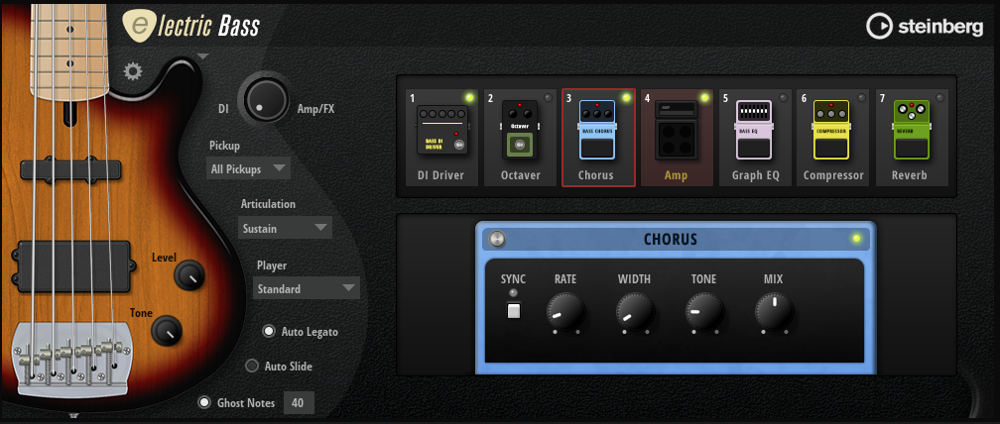