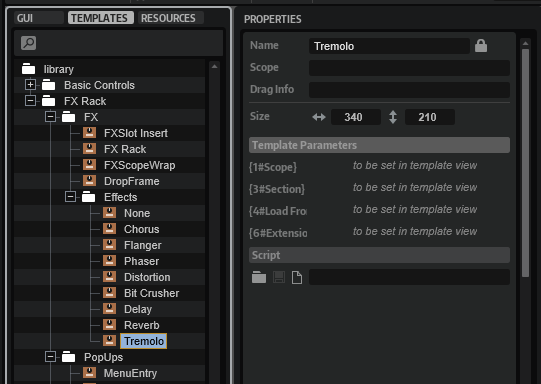

/ [HALion Developer Resource](../../HALion-Developer-Resource.md) / [HALion Tutorials & Guidelines](./HALion-Tutorials-Guidelines.md) / [Tutorials](./Tutorials.md) /

# Creating an FX Chain

---

**On this page:**

[[_TOC_]]

---

This tutorial describes how to create an FX Chain using a [Template List](../../HALion-Macro-Page/pages/Template-List.md). The FX Chain provides several slots for loading effects using a [Custom Popup Menu](./Custom-Popup-Menus.md). Furthermore, you can rearrange effects with drag and drop.

>&#10069; For a classic FX Rack instead of an FX Chain, see [Creating an FX Rack](./Creating-an-FX-Rack.md).

## Example VST Preset

* [Creating an FX Rack 01.vstpreset](../vstpresets/Creating%20an%20FX%20Rack%2001.vstpreset)

The FX Chain in this example uses both UI and MIDI script functionality. The corresponding scripts are provided, but not explained in detail line by line. Instead, the connections and interactions between the UI elements and the UI and MIDI scripts are explained so that you can adjust the number of slots and customize the look of the FX Chain without the risk of introducing errors. See [How the Elements Interact](#how-the-elements-interact).

The following section describes how to access [Templates](../../HALion-Macro-Page/pages/Template.md) and edit UI and MIDI scripts.

* Load [Creating an FX Chain 01.vstpreset](../vstpresets/Creating%20an%20FX%20Chain%2001.vstpreset).

**To explore the templates in this example:**

1. Open the **Macro Page Designer**, go to the **Templates Tree** and select the template that you want to explore. 
1. Click **Edit Element**  to examine the template.

**To edit the UI script:**

1. Open the **Macro Page Designer** and select the topmost element in the **GUI Tree**. 
1. Go to the Properties section and click **Edit Script**  to open the internal script editor.

**To edit the MIDI script:**

1. In the **Program Tree**, select the FX Rack MIDI Module.
1. Go to the Sound editor and click **Edit Script**  to open the internal script editor.

The instructions that follow use the internal script editor.

## Prerequisites

* An instrument with macro page.
* Load [Creating an FX Chain 01.vstpreset](../vstpresets/Creating%20an%20FX%20Chain%2001.vstpreset) and your instrument side-by-side into HALion.

## Overview of Workflows

* Adjust the number of slots in the UI script.
* Add further effects to the UI script and create templates for them. 
* Copy the bus and effects from the [Example VST Preset](#example-vst-preset) to your instrument.
* Copy the templates and resources from the [Example VST Preset](#example-vst-preset) to your macro page.
* Copy the code of the UI and MIDI scripts from the [Example VST Preset](#example-vst-preset) into the corresponding scripts of your instrument.
* Change the look of the FX Rack to match the look of your instrument.

## Adjusting the Number of Slots

The FX Chain in the [Example VST Preset](#example-vst-preset) has six slots. You can adjust the number of slots in the FX Chain by setting the ``numFxSlots`` variable in the UI script to the desired value.

Let's increase the number of slots from six to seven:

1. In the **Macro Page Designer**, open the UI script in the internal script editor.
1. Set the ``numFxSlots`` variable to 7.
1. Update the UI, for example, by selecting a different program and then returning to the [Example VST Preset](#example-vst-preset). This will rebuild the macro page and apply your changes.

```lua
-- FX Chain handling.

numFxSlots = 7

```

The FX Rack should now have seven slots on the macro page.

## Adding Further Effects

To add additional effects, you need to edit the UI script, as well as modify and create the relevant [Templates](../../HALion-Macro-Page/pages/Template.md). Let's add ``"Distortion"`` to the selection of available effects.

### Editing the UI Script

1. In the **Macro Page Designer**, open the UI script in the internal script editor.
1. In the ``effects`` table, between ``"Freq Shifter"`` and ``"Studio EQ"``, insert the following lines:

```lua
-- All effects for the FX Chain.
effects = {
	-- [...]
	{ name = "Distortion",
	  fxType = "Clipper",
	  settings = {
	    outputgain = 0.5,
	    hpcutoff = 0,
	    hardclip = 0,
	    Oversample = 1,
	    lpcutoff = 1,
	    hardclipoffset = 0,
	    inputgain = 0.5,
	  },
	},	
	-- [...]
}
```

The code example above lists only part of the ``effects`` table. The table lists the available effects and their parameters with names and default settings. The normalized range from 0 to 1 is used for the default settings. The default settings will be used when initializing the effects.

>&#10069; A code example for writing effects and their values to a table can be found in [Snapshot Effects](./Snapshot-Effects.md).

### Creating a Template for the FX

The Distortion effect needs an FX panel. Let's create one by reusing an existing effect template.

1. In the **Templates Tree**, go to 'library/FX Chain/FX Editors'.
1. Copy and paste an existing effect template to the 'FX Editors' folder. You can copy any effect template except the 'No FX' template.
1. Rename the new template to 'FX_Editor_Distortion' and click **Edit Element** .
1. Adjust the **Properties** of the controls and templates as described below.



#### Knob Templates

The knob templates are inside the [Disable](../../HALion-Macro-Page/pages/Disable.md) control. The knobs can be configured with template parameters.

* Set the **Template Parameters** as follows.

## How the Elements Interact