/ [HALion Developer Resource](../../HALion-Developer-Resource.md) / [HALion Tutorials & Guidelines](./HALion-Tutorials-Guidelines.md) / [Tutorials](./Tutorials.md) /

# Creating an FX Rack

---

**On this page:**

[[_TOC_]]

---

This tutorial describes how to create an FX Rack using a [Template List](../../HALion-Macro-Page/pages/Template-List.md). The FX Rack provides several slots for loading effects using a [Custom Multi Level Menu](./Custom-Multi-Level-Menus-II.md). Furthermore, you can rearrange effects via drag and drop. Subpresets for each effect are managed using the [Preset Browser Custom](../../HALion-Macro-Page/pages/Preset-Browser-Custom.md) template.

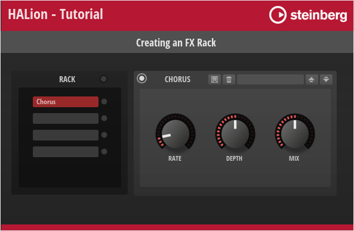

>&#10069; For an example of an FX Chain instead of an FX Rack, see [Creating an FX Chain](./Creating-an-FX-Chain.md).

## Example VST Preset

* [Creating an FX Rack 01.vstpreset](../vstpresets/Creating%20an%20FX%20Rack%2001.vstpreset)

The FX Rack in this example uses both UI and MIDI script functionality. The corresponding scripts are provided, but not explained in detail line by line. Instead, the connections and interactions between the UI elements and the UI and MIDI scripts are explained so that you can adjust the number of slots and customize the look of the FX Rack without the risk of introducing errors. See [How the Elements Interact](#how-the-elements-interact).

The following section describes how to access [Templates](../../HALion-Macro-Page/pages/Template.md) and edit UI and MIDI scripts.

* Load [Creating an FX Rack 01.vstpreset](../vstpresets/Creating%20an%20FX%20Rack%2001.vstpreset).

{{#include ./_Excerpts.md:to-explore-templates}}

{{#include ./_Excerpts.md:to-edit-ui-scripts}}

**To edit the MIDI script:**

1. In the **Program Tree**, select the FX Rack MIDI Module.
1. Go to the Sound editor and click **Edit Script**  to open the internal script editor.

The instructions that follow use the internal script editor.

## Prerequisites

* You have an instrument with a macro page.
* You have loaded both the preset [Creating an FX Rack 01.vstpreset](../vstpresets/Creating%20an%20FX%20Rack%2001.vstpreset) and your instrument into HALion.

## Workflow Overview

* Adjust the number of slots in the UI script.
* Add further effects to the UI and MIDI scripts and create templates for them. 
* Copy the bus and effects from the [Example VST Preset](#example-vst-preset) to your instrument.
* Copy the templates and resources from the [Example VST Preset](#example-vst-preset) to your macro page.
* Copy the code of the UI and MIDI scripts from the [Example VST Preset](#example-vst-preset) into the corresponding scripts of your instrument.
* Change the look of the FX Rack to match the look of your instrument.

## Adjusting the Number of Slots

The FX Rack in the [Example VST Preset](#example-vst-preset) has four slots. You can adjust the number of slots in the FX Rack by setting the ``numFxSlots`` variable in the UI script to the desired value.

Let's increase the number of slots from four to five:

1. In the **Macro Page Designer**, open the UI script in the internal script editor.
2. Set the ``numFxSlots`` variable to 5.

```lua
-- FX Rack and effects UI

numFxSlots = 5

```

3. Update the UI, for example, by selecting a different program and then returning to the [Example VST Preset](#example-vst-preset). This will rebuild the macro page and apply your changes.

The FX Rack should now have five slots on the macro page and in the **Program Tree** structure.


## Adding Further Effects

To add additional effects, you need to edit the UI and MIDI scripts, as well as modify and create the relevant [Templates](../../HALion-Macro-Page/pages/Template.md). Let's add ``"Tremolo"`` to the selection of available effects.

### Editing the UI Script

1. In the **Macro Page Designer**, open the UI script in the internal script editor.
1. In the ``fxData`` table, between ``"Phaser"`` and ``"Distortion"``, insert ``"Tremolo"`` as Name, and ``"a"`` as Bypass ID:

```lua
fxData = {
	-- Name           Bypass ID(hex)
	{ "None",              "0" },
	{ "Chorus",            "e" },
	{ "Flanger",           "e" },
	{ "Phaser",            "12" },
    { "Tremolo",           "a" }, -- Add this line.
	{ "Distortion",        "14" },
	{ "Bit Crusher",       "14" },
	{ "Delay",             "16" },
	{ "Reverb",            "13" },
}
```

The ID of the bypass parameter differs depending on the type of effect. You can look up the ID in hex format in the **Program List**, for example. This information is important when adding other types of effects.

### Editing the MIDI Script

1. In the **Program Tree**, select the FX Rack MIDI Module and the internal script editor.
1. Add the following information to the ``effectDefaults`` table.

```lua
Tremolo = {
	output = 0,
	rate = 0.7979797979798,
	syncnote = 0,
	depth = 0.75,
	phase = 1,
	temposync = 0,
},
```

The code example above lists only the lines of code that need to be added to the ``effectDefaults`` table. The table lists the available effects and their parameters with names and defaults. The normalized range from 0 to 1 is used for the defaults. The defaults will be used when loading an effect.

>&#10069; For a code example on how to write effects and their settings to a table, see [Snapshot Effects](./Snapshot-Effects.md).

### Modifying the Effect Selector

The Select Effect menu is hierarchical. It has submenus for Modulation, Distortion, and Time. Each submenu has its own [Template](../../HALion-Macro-Page/pages/Template.md). First, you need to add the 'Tremolo' menu entry to the Modulation submenu. Then you must increase the OnValues of the subsequent effects in the other submenus by one to match the indices of the arrays and [Indexed String Array](../../HALion-Script/pages/defineparameter.md#indexed-string-array) parameters in the UI script.

1. In the **Macro Page Designer**, go to the **Templates Tree** and navigate to</br>'library/FX Rack/PopUps/FX Type/M_FX Type Mod'.
1. Edit the 'M_FX Type Mod' template.
1. In the **GUI Tree** copy and paste one of the existing [Templates](../../HALion-Macro-Page/pages/Template.md), e.g. the 'Phaser' template.
1. Set the **Properties** of the new 'Tremolo' template as follows:

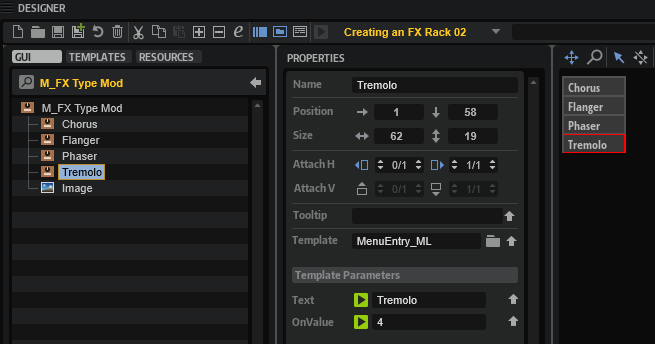

|Property|Value|
|:-|:-|
|Name|Tremolo|
|Position X|1|
|Position Y|58|
|Text|Tremolo|
|OnValue|4|

5. Now, edit the 'M_FX Type Dist' and 'M_FX Type Time' templates.
4. Set the OnValue of the the subsequent effects as follows:

|Template|Property|Value|
|:-|:-|:-|
|Distortion|OnValue|5|
|Bit Crusher|OnValue|6|
|Delay|OnValue|7|
|Reverb|OnValue|8|

### Creating a Template for the FX

The Tremolo effect needs an FX panel. Let's create one by reusing an existing effect template.

1. In the **Templates Tree**, go to 'library/FX Rack/FX/Effects'.
1. Copy and paste an existing effect template to the 'Effects' folder. You can copy any effect template except the 'None' template.
1. Rename the new template to 'Tremolo' and click **Edit Element** .
1. Adjust the **Properties** of the controls and templates as described below.

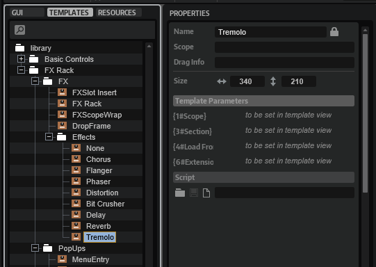

#### Knob Templates

The knob templates are inside the [Disable](../../HALion-Macro-Page/pages/Disable.md) control. The knobs can be configured with template parameters.

* Set the **Template Parameters** as follows:

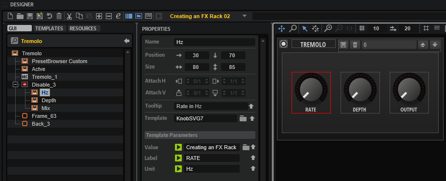

**Knob Template HZ**

|Template Parameter|Value|
|:-|:-|
|Value|@id:0|
|Label|RATE|
|Unit|Hz|

**Knob Template Depth**

|Template Parameter|Value|
|:-|:-|
|Value|@id:1|
|Label|DEPTH|


**Knob Template Mix**

|Template Parameter|Value|
|:-|:-|
|Value|@id:2|
|Label|OUTPUT|
|Unit|dB|

Now, the knobs control the effect parameters and display the corresponding parameter names and units.

#### Active Template

The ID of the Bypass parameter must be set.

* Set the **Template Parameter** of the 'Active' template as follows:


|Template Parameter|Value|
|:-|:-|
|Value|@id:a|

#### Disable Group

The value of the [Disable](../../HALion-Macro-Page/pages/Disable.md) group must be set to the same ID as the associated Bypass parameter. The three knobs will be disabled if the effect is bypassed.

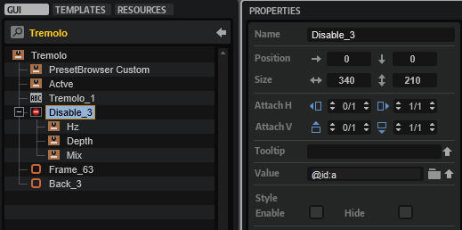

|Property|Value|
|:-|:-|
|Value|@id:a|

#### Label Control

The title of the effect must be changed.

* Set the **Properties** of the [Label](../../HALion-Macro-Page/pages/Label.md) control as follows:

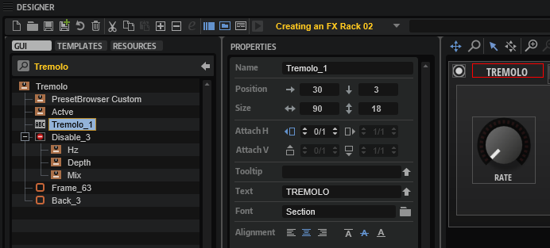

|Property|Value|
|:-|:-|
|Name|Tremolo_1|
|Text|TREMOLO|

#### Preset Browser Template

The Preset Browser FX Rack template provides the subpreset management for each effect. It can be configured with template parameters.

* Set the **Template Parameters** as follows:

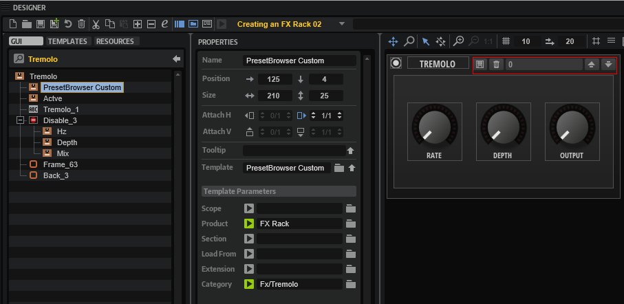

|Template Parameters|Value|
|:-|:-|
|Product|FX Rack|
|Category|FX/Tremolo|

This way, the Tremolo effect will load and save subpresets from its own location.

>&#10069; The Preset Browser FX Rack template differs from the [Preset Browser Custom](../../HALion-Macro-Page/pages/Preset-Browser-Custom.md) template. The main difference is that it omits the Mix parameter when loading an FX subpreset. To keep this functionality, you must use the template from this example instead of the [Preset Browser Custom](../../HALion-Macro-Page/pages/Preset-Browser-Custom.md) template.

* Finally, update the UI by selecting a different program and then selecting the [Example VST Preset](#example-vst-preset) again. This will rebuild the macro page and apply your changes.

To add more effects, repeat the steps described above, starting with [Adding Further Effects](#adding-further-effects), and adjust the values to match the particular effect.

## Final Example VST Preset

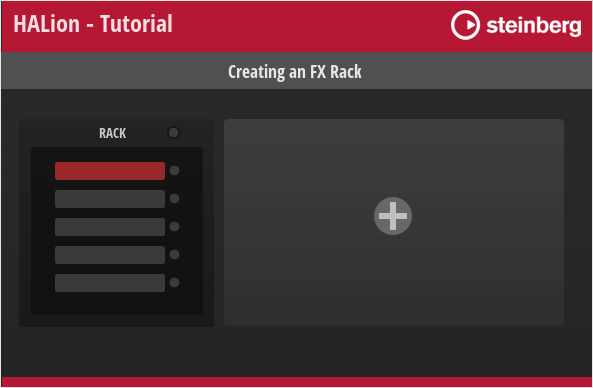

Here, you can find the Example VST Preset with all the editing steps applied.

* [Creating an FX Rack 02.vstpreset](../vstpresets/Creating%20an%20FX%20Rack%2002.vstpreset)

## How the Elements Interact

The UI script plays a central role in the FX Rack and controls most of its actions. The comments in the UI script explain which UI elements are connected to script parameters and why they are needed. Reading the comments and looking at the associated UI elements will help you to understand how the FX Rack works. The following screenshot shows the Insert Rack template with its Template Parameters linked to the parameters of the UI script. These script parameters control how the insert rack is displayed on the macro page.

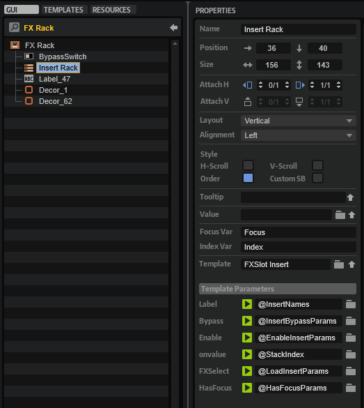

The UI script also contains print functions that are commented out. The print functions can be used to track the function calls.

1. Go to the **Macro Page Designer**.
1. Open the UI script in the internal script editor and remove the comments ``--`` before each print function. 
1. To monitor the UI script's output messages, click **Show/Hide Script Output Messages** .
1. Activate **Test Macro Page** .
1. Operate the FX Rack in the **Macro Page Designer** (not the **Macro Page Editor**).

>&#10069; You must operate the FX Rack in the **Macro Page Designer**, otherwise the output messages will not be correct.

Below follows a brief description of the connections and the message exchange within the FX Rack.

### FX Handling

1. When an effect is loaded into a slot, the UI script's ``"LoadInserts"..i`` parameter is changed and the ``onSelectFX`` function is called.
1. The UI script's ``onSelectFX`` function sets the MIDI script's ``selectFx`` parameter. This calls the ``onSelectFx`` function in the MIDI script, which loads the effect on the bus.
1. After the MIDI script's ``onSelectFx`` function has loaded the effect, the ``sendUpdateBus`` parameter is set. The MIDI script's ``sendUpdateBus`` parameter is connected to the UI script's ``updateBus`` parameter.
1. When the UI script's ``updateBus`` parameter is changed, the ``onBusChanged`` function is called and the associated parameters and templates of the FX Rack are updated.
1. After the UI script's ``onBusChanged`` function has updated the FX Rack, the ``onShowInsertChanged`` function is called. The ``onShowInsertChanged`` function sets the scope and the template for the effect panel.

### FX Drag and Drop Handling

1. When an effect is dragged and dropped to a new position in the FX Rack, the UI script's ``onTemplateListDrop`` function is called.
1. The UI script's ``onTemplateListDrop`` function sets the MIDI script's ``moveFx`` parameter. This calls the MIDI script's ``onMoveFx`` function, which repositions the effect on the bus.
1. After the ``onMoveFx`` function has moved the effect, the ``sendUpdateBus`` parameter is set. The MIDI script's ``sendUpdateBus`` parameter is connected to the UI script's ``updateBus`` parameter.

All other steps are the same as in the [FX Handling](#fx-handling) section, starting with step four.

## Transferring the FX Rack to Your Instrument

To integrate the FX Rack into your macro page, you need to do the following:

1. Copy the bus and effects in the **Program Tree**. The Program structure of your instrument must match the structure of the [Example VST Preset](#example-vst-preset) and your macro page must be attached to the topmost element in the **Program Tree**.

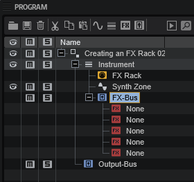

2. Copy all [Templates](../../HALion-Macro-Page/pages/Templates.md). The [Templates](../../HALion-Macro-Page/pages/Templates.md) in the [Example VST Preset](#example-vst-preset) use [Resources](../../HALion-Macro-Page/pages/Resources.md) from the [Basic Controls](../../HALion-Macro-Page/pages/Exploring-Templates.md#basic-controls) and [Vector Controls](../../HALion-Macro-Page/pages/Exploring-Templates.md#additional-and-vector-controls) library. Later, you can change the [Resources](../../HALion-Macro-Page/pages/Resources.md) to match the look of your instrument.

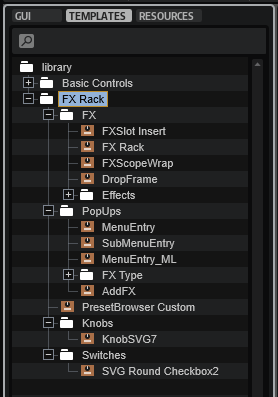

3. Copy the [Templates](../../HALion-Macro-Page/pages/Templates.md) from the **GUI Tree** to your macro page.


4. Copy the code from the UI and MIDI scripts to the respective scripts of your instrument.
5. Connect the MIDI script's ``sendUpdateBus`` parameter with the UI script's ``updateBus`` parameter.

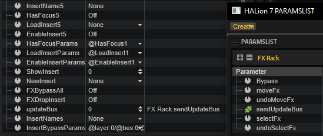

>&#10069; The FX Rack will only work if this connection exists.

6. Finally, update the UI, for example, by selecting a different program and then selecting your instrument again. This will rebuild the macro page and apply your changes.

## FX Rack with Custom Look

You can customize the look and feel of your instrument entirely by using your own [Resources](../../HALion-Macro-Page/pages/Resources.md). As an example, the FX rack of FM Lab is shown in the following screenshot.

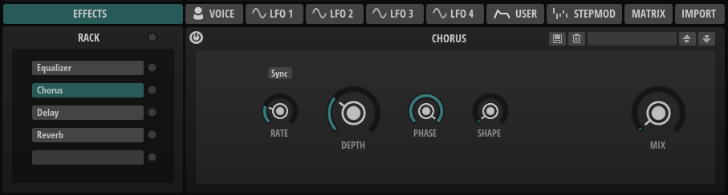
