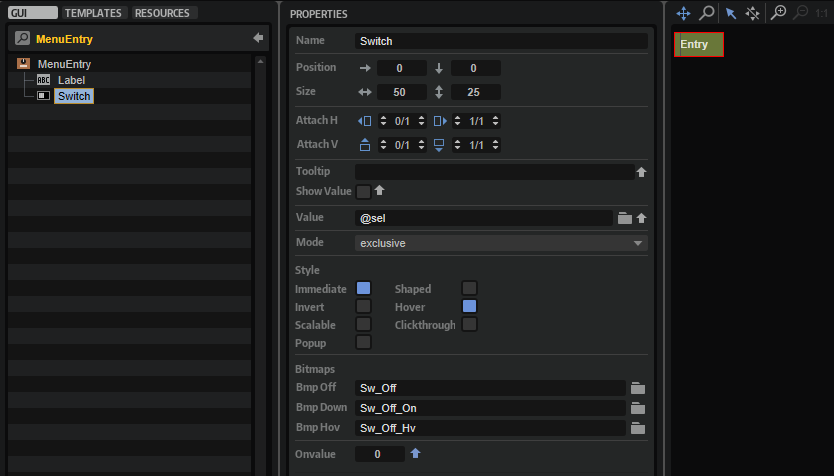

/ [HALion Developer Resource](../../HALion-Developer-Resource.md) / [HALion Tutorials & Guidelines](./HALion-Tutorials-Guidelines.md) / [How-tos](./How-tos.md) /

# Custom Multi-Level Menus II

---

**On this page:**

[[_TOC_]]

---

This how-to describes another way to build custom popup menus. The solution shown can be used to build single-level or multi-level popup menus. An example of a single-level popup menu can be found in [Working with Exported Variables](./Working-with-Exported-Variables.md).

{{#include ./_Excerpts.md:custom-multi-level-menus}}

## Example VST Preset

* [Custom Multi-Level Menus II.vstpreset](../vstpresets/Custom%20Multi-Level%20Menus%20II.vstpreset)

## Prerequisites

1. Load a program with a synth zone.
1. Open the **Macro Page Designer** and click **Create New Macro Page/Library**.

## Overview of Templates

In the subsequent example you will add the following templates from the **Basic Controls** library to the **Template List**:

## Importing the Templates

1. In the **Resource/Library Browser**, open the **Basic Controls** library and navigate to **./Menus/Custom**.
1. Drag the [Selector](#selector) template to your macro page.
1. Set the **Template Parameters** of the [Selector](#selector) template as follows:
    * Set **Popup** to 'RootMenu'.
    * Connect **Value** to the Osc1 Type parameter, e.g., ``@0:Zone 1/@id:b0001``.
    * Set **Label** to 'WAVEFORM'.
1. Go to the **Template List**. Drag the following templates from the **Resource/Library Browser** to the **Template List**: 
    * Basic Controls/Menus/Custom/Nested Menu/[RootMenu](#rootmenu)
    * Basic Controls/Menus/Custom/Nested Menu/Sub Menus/[Menu_Standard](#submenu)
    * Basic Controls/Menus/Custom/Nested Menu/Sub Menus/[Menu_Sync](#submenu)
    * Basic Controls/Menus/Custom/Nested Menu/Sub Menus/[Menu_Crossmod](#submenu)
    * Basic Controls/Menus/Custom/Nested Menu/Sub Menus/[Menu_XOR](#submenu)

The following templates will be added automatically:

* Basic Controls/Menus/Custom/Nested Menu/[RootMenuEntry](#rootmenuentry)
* Basic Controls/Menus/Custom/Simple Menu/[MenuEntry](#menuentry)

If you have followed the described steps exactly, the menu should already work.

## How the Elements Interact

### Selector

The Selector template contains the elements which are required to open the [RootMenu](#rootmenu) template and display the selected value.

#### UI Variables

|Variable|Description|Type|
|:-|:-|:-|
|**sel**|This variable is used by all menu entries of the popup menu. ``sel`` is exported as 'Value' and combined with the Value property of the [Text](../../HALion-Macro-Page/pages/Text.md) control.  Through this the display string of the connected engine parameter will be displayed instead of the integer value.|Integer|

>&#10069; For further information about exported variables, see [Working with Exported Variables](./Working-with-Exported-Variables.md).

#### Controls and Subtemplates

|Element|Description|
|:-|:-|
|**Switch**|A [Switch](../../HALion-Macro-Page/pages/Switch.md) control that opens the popup menu. Its Popup Template property is exported as 'Popup'. This allows you to select which popup menu to open for each instance of the Selector template.|
|**Text**|A [Text](../../HALion-Macro-Page/pages/Text.md) control for displaying the display string of the connected engine parameter. This is achieved by exporting the Value property as 'Value'. Since the ``sel`` UI variable is also exported as 'Value', both are combined into one template parameter, creating the interface for connecting the engine parameter.|
|**Triangle**|An [Image](../../HALion-Macro-Page/pages/Image.md) control to indicate that a popup menu can be opened.|
|**Decor**|A [Decor](../../HALion-Macro-Page/pages/Decor-Control.md) control used as background.|
|**Label**|A [Label](../../HALion-Macro-Page/pages/Label.md) control for displaying the name of the connected parameter. Its Text property is exported as 'Label'. This allows you to name the Selector template differently for each instance.|

### RootMenu

The RootMenu template displays when clicking the selector on the macro page. It defines the menu entries and opens the assigned [Submenu](#submenu) templates when navigating through the menu. 

#### UI Variables

|Variable|Description|Type|Range|
|:-|:-|:-|:-|
|**submenus**|This Popup List variable is required to assign the [Submenu](#submenu) templates to the entries of the RootMenu template. The entries in the Popup List correspond to the names of the [Submenu](#submenu) templates to be opened when navigating through the menu. The Popup List variable opens the assigned [Submenu](#submenu) template, when it receives the OnValue of the corresponding [RootMenuEntry](#rootmenuentry) template.|String|Menu_Standard, Menu_Sync, Menu_Crossmod, Menu_XOR|

#### Controls and Subtemplates

|Element|Description|
|:-|:-|
|**Standard, Sync, Crossmod, XOR**|These represent the four entries of the menu. They use the [RootMenuEntry](#rootmenuentry) template which defines the look and functionality of an entry. The Value parameter of all [RootMenuEntry](#rootmenuentry) templates must be set to ``@submenus``. The OnValue parameters of the specific [RootMenuEntry](#rootmenuentry) templates must be set to the index of the corresponding entry in the Popup List variable. The OnValue will be sent to the Value parameter which is sent to the ``submenu`` Popup List variable which opens the corresponding [RootMenuEntry](#rootmenuentry) template. The Label parameter defines the name of the entry to be displayed in the menu.|

### RootMenuEntry

This template represents one entry in the [RootMenu](#rootmenu) template. It consists of two elements:

#### Controls and Subtemplates

|Element|Description|
|:-|:-|
|**Label**|A [Label](../../HALion-Macro-Page/pages/Label.md) control to display the name of the menu entry. Its Text property is exported as 'Label'. This allows you to name the template differently for each instance.|
|**Switch**|A [Switch](../../HALion-Macro-Page/pages/Switch.md) control with hover exclusive mode which sends its OnValue when the mouse is above the menu entry. The OnValue and Value properties are exported to be set by each instance of the template. See [RootMenu](#rootmenu) for details.|

### Submenu

There are four submenu templates in the Template List: Menu_Standard, Menu_Sync, Menu_Crossmod, and Menu_XOR. Each Submenu template contains four [MenuEntry](#menuentry) templates that define the entries of the submenu.

|Element|Description|
|:-|:-|
|**Sine, Triangle,Saw, Square**|These represent the four entries of the submenu. They use the [MenuEntry](#menuentry) template which defines the look and functionality of an entry. The OnValue parameter of each [MenuEntry](#rootmenuentry) template must be set to the corresponding value of the engine parameter it selects. This value will be sent to the `sel` variable. See [MenuEntry](#rootmenuentry) and [Selector/UI Variables](#ui-variables) for details. The Label parameter defines the name of the entry to be displayed in the menu.|

### MenuEntry

This template represents one entry in the [Submenu](#submenu) template. It consists of two elements:

#### Controls and Subtemplates

|Element|Description|
|:-|:-|
|**Label**|A [Label](../../HALion-Macro-Page/pages/Label.md) control to display the name of the menu entry. Its Text property is exported as 'Label'. This allows you to name the template differently for each instance.|
|**Switch**|A [Switch](../../HALion-Macro-Page/pages/Switch.md) control with exclusive mode. The OnValue property is exported to be set by each instance of the template. See [Submenu](#submenu) for details. The Value property must be set to `@sel`, the [UI variable](#ui-variables) of the [Selector](#selector) template. The OnValue will be sent to the Value parameter which is sent to the ``sel`` variable. Through this the currently selected value will be sent to the [Selector](#selector) template which is connected to the engine parameter and the [Text](../../HALion-Macro-Page/pages/Text.md) control within the [Selector](#selector) template shows the display string of the engine parameter.|

{{#include ./_Excerpts.md:popup-menus}}
