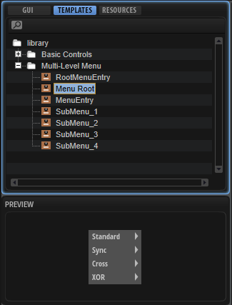
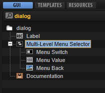
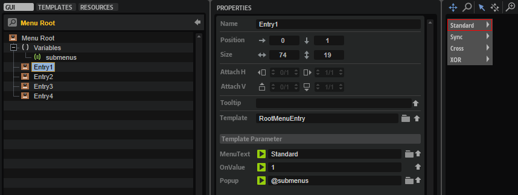
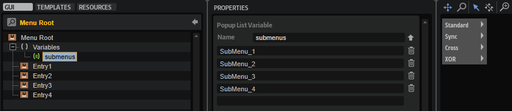
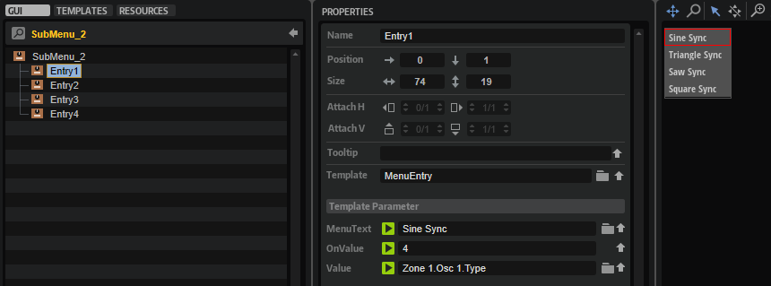

# Custom Multi-Level Menus

---

**On this page:**

[[_TOC_]]

---

The standard menu control can be used to control parameters offering a list of options, for example, the oscillator type of a synth oscillator. Although the menu control is a fast way to implement selection menus, its disadvantage is that it cannot be customized in its appearance and always uses the look of the operating system menus. If you want to implement a menu that follows the look and design language of your instrument, you can create menu templates that can be opened via switches using the popup style.

This custom popup menu can be extended to a custom multi-level menu: The template for the first level of the menu provides exclusive switches that open further popup templates for the next level of the menu. The exclusive switches on the first level must be connected to the same Popup List variable. On the next level, the menu provides exclusive switches that are connected to the desired parameter.

Creating menus with this structure is very flexible and you can configure them freely in every detail.  For example, you can reduce the available options by leaving them out. This structure also allows you to create menus that have a completely different look than standard menus. You can create menus with entries that are arranged in a circle or use icons instead of text, for example.

This how-to demonstrates how to build a custom multi-level menu for the oscillator type of the synth oscillator.

>&#10069; The menu in the example below structures the oscillator types into four subgroups. If you want to show the oscillator types in a single list, please refer to [Custom Popup Menus](./Custom-Popup-Menus.md).

## Example VST Preset

* [Custom Multi-Level Menus.vstpreset](../vstpresets/Custom%20Multi-Level%20Menus.vstpreset)

## Prerequisites

* A program with a synth zone and a macro page.
* A group with a [Switch](../../HALion-Macro-Page/pages/Switch.md), a [Text](../../HALion-Macro-Page/pages/Text.md) and an [Image](../../HALion-Macro-Page/pages/Image.md) control.
* A [Menu Root](#menu-root) template for the first level of the menu.
* A [RootMenuEntry](#rootmenuentry) template for creating the entries of the first level menu.
* A [SubMenu_1, 2, 3, 4](#submenu_1-2-3-4) template for each second level menu.
* A [MenuEntry](#menuentry) template for creating the entries of the second level menu.

## How the Elements Interact

### Multi-Level Menu Selector

The Multi-Level Menu Selector [Group](../../HALion-Macro-Page/pages/Group.md) contains the elements [Menu Switch](#menu-switch), [Menu Value](#menu-value) and [Menu Back](#menu-back).

[Menu Switch](#menu-switch) is a [Switch](../../HALion-Macro-Page/pages/Switch.md) control that is configured to open the popup menu. It uses the Popup style with the [Menu Root](#menu-root) template which contains a Popup List variable and entries for each submenu. The entries for the submenus use the [RootMenuEntry](#rootmenuentry) template to determine the entries in the root menu. All entries must be connected to the same Popup List variable which selects the [SubMenu_1,2,3,4](#submenu_1-2-3-4) template for the respective entry. The [RootMenuEntry](#rootmenuentry) template uses the hover exclusive mode to open the respective submenu template when you hover over an entry. The [SubMenu_1,2,3,4](#submenu_1-2-3-4) and [MenuEntry](#menuentry) templates determine the entries of the submenus. All aforementioned templates will be explained in more detail below. [Menu Value](#menu-value) is a text control for displaying the current value and [Menu Back](#menu-back) is an image control for the background picture.

#### Menu Switch

This [Switch](../../HALion-Macro-Page/pages/Switch.md) control is used to open the [Menu Root](#menu-root) template as a pop-up. Since it is combined with a background image and a text, the switch itself does not require any graphics. To open the pop-up menu, the properties of the switch must be set to the following values:

|Property|Values|
|:-|:-|
|Mode|push|
|Style|Popup|
|Template|Menu Root|
|Close on Click|Outside|
|Placement|Place Left, Place Right, Place Below|

#### Menu Value

This [Text](../../HALion-Macro-Page/pages/Text.md) control is connected to the oscillator type parameter and displays the selected type.

#### Menu Back

This [Image](../../HALion-Macro-Page/pages/Image.md) control displays a backgroud picture, which is simply a black panel.

### Menu Root
This template contains four instances of the [RootMenutEntry](#rootmenuentry) template, one for each oscillator subgroup. The entries are determined by their Template Parameters: The names of the entries is set with the MenuText (Standard, Sync, Cross, or XOR). All four entries must be connected to the same Popup List variable (@submenus) and the OnValues must be set accordingly (1-4). When hovering the mouse over a menu entry, it will open the submenu template that refers to the OnValues 1-4.

#### Variables submenus

The Popup List variable "submenus" selects the [SubMenu_1,2,3,4](#submenu_1-2-3-4) templates for the respective entry. The order of the list refers to the OnValues 1-4.

### RootMenuEntry

This template represents one entry of the root menu. It consists of four elements:

#### Triangle

This [Image](../../HALion-Macro-Page/pages/Image.md) control displays a open menu triangle.

#### Switch

This [Switch](../../HALion-Macro-Page/pages/Switch.md) control uses the hover exclusive mode to open the respective submenu template when you hover over an entry. Since it is combined with a background image and a text, the switch itself does not require any graphics. To open the submenu template, the properties of the switch must be set to the following values:

|Property|Values|
|:-|:-|
|Value|Exported to the template level.|
|Mode|hover exclusive|
|Style|Popup, Scalable|
|Close on Click|Inside, Outside|
|Placement|Place Right, Place Below|
|Bmp On|MenuHover|
|Onvalue|Exported to the template level.|

#### Text

This [Text](../../HALion-Macro-Page/pages/Text.md) control displays the name of the entry. The Style of the control is set to Read-Only so that the text cannot be edited. The Value of the text is exported and the name is set to MenuText on the template level.

#### Image

This [Image](../../HALion-Macro-Page/pages/Image.md) control displays a background picture for the entry.

### SubMenu_1, 2, 3, 4
Each of these templates contains four instances of the [MenuEntry](#menuentry) template, one for each oscillator type. The entries are determined by their Template Parameters: The names of the entries is set with the MenuText (e.g., Sine, Triangle, Saw, or Squ PWM). All four entries must be connected to the type parameter of the desired oscillator and the OnValues must be set accordingly (0-15).

For example:

* MenuText = Sine
* OnValue = 0
* Value = @0:Zone 1/@id:b0001

for the Sine oscillator or

* MenuText = Sine
* OnValue = 4
* Value = @0:Zone 1/@id:b0001

for the Sine Sync oscillator.

### MenuEntry

This template represents one menu entry of the [SubMenu_1,2,3,4](#submenu_1-2-3-4) templates and must be instantiated for each oscillator type. It consists of three elements:

#### Text
This [Text](../../HALion-Macro-Page/pages/Text.md) control displays the name of the entry. The Style of the control is set to Read-Only so that the text cannot be edited. The Value of the text is exported and the name is set to MenuText on the template level.

#### Switch
This [Switch](../../HALion-Macro-Page/pages/Switch.md) control uses the exclusive mode to set the respective oscillator type when you select an entry. Since it is combined with a background image and a text, the switch itself does not require any graphics. The properties of the switch must be set to the following values:

|Property|Values|
|:-|:-|
|Value|Exported to the template level.|
|Mode|exclusive|
|Style|Hover, Scalable|
|Bmp Hov|MenuHover|
|Onvalue|Exported to the template level.|

#### Image

This [Image](../../HALion-Macro-Page/pages/Image.md) control displays a background picture for the entry.

>&#10069; Popup menus can only be displayed within the dimensions of the macro page. If a popup menu is too large, it will be clipped. To remedy this, you can either change the direction in which the popup menu opens, for example, open it to the top instead of to the bottom, or you can change the size of the template, so that it fits, and then activate the scrollbar to be able to scroll to the available entries.