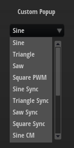
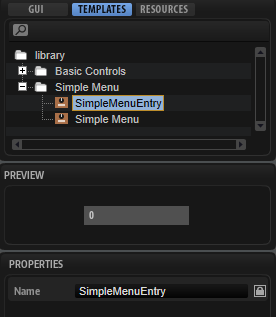
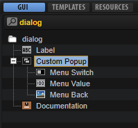
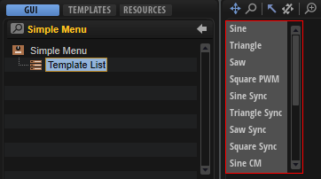
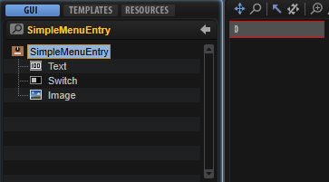

# Custom Popup Menus

---

**On this page:**

[[_TOC_]]

---

The standard menu control can be used to set parameters offering a list of options, e.g., the oscillator type of a synth oscillator. Allthough the menu control is a fast way to implement selection menus, its disadvantge is that it always uses the look of the operating system menus. If you want to implement a menu that follows the look and design language of your instrument, you can create menu templates that are openend via a switch using the popup style.

This how-to demonstrates how to build a custom popup menu for the ocillator type of a synth oscillator. This is how it looks on the macro page if the pop-up menu is opened:

>&#10069; The menu in the example below shows all oscillator types in a long list. If you want to create a menu with mutiple levels, please refer to [Custom Multi-Level Menus](./Custom-Multi-Level-Menus.md) or [Multi-Level System Menus](./Multi-Level-System-Menus.md).

## Example VST Preset

* [Custom Popup Menus.vstpreset](../vstpresets/Custom%20Popup%20Menus.vstpreset)

## Prerequisites
* A program with a synth zone and a macro page.
* A [Group](../../HALion-Macro-Page/pages/Group.md) with a [Switch](../../HALion-Macro-Page/pages/Switch.md), a [Text](../../HALion-Macro-Page/pages/Text.md) and an [Image](../../HALion-Macro-Page/pages/Image.md) control.
* A [Simple Menu](#simple-menu) template for the popup menu.
* A [SimpleMenuEntry](#simplemenuentry) template for creating the entries of the popup menu.

## How the Elements Interact

### Custom Popup

The Custom Popup [Group](../../HALion-Macro-Page/pages/Group.md) contains the elements that are needed to open the pop-up menu and to display the selected value.

[Menu Switch](#menu-switch) is a [Switch](../../HALion-Macro-Page/pages/Switch.md) control that is configured to open the popup menu. It uses the Popup style with the [Simple Menu](#simple-menu) template which contains a Template List that uses the [SimpleMenuEntry](#simplemenuentry) template for displaying the available options. [Menu Value](#menu-value) is a [Text](../../HALion-Macro-Page/pages/Text.md) control for displaying the current value and [Menu Back](#menu-back) is an [Image](../../HALion-Macro-Page/pages/Image.md) control for the background picture.

#### Menu Switch

This [Switch](../../HALion-Macro-Page/pages/Switch.md) control is used to open the [Simple Menu](#simple-menu) template as a pop-up. Since it is combined with a background image and a text, the switch itself does not require any graphics. To open the pop-up menu, the properties of the switch must be set to the following values:

|Property|Values|
|:-|:-|
|Mode|push|
|Style|Popup|
|Template|Simple Menu|
|Close on Click|Inside, Outside|
|Placement|Place Left, Place Right, Place Below|

#### Menu Value

This [Text](../../HALion-Macro-Page/pages/Text.md) control is connected to the oscillator type parameter and displays the selected type.

#### Menu Back

This [Image](../../HALion-Macro-Page/pages/Image.md) control displays a background picture, which is simply a black panel.

### Simple Menu

This template contains a template list view that uses the [SimpleMenuEntry](#simplemenuentry) template to create the entries of the pop-up menu.

The Value is connected to the oscillator type for switching the types. To create the entries for the available types, the template parameter MenuText must be connected to the oscillator type. The look of the entries is defined in the [SimpleMenuEntry](#simplemenuentry) template.

### SimpleMenuEntry

This template represents one entry in the pop-up menu and is instanciated for each oscillator type.

#### Text

This [Text](../../HALion-Macro-Page/pages/Text.md) control displays the name of an entry. The control is set to Read-only so that the text cannot be edited. The Value property is exported and named to MenuText on the template level. The entries in the pop-up are created by connecting the exported parameter in the template list view to the oscillator type.

#### Switch

This [Switch](../../HALion-Macro-Page/pages/Switch.md) control provides the hover image when moving the mouse over an entry.

#### Image

This [Image](../../HALion-Macro-Page/pages/Image.md) control displays the gray background for an entry.

>&#10069; Popup menus can only be displayed within the dimensions of the macro page. If a popup menu is too large, it will be clipped. To remedy this, you can either change the direction in which the popup menu opens, for example, open it to the top instead of to the bottom, or you can change the size of the template, so that it fits, and then activate the scrollbar to be able to scroll to the available entries.