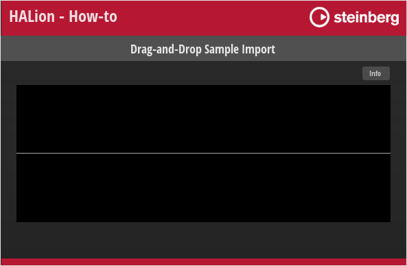
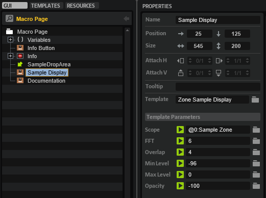
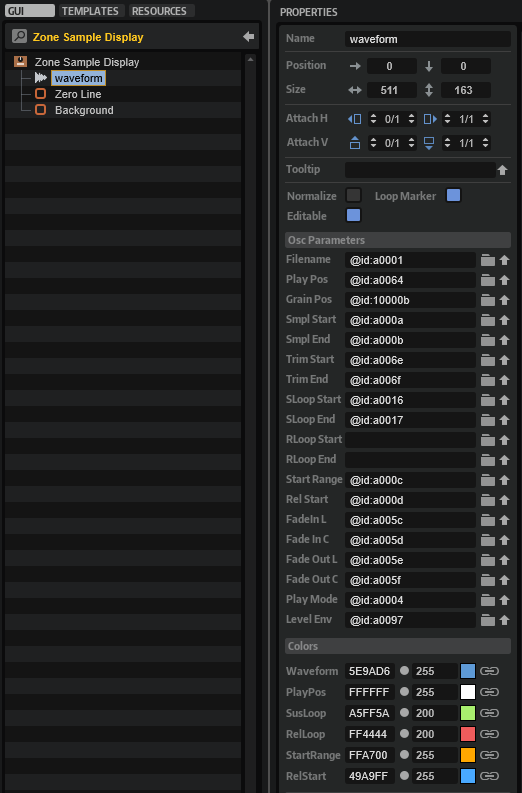
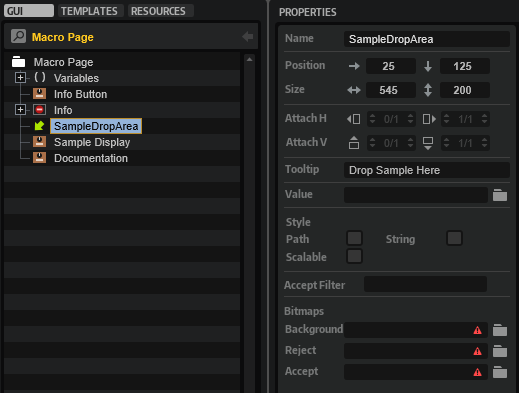
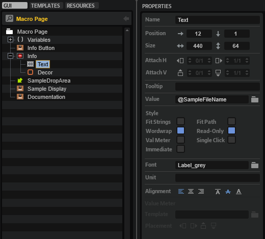

/ [HALion Developer Resource](../../HALion-Developer-Resource.md) / [HALion Tutorials & Guidelines](./HALion-Tutorials-Guidelines.md) / [How-tos](./How-tos.md) /

# Drag-and-Drop Sample Import

For your macro page to accept sample import by drag and drop, you need a [Drop](../../HALion-Macro-Page/pages/Drop.md) control, the [Sample Display](../../HALion-Macro-Page/pages/Sample-Display.md) template, and a UI script.

## Example VST Preset

* [Drag-and-Drop Sample Import.vstpreset](../vstpresets/Drag-and-Drop%20Sample%20Import.vstpreset)



The following section describes how to access [Templates](../../HALion-Macro-Page/pages/Template.md) and edit UI scripts.

* Load [Drag-and-Drop Sample Import.vstpreset](../vstpresets/Drag-and-Drop%20Sample%20Import.vstpreset).

{{#include ./_Excerpts.md:to-explore-templates}}

{{#include ./_Excerpts.md:to-edit-ui-scripts}}

## Prerequisites

* You have a program that contains a sample zone and a macro page.

## How the Elements Interact

### Sample Display

The [Sample Display](../../HALion-Macro-Page/pages/Sample-Display.md) template is the same as the one that comes with the [Basic Controls](../../HALion-Macro-Page/pages/Exploring-Templates.md#basic-controls) library. The **Template Parameters** of the [Sample Display](../../HALion-Macro-Page/pages/Sample-Display.md) template are fixed, displaying only the waveform, not the FFT. The Scope defines the zone where the sample is loaded, here ``@0:Sample Zone``. See [Sample Display > Template Parameters](../../HALion-Macro-Page/pages/Sample-Display.md#template-parameters) for further details.



You can find more properties inside the [Sample Display](../../HALion-Macro-Page/pages/Sample-Display.md) template. The screenshot shows how they are set up.



In the current example, the original UI script that came with the [Sample Display](../../HALion-Macro-Page/pages/Sample-Display.md) template has been replaced with the UI script on the macro page, primarily to implement the [Drag Group Callbacks](../../HALion-Macro-Page/pages/Drag-Group.md#drag-group-callbacks) needed for the drag-and-drop functionality. [Drag Group Callbacks](../../HALion-Macro-Page/pages/Drag-Group.md#drag-group-callbacks) are called when you drop something on a [Drop](../../HALion-Macro-Page/pages/Drop.md) control.

### SampleDropArea

The [Drop](../../HALion-Macro-Page/pages/Drop.md) control is named 'SampleDropArea' and has the same position and size as the [Sample Display](../../HALion-Macro-Page/pages/Sample-Display.md) template.



Its name 'SampleDropArea' is used by the [Drag Group Callbacks](../../HALion-Macro-Page/pages/Drag-Group.md#drag-group-callbacks) as a condition for calling other functions to import the sample. The sample import as implemented in the UI script supports sample files from the hard disk as well as regions from Cubase. Take a look at the ``firstRegion`` function for more details on this.

```lua
-- Drag & Drop Sample Import

zone   = getElement():getZone()

function firstRegion(data)
	if data then
		if data.files and data.files[1] then
			local af = AudioFile.open(data.files[1])
			if af.valid then
				return af, 0, af.length
			end
		end
		if data.regions and data.regions[1] then
			local af = AudioFile.open(data.regions[1].filename)
			if af.valid then
				return af, data.regions[1].start, data.regions[1].length
			end
		end
	end
	return { valid = false }, 0, -1
end

function onDropFeedback(viewname, draginfo, copy, data)
	if viewname == "SampleDropArea" then
		local af, start, length = firstRegion(data)
		return af.valid
	end
end

function onDropGetInfo(viewname, info)
	return { info = info, copy = true, move = false }
end

function importSample(sample, start, length)
	if sample.valid then
		startUndoBlock("Import Sample " .. sample.fileName)
		zone:setParameter("SampleOsc.Filename", sample.fileName)
		zone:setParameter("SampleOsc.SampleStart", start)
		zone:setParameter("SampleOsc.SampleEnd", start + length)
		-- check loops
		local loop = sample.loops[1]
		zone:setParameter("SampleOsc.SustainLoopModeA", 1)
		local ls = loop and (loop.loopStart < loop.loopEnd) and math.max(start, math.min(loop.loopStart, start + length)) or start
		local le = loop and (loop.loopStart < loop.loopEnd) and math.max(start, math.min(loop.loopEnd,   start + length)) or start + length
		zone:setParameter("SampleOsc.SustainLoopStartA", ls)
		zone:setParameter("SampleOsc.SustainLoopEndA", le)
		endUndoBlock()
		SampleFileName = sample.fileName
	end
end

function onDropInsert(viewname, draginfo, copy, data)
	if viewname == "SampleDropArea" then
		local sample, start, length = firstRegion(data)
		importSample(sample, start, length)
	end
end

defineParameter("SampleFileName", nil, "Drag a sample onto the waveform display to import it.")
```

### Info

Hovering over the 'Info' button on the macro page displays the file path of the sample. The 'Info Button' [Template](../../HALion-Macro-Page/pages/Template.md) and the 'Info' [Disable Group](../../HALion-Macro-Page/pages/Disable.md) are both linked to the ``@SampleInfo`` UI variable, which controls whether the 'Info' [Disable Group](../../HALion-Macro-Page/pages/Disable.md) and its contents are displayed. The 'Info' [Disable Group](../../HALion-Macro-Page/pages/Disable.md) contains a [Text](../../HALion-Macro-Page/pages/Text.md) and a [Decor](../../HALion-Macro-Page/pages/Decor-Control.md) control. The information to be displayed by the [Text](../../HALion-Macro-Page/pages/Text.md) control is set by the ``SampleFileName`` parameter of the UI script.

