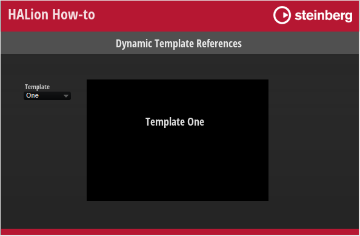

/ [HALion Developer Resource](../../HALion-Developer-Resource.md) / [HALion Tutorials & Guidelines](./HALion-Tutorials-Guidelines.md) / [How-tos](./How-tos.md) /

# Dynamic Template References

---

**On this page:**

[[_TOC_]]

---

When building macro pages that use multiple, switchable editors, e.g., for different articulations of an instrument, it is advanteageous to use dynamic template references instead of stacked pages. The convenience of a stack is that you always have access to all subpages from the GUI Tree and that you can establish connections with engine parameters easily. The disadvantage of a stack is that the entire macro page with all subpages must be kept in memory, even if only parts of it get displayed. A more economic way to deal with multiple editors is to work with template views and to switch the template reference using a script or a stringlist variable.

This how-to demonstrates how to use a stringlist variable with template references for switching between two templates.

## Example VST Preset

* [Dynamic Template References.vstpreset](../vstpresets/Dynamic%20Template%20Reference.vstpreset)

## Prerequisites

* A macro page with a template view.
* Two templates, One and Two, to be shown alternatively in the template Dynamic Editor.
* A stringlist variable t determining the names of the templates.
* A Menu template to select the template to be displayed.

## How the Elements Interact

The UI variable defines the names of the templates, One and Two, that are to be switched. The templates One and Two have been setup separately. You find them in the Templates Tree. They are referenced by the template Dynamic Editor, which displays only one of them, depending on which template is selected by the Menu template. This is achieved by setting the Template property of the Dynamic Editor and the Value property of the Menu template both to the UI variable ``@t``.

### UI Variables

This variable defines the templates to be switched and it connects the Menu and Dynamic Editor templates.

|Variable|Description|Type|Values|
|:-|:-|:-|:-|
|t|Switches between the defined templates.|stringlist|One, Two|

### Menu

This Menu template switches between the templates One and Two. Its Value must be set to the UI Variable ``@t``.

### Dynamic Editor

This [Template](../../HALion-Macro-Page/pages/Template.md) control references and displays the templates One or Two, depending on which template is selected by the Menu template. The Template property must be set to the UI variable ``@t``. 

## More Options

* Instead of using a stringlist variable, you can control the template reference using a UI script parameter.
* When using a UI variable or a UI script parameter, the selected template reference will not be saved with the preset, instead the state will only be saved and restored with projects. If you want to save and restore the state with presets, you must use a Lua Script MIDI module with a corresponding parameter defined.
* Instead of using a [Menu](../../HALion-Macro-Page/pages/Menu.md) control, you can also use exclusive switches to select the template reference.