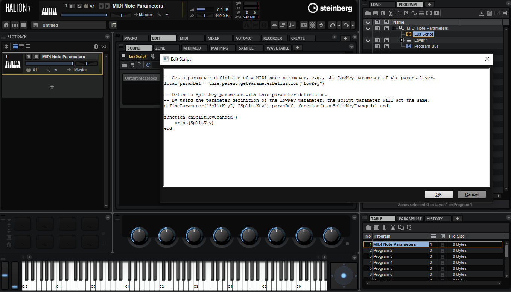

/ [HALion Developer Resource](../../HALion-Developer-Resource.md) / [HALion Tutorials & Guidelines](./HALion-Tutorials-Guidelines.md) / [Getting Started](./Getting-Started.md) /

# Exploring the Turorials and How-tos

---

**On this page:**

[[_TOC_]]

---

Many of the tutorials and how-tos provide downloadable VST presets either as starting point or as fully working example for the introduced topic.

>&#10069; The minimum version for using the example VST presets is HALion 6.3.

## Using the Example VST Presets

It is recommended to import the VST preset to the user presets folder.

1. Right-click the link to the VST preset and download it.
1. Open the download location and drag the preset to HALion's MediaBay. This will import the VST preset to the user presets folder.
1. Go to MediaBay, use the **Select Content Set** pop-up to select **HALion Tutorials** or **HALion How-tos**.

1. In the MediaBay, set the View Filter to **Program Filter**   and the Content Filter to **User Content** .
1. Drag the preset from the result list to the Slot Rack.

If you do not want to import the VST preset to the user presets folder, just drag it from the download location to the Slot Rack.

## Using the Example Macro Pages

The example VST presets come with a basic macro page.

The functionality is as follows:

* The title in the top left tells you if the VST preset belongs to a tutorial or a how-to.
* A click on the Steinberg logo brings you to the [Steinberg](https://www.steinberg.net/) website.
* The title in the middle tells you the topic the VST preset belongs to. Click this title to open the accompanying page on [developer.steinberg.help](https://developer.steinberg.help/).
* The lower area often contains controls to try out the described functionality.

## Accessing the Code Examples
It is an advantage if you read the accompanying page while you examine the example VST Preset. The accompanying page usually lists MIDI Scripts or UI Scripts or both. You find the scripts in the VST preset as follows:

**MIDI Scripts** can be found in the Lua Script MIDI module.

* Go to the Program Tree, select the Lua Script MIDI module and open the internal script editor.

**UI Scripts** can be found in the Macro Page Designer.

* Go to the Macro Page Designer and open the internal script editor of the macro page.

