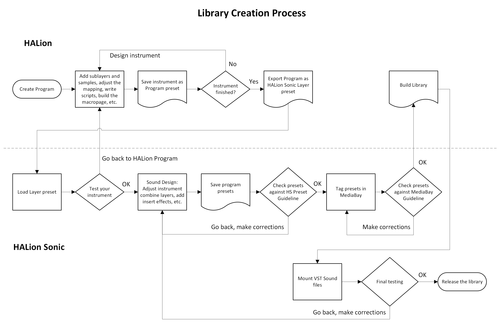

/ [HALion Developer Resource](../../HALion-Developer-Resource.md) / [HALion Tutorials & Guidelines](./HALion-Tutorials-Guidelines.md) / [Getting Started](./Getting-Started.md) /

# HALion Libraries

---

**On this page:**

[[_TOC_]]

---

HALion allows you to create your own libraries and distribute them as VST Sound files. VST Sound is a Steinberg file format that can be compared to ZIP or ISO files, for example. It contains a file structure with folders and files. The **Library Manager** allows you to manage the VST Sound files of a library on your computer and to register them to the **MediaBay**. Once a VST Sound file is registered in the **MediaBay**, it is mounted, and all compatible Steinberg products can access the folders and files within it. For more details regarding the **Library Manager**,  see [steinberg.help / VST Manuals / Library Manager](https://steinberg.help/vst-manuals/library-manager/).

HALion libraries incorporate many source files, such as presets, samples, macro pages, MIDI modules, scripts, and sub presets. The **Library Creator** allows you to write VST Sound files that contain all the necessary source files of a library. A library can be created as a single VST Sound file or as a combination of VST Sound files. For example, you might want to put the presets into one VST Sound file and the samples into another. For more details on using the **Library Creator**, see [steinberg.help / HALion 7 / Library Creator](https://steinberg.help/halion/v7/en/halion/topics/library_creator/library_creator_c.html).

## Defining Your Target Users

The HALion family consists of the plug-ins HALion and HALion Sonic. HALion allows you to create libraries for both plug-ins.

Before you create a library, you must decide who your target users or customers are and in which plug-in you want the library to work. Please note the following:

* HALion Sonic has restrictions regarding the program structure. The number of instrument layers is limited to four and certain MIDI modules are always needed. HALion does not have these restrictions.
* HALion Sonic libraries are compatible with HALion. HALion libraries are only compatible with HALion.

You could build a library that only HALion users can use, which gives you the freedom to build a program with a different structure, for example. However, this limits the number of potential users.

Most often, you will probably want to build your library so that it works with HALion Sonic, which means that it can be used by everybody. HALion Sonic is freely available for download on the Steinberg website.

|Plug-in|Description|Compatibility|
|:-|:-|:-|
|HALion|HALion libraries have no restrictions.|HALion|
|HALion Sonic|HALion Sonic libraries have restrictions regarding the program structure. The number of instrument layers is limited to four and certain MIDI modules are always needed. See [HALion Sonic Program Structure](./Creating-Instruments.md#halion-sonic-program-structure) for details.|HALion, HALion Sonic|

{{#include _Maximum-Macro-Page-Size.md}}

## Library Creation Process

### Library Creation Workflow

To build a library that works in HALion Sonic, proceed as follows:

1. **Build the instrument in HALion.** In this step, you add sublayers and samples, adjust the mapping, write scripts, build the macro page, etc. When creating the macro page, you must select **Create HALion Sonic Macro Page**. This creates a canvas with the default size for the HALion Sonic macro page. While working in HALion, the instrument is saved as Program preset.
1. **Export the program as HALion Sonic Layer preset.** This step makes it possible to load the instrument you created in HALion as a Layer in HALion Sonic.
1. **Load the exported Layer in HALion Sonic.** In this step, you should test your instrument thoroughly. If you find issues, you need to go back to the original HALion Program preset from step 1 and correct whatever you found. Then, you must export the instrument again as HALion Sonic Layer preset, load it in HALion Sonic, test it, etc. This is an iterative process. Once your instrument is set up correctly and works the way you want it, you can move on to the next step.
1. **Load the Layer in HALion Sonic and do the sound design.** In this step, you tweak parameters on the macro page, add effects on the **Inserts** tab, assign quick controls, etc. You can even load more than one layer of your instrument and adjust the parameters on the **Program** tab. The macro pages of the Layers can be accessed in HALion Sonic via the L1 to L4 tabs.
1. **Save the sound as HALion Sonic Program.** In this step, you should set the MediaBay tags.
1. **In the Library Creator, build your VST Sound file(s) as HALion Sonic library.** The HALion Sonic presets and all the necessary source files of the library are written into the VST Sound files.

Regarding the steps above, designing a library can be divided into three phases:

|Phase|Description|
|:-|:-|
|I.|The main part of the work usually happens in step 1.|
|II.|Steps 2 through 5 are mainly testing and sound design.|
|III.|Step 6 is the final step, just before the release.|

### Library Creation Flowchart

This flowchart shows the complete library creation process from start to end.

