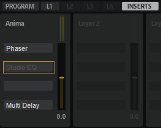

# HS Preset Guideline

---

**On this page:**

[[_TOC_]]

---

When you create the final HALion Sonic Program presets, you should follow the guideline below. For example, if the library manufacturers adjust preset levels using different standards, the user might have to adjust the mixer level with every preset to compensate for this. Following the guideline below ensures an equal quality of the libraries and, therefore, improves the user experience and the success of your library.

## Sound Design Conventions

### Modulation Wheel, MIDI CCs and Quick Controls

* The modulation wheel should always be assigned. You can assign the modulation wheel as MIDI CC in the modulation matrix or as a quick control.
* Do not assign any MIDI CCs to controls on the interface. They are not saved with VST3 presets.
* For details how to assign the quick controls, see the [Quick Controls Guideline](./Quick-Controls-Guideline.md).

### Trigger Pads

* Please assign the Trigger Pads where you think it is useful. For example, to trigger different chords or phrases.
* If you assign the Trigger Pads, please always start with the top row and assign the pads from left to right. If you assign a mix of variations and chords, please use the top row for the variations and the bottom row for the chords.
* If you assign chords to the Trigger Pads, please use the chord as pad name, e.g., Cm, C, CMaj7, C7, etc. If you assign variations to the Trigger Pads, please use Vari 1, Vari 2, Vari 3, etc., as pad name. Arp 1, Arp 2, Arp 3, etc., is also allowed.

### Level Settings

* If you use the plug-in in a sequencer: Start a default project. The Slot Level of the Program in HALion Sonic should be set to default. The master fader and any other levels in the project should be set to default. To check the level, open the mixer in the sequencer and check the peak level of the master channel. The clipping LED should not light up.
* If you use the standalone version of the plug-in: Start the plug-in with the factory defaults. The Master Volume of the plug-in and and the Slot Level should be set to default. The clipping LED of the slot should not light up.
* Bass and lead sounds should be between -1 dB and 0 dB if you play a single note at full velocity.
* Polyphonic sounds, e.g., pads, should be at -6 dB if you play a single note at full velocity.

### Transpose Settings

* Sounds like leads, pads, and comps should not be transposed. A3 (69) should play 440 Hz.
* (Synth) Bass sounds can be transposed -2 octaves below the normal sounds. This allows for playing bass sounds without transposing, e.g., on small two octaves MIDI controller keyboards.

### Effect Settings

* You can assign insert effects to the layers and the program on the Inserts tab in HALion Sonic. Please do not use any AUX effects, because they are not saved with Program presets.
* If you use REVerence for your presets, remember that it can be quite heavy on the CPU. Please consider to use the algorithmic reverb instead.
* Remove any effects that you do not use anymore.
* Avoid empty slots in the insert rack.

In the example above, the second insert is deactivated and the third is empty. This should be avoided.

### Tempo Sync

* Sounds that typically play in sync with the song tempo, e.g., dance and sequencer sounds, should make use of the sync settings for the LFOs and effects. Use 120 BPM as your base song tempo.

### Orphaned Settings

* Oscillators and other settings that are not in use should be switched off. However, if a setting is switched off and the user activates this setting, the sound should still be OK.
* If you copy and modify a preset, an orphaned setting might not sound OK. Please set these settings to useful default values.

### Preset Naming Conventions

* Please use only English names.
* Avoid names of companies, artists, or song names.
* Decades in preset names should always be named like this: 70s, 80s, 90s, etc. Not 70ies or 80's, etc.
* Presets should not start with numbers. Otherwise, they will be listed at the beginning of the results list. Instead of "80s Glamor", you should use "Glamorous 80s ", for example.
* Avoid childish or offending play on words in your preset names.
* Avoid generic names, e.g., Digi Bass, Ana Lead, Smooth Pad, etc. It is likely that such names are already used.
* Do not use the instrument category in the name. For example, bass, lead, pad, synth brass, etc. are already covered by the MediaBay’s category and subcategory. Therefore, these words should not be used in the preset name. It would be redundant information.
