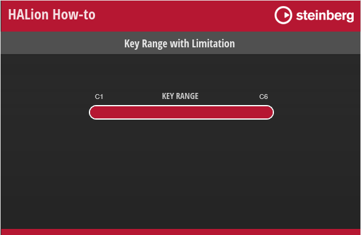
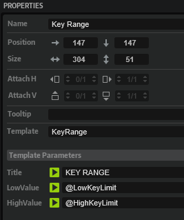

/ [HALion Developer Resource](../../HALion-Developer-Resource.md) / [HALion Tutorials & Guidelines](./HALion-Tutorials-Guidelines.md) / [How-tos](./How-tos.md) /

# Key Range Limitation

The key range of a layer is usually C-2 to G8. In the following example, a [Range Slider](../../HALion-Macro-Page/pages/Range-Slider.md) and a UI script are used to limit the key range of a layer to a definable range.

## Example VST Preset

* [Key Range with Limitation.vstpreset](../vstpresets/Key%20Range%20with%20Limitation.vstpreset)



The following section describes how to access [Templates](../../HALion-Macro-Page/pages/Template.md) and edit UI scripts.

* Load [Key Range with Limitation.vstpreset](../vstpresets/Key%20Range%20with%20Limitation.vstpreset).

{{#include ./_Excerpts.md:to-explore-templates}}

{{#include ./_Excerpts.md:to-edit-ui-scripts}}

## Prerequisites

* You have a program with a layer, a zone, and a macro page.

## How the Elements Interact

### Key Range

The Key Range template contains the [Range Slider](../../HALion-Macro-Page/pages/Range-Slider.md) and [Text](../../HALion-Macro-Page/pages/Text.md) controls that are needed to set and display the key range. The Low Value and High Value of the [Range Slider](../../HALion-Macro-Page/pages/Range-Slider.md) and the corresponding values of the [Text](../../HALion-Macro-Page/pages/Text.md) controls are exported as template parameters with the same names, LowValue for the low key and HighValue for the high key. The template parameters LowValue and HighValue are connected to the LowKeyLimit and HighKeyLimit parameters of the UI script.



### UI Script

The LowKeyValue and HighKeyValue parameters of the UI script are connected to the Low Key and High Key parameters of the layer, respectively, and they define the key range.


 The maximum key range is defined by the ``lowKey`` and ``highKey`` variables in the UI script.

```lua
-- Variables and values to be used for the key range.
function setupKeyRangeParams()
	-- Moved into function to keep locals out of global table.
	local lowKey = 36
	local highKey = 96

	local paramDefLow = getElement():getParameterDefinition("LowKey")
	local paramDefHigh = getElement():getParameterDefinition("HighKey")
	local noteNames = {}
	for i = lowKey, highKey do
		noteNames[i - lowKey] = paramDefLow:getDisplayString(i):gsub(' ', '')
	end
	defineParameter("LowKeyValue",  nil, paramDefLow, function()  LowKeyLimit = LowKeyValue - lowKey end)
	defineParameter("HighKeyValue", nil, paramDefHigh, function() HighKeyLimit = HighKeyValue - lowKey end)


	function onLowKeyLimit()
		if LowKeyLimit > HighKeyLimit then
			LowKeyLimit = HighKeyLimit
		end
		LowKeyValue = LowKeyLimit + lowKey
	end
	function onHighKeyLimit()
		if LowKeyLimit > HighKeyLimit then
			HighKeyLimit = LowKeyLimit
		end
		HighKeyValue = HighKeyLimit + lowKey
	end
	defineParameter("LowKeyLimit",  nil, 0, noteNames, onLowKeyLimit)
	defineParameter("HighKeyLimit", nil, highKey - lowKey, noteNames, onHighKeyLimit)
end

setupKeyRangeParams()
```
