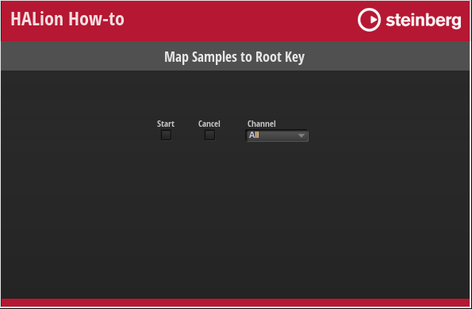

/ [HALion Developer Resource](../../HALion-Developer-Resource.md) / [HALion Tutorials & Guidelines](./HALion-Tutorials-Guidelines.md) / [How-tos](./How-tos.md) /

# Map Samples to Root Key

---

**On this page:**

[[_TOC_]]

---

This how-to shows how to map sample zones automatically to the root key that matches the analyzed pitch of the sample. Such helper functions can be useful during the production of large-scale sample libraries.

## Example VST Preset

The script parameters Start, Cancel and Channel can be accessed from the macro page of the example VST preset.

* [Map Samples to Root Key.vstpreset](../vstpresets/Map%20Samples%20to%20Root%20Key.vstpreset)



>&#10069; The example VST preset requires the factory content of HALion.

## Prerequisites

* A program with sample zones.
* The samples have a distinct pitch.

## Mapping Samples to the Root Key

The example below assumes that you have a program with sample zones that are not mapped to the root key yet. 

<ol start = "1"><li>Add a Lua Script module to your program.</li><li>Copy the following code to the Lua Script module.</li></ol>

```lua
channelNames = { [0] = "All", "Left", "Right" }
 
defineParameter( "Channel", nil, 0, channelNames)
defineParameter( "Start", nil, false, function() if Start then onStart() end end)
defineParameter( "Cancel", nil, false)
 
function onPitchAnalysisFinished(audioFile, channelNum)
    print("Progress: 100%")
    print(channelNames[channelNum].." channel(s) of "..audioFile.fileName.." analyzed.")
end
 
function onStart()
    zones = this.parent:findZones(true)
    for i, zone in ipairs(zones) do
        local samplePath = zone:getParameter("SampleOsc.Filename")
        print("File: "..samplePath)
        local afile = AudioFile.open(samplePath)
        afile:analyzePitch(onPitchAnalysisFinished, Channel)
        while afile:getPitchAnalysisProgress(Channel) < 1 do
            if Cancel then
                afile:cancelPitchAnalysis(Channel)
                break
            end
            local progressPercent = 100 * afile:getPitchAnalysisProgress(Channel)
            print(string.format("Progress: %2d%%", progressPercent))
            wait(2000)
        end
        if Cancel then
            Cancel = false
            print("Canceled!")
            break
        end
        local pitch = afile:getPitch(0, -1, Channel)
 
        pitch = math.floor(pitch+0.5)
         
        print("Analyzed Pitch: "..pitch)
 
        zone:setParameter("SampleOsc.Rootkey", pitch)
        zone.keyLow = pitch
        zone.keyHigh = pitch
 
    end
    print("Done!")
    Start = false
end
```
<ol start = "3"><li>Go to the Parameter List and activate "Start".</li><li>Open the Mapping editor.</li></ol>

The sample zones will be mapped automatically to the matching root key.
