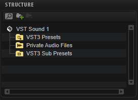

# MediaBay Guideline

---

**On this page:**

[[_TOC_]]

---

With the help of MediaBay attributes, you can quickly and easily browse and search presets. Attributes are descriptive keywords that you can assign to your presets. Good search results in the MediaBay highly depend on accurately set attributes. When you specify attributes for your final HALion Sonic Program presets, you should follow the guideline below. This ensures an equal quality of the attributes and, therefore, improves browsing and searching in the MediaBay.

>&#10069; Please use the MediaBay of HALion Sonic to specify attributes for your presets. Do not use the MediaBay of Cubase, because it contains attributes that are not supported by HAlion Sonic presets.

## Library Creator Properties

The following attributes are assigned automatically to all your presets when you build your libraries using the **Library Creator**:

|Library Creator Property|MediaBay Attribute|Description|
|:-|:-|:-|
|Long Name|Library Name|If the Long Name is too long, the Name property is used instead.|
|Manufacturer|Library Manufacturer|Your name or company name.|
|Family|PlugIn Name|The target plug-in that the library was designed for.|

Any other attributes must be set manually.

## Which Media Files Must Get Attributes?

* The MediaBay scans only those VST3 presets that are located in the VST3 Presets folder of your library. This means that you must specify attributes for all VST3 presets that are located in this folder. Otherwise, the users cannot find the presets. In the **Library Creator**, a warning message is displayed if attributes were not set.
* The subpresets in the VST3 Sub Presets folder are not scanned by the MediaBay and do not need attributes. These subpresets are loaded via a script and not with the MediaBay.
* All samples of your library are located in a Private Audio folder. Private means that the MediaBay does not scan these samples and you do not need to add attributes to them. The samples are loaded together with the VST3 preset or via a script.

## VST3 Preset Attribute Conventions

The different preset categories require different sets of attributes. This guideline gives you advice on how to add the correct attributes.

* For regular instrument presets, the common attributes should be set.
* For categories like Drum&Perc > Beats, for example, you should add additional attributes.

### Common Attributes

The following MediaBay attributes must be set:

|MediaBay Attribute|Description|
|:-|:-|
|Author|The name of the company or of the sound designer.|
|Category|Use this attribute to classify the sound. If you set the Sub Category first, the Category is set automatically.|
|Character|See [Character Attribute Conventions](#character-attribute-conventions).|
|Library Manufacturer|This attribute does not have to be set manually. It is defined with the Manufacturer property in the **Library Creator**.|
|Library Name|This attribute doesnot have to be set manually. It is defined with the Long Name property in the **Library Creator**.|
|Name|This attribute doesnot have to be set manually. It is defined with the preset name when the preset is saved.|
|PlugIn Name|This attribute doesnot have to be set manually. It is defined with the Family property in the **Library Creator**.|
|Rating|A rating of three stars is recommended as starting point for presets. The users can then lower or raise the rating.|
|Sub Category|Use this attribute to classify the sound. If you set the Sub Category before the Category, the Category is set automatically.|

### Additional Attributes

These attributes should be set in addition, for example, for VST3 presets with the Category Drum&Perc > Beats.

|MediaBay Attribute|Description|
|:-|:-|
|Signature|The time signature as numerator and denominator.|
|Style|Use this attribute to classify the musical style. If you set the Sub Style first, the Style is set automatically.|
|Sub Style|Use this attribute to classify the musical style. If you set the Sub Style before the Style, the Style is set automatically.|
|Tempo|The tempo in beats per minute (bpm).|

### Special Attributes

These attributes are mainly needed to display information in HALion's **Browser**.

|MediaBay Attribute|Description|
|:-|:-|
|Bars & Beats|The number of bars and beats in a loop, for example. This attribute is set for samples, not for presets.|
|Comment|Use this attribute to add a comment to each preset.|
|Family Name|This attribute is used for sample sets. Samples with the same Family Name belong to the same sample set.|
|Follow Tempo|This attribute defines whether a loop uses AudioWarp to follow the host tempo.|
|GM Sound|This attribute defines the program number of a GM Sound.|
|Key|The key in which a loop was written, for example, a loop with chords or a loop with a melody.|
|Keywords|This attribute is set by HALion when you import third-party sampler programs.|

### Properties, Moods, and Articulations

* Set the Character attributes so that they describe the preset as precisely as possible.
* Character attributes that do not fit should not be used at all.
* Fewer character attributes that perfectly match are much better than too many character attributes that do not match.

>&#10069; Presets that use an arpeggiator should not get the attribute Synth Lead > Arpeggio by default. You should use this Category only for classic arpeggio sounds. If you have a synth bass with a step sequencer or arpeggio, you should add the attribute Bass > Synth Bass. To indicate that the preset contains an arpeggio or a sequence, use the Sequenced or Arpeggio Character attributes, instead.